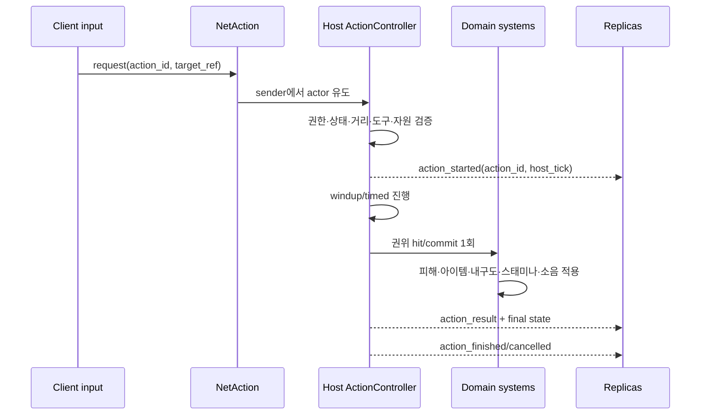

# PRIMAL NIGHT 행동 시스템 설계

- 문서 상태: 정식 행동 시스템 기준안
- 작성 기준일: 2026-07-16
- 엔진 기준: Godot 4.7 stable, GDScript 2.0
- 관련 기획: `docs/design/GAME_SCENARIO_WORLD_TILEMAP.md`
- 진행 계획: `docs/technical/WEEK5_6_PLAN.md`는 수정하지 않으며 W6 확정 작업을 침범하지 않는다.

> 표기 규칙
>
> - **현재 구현**: 저장소의 코드·리소스·자동 테스트로 확인한 사실이다.
> - **변경 제안**: 아직 구현되지 않았거나 현재 구조를 승격·확장하는 설계다.
> - 이 문서의 코드 블록은 전부 **변경 제안 스켈레톤**이다. 구현 완료를 뜻하지 않는다.
> - 수치의 정본은 코드 상수가 아니라 `.tres` Resource다. 표의 새 수치는 밸런스 시작값일 뿐이다.

---

## 1. 결론

PRIMAL NIGHT의 행동은 다음 순서를 정본으로 사용한다.

```text
입력
→ 행동 요청(action_id, target_ref)
→ 호스트가 도구·거리·상태·스태미나·대상 소유권 검사
→ 행동 상태 진입과 이동/다른 행동 잠금
→ 애니메이션 시작
→ 호스트 타임라인의 실제 타격·완료 프레임 1회
→ 피해·자원·제작·좌표 결과를 호스트가 확정
→ 소음·피로·도구 내구도·경험치 정책을 호스트가 적용
→ 후딜레이 뒤 행동 종료 또는 조건 위반으로 취소
```

**변경 제안 — 핵심 원칙:** 일반 액션 게임처럼 “충돌했으니 즉시 결과”를 만들지 않는다. 센서인 `RayCast2D`, `ShapeCast2D`, 상호작용 `Area2D`, 타일 custom data는 후보를 찾거나 공간을 설명할 뿐이다. 결과는 반드시 `ActionController`가 연 행동의 권위 프레임에서 한 번만 커밋한다.

**변경 제안 — 네트워크 원칙:** 싱글플레이도 로컬 호스트 흐름을 쓴다. 클라이언트는 `action_id`와 대상 참조만 요청하고, 피해량·획득 아이템·수량·내구도 비용·경험치·명중 여부·소음 반경·완료 시간·피격 목록을 보내지 않는다.

---

## 2. 현재 코드와의 정밀 대조

### 2.1 이미 있는 행동 기반

| 영역 | 현재 구현 근거 | 판정 | 변경 제안 |
|---|---|---|---|
| 상호작용 선택 | `Interactor`가 입력 시점에만 겹친 `Area2D`를 조회하고 `can_interact/get_hold_seconds/interact` 덕 타이핑 계약을 호출한다. | **승격** | 타깃 후보 탐색과 HUD 프롬프트는 유지한다. 결과 커밋과 취소 소유권만 `ActionController`로 옮긴다. |
| 2초 치료 | `HealTarget`과 `NetSurvival`이 2초 홀드, 양쪽 이동 잠금, 붕대·거리·출혈·생존 상태, 호스트 경과 시간을 검증한다. | **TimedAction의 검증된 원형** | 즉시 제거하지 않는다. 다음 작업은 치료 2초를 공통 행동에 연결하고 기존 `test_healing/test_net_survival`을 그대로 통과시키는 것이다. |
| 1초 모닥불 설치 | `CampfireSite/CampfireConfig`가 1초 홀드, 돌 3+나무 2, 설치 소음 200px를 데이터로 가진다. `NetCampfire`가 자리·거리·재료를 호스트에서 확정한다. | **TimedAction+제작의 검증된 원형** | 지정 자리와 `CampfireConfig`를 유지한다. `ActionDefinition`은 흐름만 공통화하고 비용의 정본을 복제하지 않는다. |
| 월드 아이템 획득 | `WorldItem`은 즉시 상호작용이고 `NetPickup`은 안전한 상대 경로, 거리, 존재, 잔량, 인벤토리 여유를 호스트에서 검증한다. 동시 요청은 직렬 확정한다. | **권위 mutation 기준 구현** | 자원 노드와 제작 산출도 같은 “의도→호스트 조회→확정→신뢰 복제” 패턴을 따른다. |
| 퀵 제작 | `RecipeData`, `Crafting`, `ActionDefinition/ActionController/TimedAction` 최소 절편, `NetCrafting`이 연결됐다. 클라이언트는 `recipe_id`만 보내고 호스트가 재료·무게·슬롯·산출을 원자적으로 검증한 뒤 결과를 복제한다. | **W6 최소 구현** | 현재는 `craft_bait` 한 경로다. 치료/모닥불을 즉시 갈아엎지 않고, 다음 라운드에서 치료 2초만 공통 행동으로 승격한다. |
| 피해·출혈 | `HealthComponent`가 체력·출혈·피 냄새를 소유하고 `NetSurvival`이 디버그 부상 의도를 호스트에서 상한 처리한다. | **부분 승격** | 체력 컴포넌트는 유지한다. 무기 피해·부위 부상·밀침·넘어짐의 계산과 1회 커밋을 `DamageSystem`에 추가한다. |
| 스태미나·피로 | `StaminaComponent`와 `SurvivalStats`가 호스트에서 달리기 소모, 피로 보정과 회복을 계산한다. | **재사용** | 행동 시작 비용과 행동 중단 조건을 이 컴포넌트에 연결한다. 별도 스태미나 시스템을 만들지 않는다. |
| 행동 소음 데이터 | `NoiseProfile`은 `id/radius/merge_window_seconds/merge_distance_px`를 가진 Resource다. | **NoiseSystem의 데이터 정본** | `ActionDefinition`에는 `NoiseProfile` 참조만 둔다. `noise_radius`를 중복 저장하지 않는다. |
| 행동 소음 발신 | `NoiseEmitter`가 권위 여부, 유효 위치, 프로필별 시간·거리 병합을 검사하고 `EventBus.noise_emitted`를 발신한다. | **NoiseSystem의 생산부** | 교체하지 않는다. 행동 완료/타격 프레임에서 기존 API를 호출한다. |
| 벽 소리 감쇠 | `Raptor._resolve_pending_noise()`가 terrain ray query와 `CreatureData.occlusion_attenuation=0.5`로 유효 반경을 줄인다. | **NoiseSystem의 현재 소비부** | 현재 랩터 1종 동안 유지한다. 여러 청취자 유형이 생겨 중복될 때만 공통 공간 질의로 올린다. |
| 이동 잠금 | `Player.movement_locked`를 `Interactor`, `HealTarget`, `NetSurvival`이 사용한다. | **재사용** | 행동별 직접 대입을 줄이고 `ActionController`가 잠금의 단일 소유자가 되도록 단계적으로 옮긴다. |
| RPC 방어 | `RpcGuard`가 등록 RPC, 허용 peer, host-only, 초당 횟수, payload 상한을 검사하고 재접속 peer 명부를 갱신한다. | **필수 재사용** | 행동 RPC도 같은 규칙과 세션 감시를 사용한다. 별도 보안 프레임워크를 만들지 않는다. |
| 재접속 | `NetResync`가 인벤토리·체력·출혈·생존 수치·위치를 전체 스냅샷으로 복원한다. | **확장** | 진행 중 행동은 재접속 시 기본 취소한다. 이미 커밋한 결과만 스냅샷/월드 델타로 복원한다. |
| 현재 SceneTree | `Main` 직속에 `NetMovement/NetPickup/NetSurvival/NetCampfire/NetResync`, 플레이어 아래 `Interactor`가 있다. | **점진 확장** | 대규모 재배치 없이 필요한 노드만 추가한다. 기존 네트워크 노드 순서를 보존한다. |

### 2.2 아직 없는 것

다음은 저장소 검색상 구현이 없으므로 모두 **변경 제안**이다.

- `ResourceNode`, 범용 `DamageSystem`, `TileInteractionSystem`.
- 근접 공격용 `ShapeCast2D`, 총기 hitscan, 무기 범위·각도·반동·탄약·내구도 처리.
- 벽·담장 넘기 custom data와 `VaultState`.
- 제작은 W6 `craft_bait`만 현재 구현이다. 자원 잔량·재생성 처리, 사체 `yield_mask` 커밋, 지정 설비 제작 확장은 아직 없다.
- 부위 부상, 도구 내구도, 스킬·경험치 시스템.

**변경 제안 — 대체 금지:** 새 시스템이 `Inventory`, `HealthComponent`, `StaminaComponent`, `NoiseProfile/NoiseEmitter`, `Interactor`, `NetPickup`, `NetSurvival`, `NetCampfire`, `RpcGuard`를 한 번에 대체하지 않는다. 검증된 도메인 mutation은 유지하고 행동의 순서·취소·권위 타이밍만 공통화한다.

---

## 3. 권위 흐름과 상태 모델

### 3.1 요청 스키마

**변경 제안:** 원격 행동 요청의 허용 필드는 두 개다.

| 필드 | 의미 | 검증 |
|---|---|---|
| `action_id: String` | 호스트 Catalog에 등록된 행동 ID | 빈 값·길이 상한·미등록 ID 거부 |
| `target_ref: String` | 현재 씬의 안전한 상대 경로 또는 청크의 안정 ID | 길이 상한, 절대/상위 경로 거부, 호스트 월드에서 재해석 |

조준점이 필요한 행동은 `target_ref`가 호스트가 해석할 타일 좌표·안정 ID·제한된 월드 지점을 가리킨다. 대상이 없는 자기 행동은 빈 대상이 아니라 명시적 `self` 규칙을 쓴다. 클라이언트가 보낸 Node 객체나 직렬화한 Resource는 받지 않는다.

### 3.2 호스트 검증 순서

**변경 제안:** 모든 행동은 아래 순서로 검사한다. 비싼 물리 질의 전에 값·권한·거리의 값싼 검사를 끝낸다.

1. `RpcGuard`: 알려진 peer, 호출 빈도, payload 크기, 스키마.
2. 발신 peer에서 행동자 PlayerId를 유도한다. 페이로드의 행동자 ID는 받지 않는다.
3. `action_id`를 호스트 `ActionDefinition` Catalog에서 조회한다.
4. 현재 행동, 생존, 쓰러짐, 이동/공격 잠금, 쿨다운을 검사한다.
5. 대상의 존재, 안정 ID, 소유권, 활성 청크, 거리와 방향을 호스트 좌표로 검사한다.
6. 필요한 도구·재료·탄약·스태미나·도구 상태를 호스트 인벤토리에서 검사한다.
7. 타일·반대쪽 공간·충돌·가시선처럼 행동별 조건을 검사한다.
8. 행동 세션을 열고 호스트 physics tick을 시작 시각으로 기록한다.
9. 권위 타격/완료 tick에 조건을 다시 검사한 뒤 결과를 한 번만 커밋한다.
10. 확정 결과와 시각 상태만 신뢰 RPC로 복제한다.

### 3.3 상태 전이

**변경 제안:** 상태별 Node 클래스를 만들지 않고 한 컨트롤러의 작은 enum으로 시작한다.

```text
IDLE
  └─ request accepted → WINDUP 또는 TIMED
       ├─ cancel condition → CANCELLED → IDLE
       ├─ melee/firearm → HIT_FRAME(1회) → RECOVERY → IDLE
       ├─ harvest/craft/heal → COMMIT_FRAME(1회) → RECOVERY → IDLE
       └─ vault → VAULT_MOVE(1회 좌표 확정) → RECOVERY → IDLE
```

`AnimationPlayer`의 콜백은 표시 동기화에 쓸 수 있지만 결과 권위가 아니다. 호스트가 `ActionDefinition`의 tick을 기준으로 `HIT_FRAME/COMMIT_FRAME`을 발생시키고, 같은 행동 인스턴스의 `committed` bit가 두 번째 결과를 막는다.

이 문서의 `ActionState`는 별도 범용 프레임워크가 아니라 `ActionController`의 `phase+current action` 런타임 상태를 뜻한다. 근접은 `ActionState+ShapeCast2D`, 총기는 `ActionState+host hitscan+NoiseSystem`, 넘기는 `TileMetadata+VaultState` 조합이다.

### 3.4 네트워크 시퀀스



**변경 제안:** 요청·시작·취소·결과는 신뢰 전송한다. 조준 방향처럼 계속 바뀌는 표시는 별도 비신뢰 최신값으로 보낼 수 있지만, 명중 판정은 발사 요청 시 호스트가 가진 최신 유효 상태만 사용한다. 첫 버전은 결과 예측을 하지 않고 호스트 승인 뒤 애니메이션을 시작한다. RTT 때문에 조작감 문제가 측정될 때만 로컬 애니메이션 예측을 추가한다.

---

## 4. 목표 Node·Resource 구조

**변경 제안:** 기존 SceneTree를 유지하며 최소 노드만 붙인다.

```text
Main
├─ NetAction                         # 변경 제안: 얇은 의도/확정 RPC 어댑터
├─ DamageSystem                     # 변경 제안: 호스트 피해·밀침·부상 계산
├─ TileInteractionSystem            # 변경 제안: 타일/문/담장/자원 후보 해석
├─ NetMovement / NetPickup / NetSurvival / NetCampfire / NetResync  # 현재
├─ Player
│  ├─ ActionController              # 변경 제안: 이 플레이어의 현재 행동 1개
│  ├─ Interactor                    # 현재: 후보 선택·프롬프트, 점진 어댑터화
│  ├─ HealthComponent               # 현재
│  ├─ StaminaComponent              # 현재
│  └─ Inventory                     # 현재
└─ World
   ├─ TileMapLayer                  # 현재 3레이어, metadata는 변경 제안
   ├─ ResourceNode                  # 변경 제안: 돌·나무·섬유 자원 상태
   ├─ Carcass                       # 변경 제안: stable id, progress, yield_mask
   └─ Door/Window/Barricade         # 변경 제안: 독립 상태가 있는 Scene 오브젝트

data/
├─ actions/*.tres                    # 변경 제안: ActionDefinition
├─ recipes/*.tres                    # 변경 제안: RecipeData
└─ senses/*.tres                     # 현재 NoiseProfile, 프로필 추가만 제안
```

`NetAction`은 일곱 번째 게임 시스템이 아니다. 기존 `NetPickup/NetSurvival/NetCampfire`와 같은 전송 어댑터이며, 규칙은 여섯 핵심 시스템이 소유한다.

---

## 5. 여섯 핵심 시스템

## 5.1 ActionController

### 책임과 판정

| 항목 | 내용 |
|---|---|
| 상태 | **변경 제안**, 신규. 현재 `Interactor`와 각 `Net*`에 분산된 흐름을 승격한다. |
| 책임 | 현재 행동 1개, 시작/취소, phase tick, 이동·공격 잠금, 1회 커밋, 종료 신호. |
| 소유하지 않음 | 피해 공식, 인벤토리 저장, 소음 전파, 타일 데이터, 애니메이션 에셋. |
| 배치 | Player 자식 Node. `NetAction`이 발신 peer에 대응하는 Player의 컨트롤러를 찾는다. |
| 첫 범위 | 큐·콤보 그래프·범용 상태 머신 없음. 행동은 동시에 하나만 허용한다. |

### 주요 신호와 API

**변경 제안:**

- `action_started(action_id, target_ref, host_start_tick)`
- `action_phase_changed(action_id, phase)`
- `action_committed(action_id, target_ref)`
- `action_cancelled(action_id, reason)`
- `action_finished(action_id)`
- `try_start(definition, target_ref) -> bool`
- `cancel(reason) -> void`
- `is_busy() -> bool`
- `advance_host_tick(tick) -> void`

### GDScript 스켈레톤

```gdscript
class_name ActionController
extends Node

signal action_started(action_id: StringName, target_ref: String, host_tick: int)
signal action_cancelled(action_id: StringName, reason: StringName)
signal action_finished(action_id: StringName)

enum Phase { IDLE, WINDUP, TIMED, HIT_FRAME, VAULT_MOVE, RECOVERY }

var phase: Phase = Phase.IDLE
var current: TimedAction
var actor: Player

func try_start(definition: ActionDefinition, target_ref: String) -> bool:
	if not multiplayer.is_server() or phase != Phase.IDLE:
		return false
	if not _host_can_start(definition, target_ref):
		return false
	current = TimedAction.new(definition, actor, target_ref, Engine.get_physics_frames())
	phase = Phase.TIMED if definition.duration_seconds > 0.0 else Phase.WINDUP
	actor.movement_locked = definition.locks_movement
	action_started.emit(definition.id, target_ref, current.start_tick)
	return true

func advance_host_tick(tick: int) -> void:
	if not multiplayer.is_server() or current == null:
		return
	if not _host_conditions_still_valid(current):
		cancel(&"condition_changed")
	elif current.should_commit(tick):
		_commit_once()

func cancel(reason: StringName) -> void:
	if current == null:
		return
	var id := current.definition.id
	current.cancelled = true
	_finish_local()
	action_cancelled.emit(id, reason)
```

스켈레톤의 `_host_can_start`, `_host_conditions_still_valid`, `_commit_once`는 행동 종류를 `match`로 분기하는 작은 함수로 시작한다. 실제 중복이 생기기 전에는 handler interface와 factory를 만들지 않는다.

### 기존 통합 지점

- `Interactor.find_target()`과 `hold_changed`는 후보/표시용으로 유지한다.
- `Player.movement_locked` 직접 사용처는 테스트를 보존하며 순차적으로 컨트롤러로 모은다.
- `NetSurvival` 치료 세션의 호스트 시간 검증을 공통 tick 검증의 기준으로 삼는다.
- `NetPickup`의 sender→avatar 유도와 `NetCampfire`의 지정 자리 검증을 `NetAction`이 재사용한다.
- `NetResync`는 진행 중 행동을 복원하지 않고 호스트에서 `disconnect` 취소한다.

### RED 우선 테스트

1. 행동 중 두 번째 요청이 거부되고 첫 행동 상태가 훼손되지 않는다.
2. 미등록 `action_id`, 타인 actor 주장, 안전하지 않은 target 경로가 거부된다.
3. 피격·사망·거리 이탈·대상 제거·연결 종료 때 잠금이 반드시 풀린다.
4. 클라이언트가 완료 RPC를 직접 보내도 결과가 생기지 않는다.
5. 같은 action tick을 두 번 처리해도 `committed`가 결과를 정확히 한 번만 만든다.

---

## 5.2 TimedAction

### 책임과 판정

| 항목 | 내용 |
|---|---|
| 상태 | **변경 제안**, 신규. `HealTarget` 2초와 모닥불 1초 홀드의 공통 원형을 추출한다. |
| 책임 | 시작 tick, 완료 tick, 취소/커밋 bit, 진행률 계산. |
| 소유하지 않음 | 결과 mutation과 조건 공식. 컨트롤러와 도메인 시스템이 담당한다. |
| 형태 | Player마다 Timer Node를 늘리지 않는 `RefCounted` 런타임 값. |

### 주요 신호와 API

**변경 제안:** `should_commit(host_tick)`, `progress(host_tick)`, `cancelled`, `committed`. 별도 `_process`와 별도 Timer를 만들지 않고 `ActionController`의 physics tick에서만 갱신한다.

### GDScript 스켈레톤

```gdscript
class_name TimedAction
extends RefCounted

var definition: ActionDefinition
var actor: Player
var target_ref: String
var start_tick: int
var commit_tick: int
var committed := false
var cancelled := false

func _init(def: ActionDefinition, who: Player, target: String, tick: int) -> void:
	definition = def
	actor = who
	target_ref = target
	start_tick = tick
	commit_tick = tick + ceili(def.commit_seconds() * Engine.physics_ticks_per_second)

func should_commit(host_tick: int) -> bool:
	return not committed and not cancelled and host_tick >= commit_tick

func progress(host_tick: int) -> float:
	return clampf(float(host_tick - start_tick) / maxf(commit_tick - start_tick, 1), 0.0, 1.0)
```

### 기존 통합 지점

- 치료의 `HEAL_HOLD_SLACK_SECONDS`는 네트워크 지연 검증 경험이다. 새 흐름도 클라이언트 elapsed를 받지 않고 호스트 tick만 쓴다.
- `Interactor`의 로컬 진행률은 표시용이다. 호스트 결과는 `TimedAction` 완료 전 발생하지 않는다.
- 사체 25/50/75/100%는 한 거대 타이머가 아니라 **구간별 TimedAction 네 번**으로 만든다. 각 구간 커밋 후 `yield_mask` bit를 즉시 저장해 중단·재접속을 단순화한다.

### RED 우선 테스트

1. 요구 시간보다 한 tick 이른 커밋은 실패하고 정확한 tick에만 성공한다.
2. 취소 후 시간이 지나도 재료·자원·소음·내구도가 바뀌지 않는다.
3. 완료 직전 대상이 사라지거나 거리를 벗어나면 커밋하지 않는다.
4. 사체 구간을 동시에 두 명이 완료해도 같은 `yield_mask` bit가 한 번만 열린다.

---

## 5.3 ActionDefinition

### 책임과 판정

| 항목 | 내용 |
|---|---|
| 상태 | **변경 제안**, 신규 Resource. |
| 책임 | 행동 시간, 애니메이션, 거리·각도, 도구/비용, 소음 프로필, 결과 참조, 실패율, 스킬/XP 정책을 데이터화한다. |
| 원칙 | 아이템 설명, HUD, 서버 판정이 같은 Resource를 읽는다. 수치를 코드와 문서에 중복하지 않는다. |
| 단순화 | 처음에는 flat Resource 하나다. 근접/총기/제작별 상속 트리는 실제 중복이 확인될 때만 도입한다. |

### 주요 시그널과 API

`ActionDefinition`은 불변 데이터 Resource이므로 신호를 발신하지 않는다. **변경 제안 API:** `commit_seconds()`, `noise_radius()`, Catalog의 `get_action(id)`, 개발 빌드 로드 관문의 `validate() -> PackedStringArray`만 둔다. 상태 변경 신호는 `ActionController`, 결과 신호는 도메인 시스템이 소유한다.

### GDScript 스켈레톤

```gdscript
class_name ActionDefinition
extends Resource

enum Kind { TIMED, MELEE, HITSCAN, VAULT }

@export var id: StringName
@export var kind: Kind = Kind.TIMED
@export var duration_seconds := 0.0
@export var windup_seconds := 0.0
@export var hit_time_seconds := 0.0
@export var recovery_seconds := 0.0
@export var animation_name: StringName
@export var locks_movement := true

@export_group("Requirements and costs")
@export var required_tool_tag: StringName
@export var required_item_id: StringName
@export var stamina_cost := 0.0
@export var tool_condition_cost := 0
@export var recipe_id: StringName

@export_group("Targeting")
@export var max_distance_px := 0.0
@export var arc_degrees := 0.0
@export var max_targets := 1

@export_group("Result and senses")
@export var result_item_ids: Array[StringName] = []
@export var result_item_counts: PackedInt32Array = []
@export var noise_profile: NoiseProfile
@export_range(0.0, 1.0) var failure_chance := 0.0

@export_group("Deferred progression")
@export var skill_id: StringName
@export var xp_reward := 0.0

func commit_seconds() -> float:
	return hit_time_seconds if kind in [Kind.MELEE, Kind.HITSCAN] else duration_seconds

func noise_radius() -> float:
	return 0.0 if noise_profile == null else noise_profile.radius
```

`noise_radius`의 개념적 필드는 기존 `NoiseProfile.radius`를 반환한다. 같은 숫자를 `ActionDefinition`에도 저장하면 발소리·아이템 설명·AI 판정이 어긋나므로 중복 필드를 두지 않는다.

### ResourceNode와 런타임 상태

남은 자원량은 행동 정의가 아니라 월드 인스턴스 상태다. **변경 제안:** `ResourceNode`가 이를 소유한다.

```gdscript
class_name ResourceNode
extends Area2D

@export var stable_id: StringName
@export var action_id: StringName
@export var remaining_amount := 1
@export var result_item_id: StringName
@export var amount_per_commit := 1
@export var respawn_days := 0

func host_commit_harvest(inventory: Inventory) -> int:
	if not multiplayer.is_server() or remaining_amount <= 0:
		return 0
	var requested := mini(amount_per_commit, remaining_amount)
	var added := inventory.add_item(result_item_id, requested)
	remaining_amount -= added # 실제 들어간 양만 줄여 복제·소실을 막는다.
	return added
```

열매·약초만 `respawn_days > 0`을 허용하고, 나무·광물·핵심 부품·현대 장비·사체는 0으로 둔다. 실제 재생성 여부와 날짜는 청크 델타가 호스트에서 확정한다.

**변경 제안 — 도구 내구도 상태:** 현재 `ItemData/Inventory`는 `id+count`만 저장하므로 내구도는 아직 없다. 도구를 실제 도입할 때 `ItemData.max_condition`은 정의값, 비스택 도구 슬롯의 `condition`은 인스턴스/저장값으로 추가한다. `tool_condition_cost`는 커밋 프레임에 호스트가 그 슬롯에서만 차감하고, `NetResync` 전체 snapshot에도 condition을 포함한다. 재료 스택 전체에 개별 내구도를 붙이지 않는다.

### 스킬·경험치 결정

`GAME_SCENARIO_WORLD_TILEMAP.md` §13은 스킬 시스템을 채택하지 않고, §6.4는 영구 능력치 성장으로 난이도를 무너뜨리지 않는다고 정한다. 따라서 다음이 정본이다. 자원 재생성도 ActionDefinition이 아니라 위 `ResourceNode.respawn_days`와 청크 델타가 소유한다.

- **변경 제안 — MVP:** `skill_id = &""`, `xp_reward = 0.0`; `ExperienceSystem`을 만들지 않는다.
- **변경 제안 — 정식 확장 조건:** 기획서 §13에 스킬의 범위·상한·세션 리셋 여부가 먼저 승인된 뒤에만 값과 처리 시스템을 활성화한다.
- 현재 사용자 요구의 도구·거리·스킬 검사는 스킬이 비어 있으면 도구·거리만 검사한다. 숨은 기본 숙련도나 가짜 XP 지급은 없다.

### 기존 통합 지점

- 현재 `CampfireConfig.build_seconds/stone_cost/wood_cost`와 `SurvivalConfig.bandage_hold_seconds`는 마이그레이션 전까지 정본으로 유지한다. ActionDefinition을 먼저 만들었다는 이유로 같은 값을 복사하지 않는다.
- 소음은 기존 `NoiseProfile`, 아이템은 기존 `ItemData/GameData`, 생존 비용은 기존 `StaminaComponent/SurvivalStats`를 참조한다.
- 제작은 기획된 `RecipeData`, 월드 잔량은 `ResourceNode/Carcass`가 소유한다. ActionDefinition은 이들의 ID만 연결한다.
- 데이터 Catalog는 현재 `GameData.ITEM_PATHS`의 작은 명시 목록 패턴으로 시작하고, 항목 수가 실제로 늘 때만 디렉터리 스캔이나 Catalog Resource로 바꾼다.

### RED 우선 테스트

1. 중복 ID, 음수 시간/비용, 결과 배열 길이 불일치, 미등록 아이템/레시피를 로드 관문에서 실패시킨다.
2. UI 표시 시간·소음·비용이 서버가 읽는 같은 Resource 값과 일치한다.
3. `skill_id`가 비어 있을 때 XP나 숙련 상태가 생성되지 않는다.
4. 재생성 불가 노드가 날짜 전환 뒤 되살아나지 않는다.

---

## 5.4 DamageSystem

### 책임과 판정

| 항목 | 내용 |
|---|---|
| 상태 | **변경 제안**, 신규 계산/커밋 Node. 현재 `HealthComponent/NetSurvival`을 대체하지 않고 앞단을 확장한다. |
| 책임 | 공격 1회의 피해, 밀침, 넘어짐, 부위 부상, 동시 타격 상한, 사망 전환을 호스트에서 계산한다. |
| 결과 소유자 | 체력·출혈은 기존 `HealthComponent`, 스태미나는 기존 `StaminaComponent`, 새 부위 상태는 최소 `InjuryState`가 소유한다. |
| 금지 | 피격 Area가 닿는 매 프레임 피해, 클라이언트가 보낸 damage/limb/knockback 적용. |

### 주요 신호와 API

**변경 제안:**

- `damage_applied(source, target, amount, kind)`
- `injury_applied(target, body_part, injury_kind)`
- `knockback_applied(target, impulse)`
- `apply_melee_hit(action_instance, targets) -> int`
- `apply_hitscan(action_instance, origin, aim_point) -> Dictionary`
- `apply_environment_hit(source_id, target, profile_id) -> bool`

### GDScript 스켈레톤

```gdscript
class_name DamageSystem
extends Node

signal damage_applied(source: Node, target: Node, amount: float, kind: StringName)
signal injury_applied(target: Node, body_part: StringName, injury: StringName)

func apply_hit(source: Player, target: Node, profile: Resource, hit_position: Vector2) -> bool:
	if not multiplayer.is_server() or source == null or target == null:
		return false
	if not target.has_node("HealthComponent"):
		return false
	var amount := _host_damage(profile, source, target)
	var health: HealthComponent = target.get_node("HealthComponent")
	health.take_damage(amount, profile.damage_kind)
	_apply_host_knockback(target, source.global_position, profile)
	_apply_host_injury_roll(target, profile)
	damage_applied.emit(source, target, amount, profile.damage_kind)
	return true
```

### 근접 공격 판정

**변경 제안:** 근접 공격은 다음 순서를 지킨다.

1. 요청 시 호스트가 바라보는 방향과 무기 소유·상태를 검사한다.
2. `windup_seconds` 동안 이동/다른 공격을 잠근다.
3. `hit_time_seconds`에 호스트가 `ShapeCast2D.force_shapecast_update()`를 **한 번만** 호출한다.
4. 결과를 무기 거리, 부채꼴 각도, 바라보는 방향, 충돌 레이어로 다시 필터링한다.
5. 거리순으로 `max_targets`까지만 `DamageSystem`에 전달한다.
6. 피로·팔 부상·도구 상태·숙련 정책으로 피해/밀침을 계산한다.
7. 도구 내구도·스태미나·타격 소음은 공격이 실제 타격 프레임에 도달했을 때 호스트가 적용한다.
8. 넘어짐/밀침과 후딜레이 뒤 종료한다.

`ShapeCast2D`는 결과 후보를 찾는 센서다. cast 충돌 신호 자체가 피해를 주지 않는다. 같은 swing의 action instance ID를 `DamageSystem`이 한 번만 수용한다.

### 총기 판정

**변경 제안 — 정식 버전:** 총기는 호스트 hitscan과 `NoiseProfile`을 쓴다.

```text
최종 분산 = 기본 정확도
          - 호스트가 누적한 조준 시간 보정
          - 숙련 보정(현재 정책은 0)
          + 이동 속도 보정
          + 피로 보정
          + 팔/몸통 부상 보정
          + 거리 보정
          + 현재 반동
          + 공포 보정(§13 정책상 현재 0)
```

- `aim_pistol` 시작 tick과 `fire_pistol` 요청 tick 차이로 조준 시간을 호스트가 계산한다.
- 호스트 세션 seed+행동 sequence로 탄 퍼짐을 결정해 재요청 reroll을 막는다.
- 탄약 1발, 내구도, 반동, 명중/빗나감, 피해, 총성 이벤트를 호스트가 한 transaction으로 확정한다.
- 권총은 기획 정본대로 **총알 3발**만 존재한다. 다만 `GAME_SCENARIO_WORLD_TILEMAP.md` §1.4에 따라 24주 MVP 구현은 연기한다.
- §13이 수치형 공포를 제외하므로 `fear_penalty`는 0이다. 숨은 공포 게이지를 추가하지 않는다.

### 기존 통합 지점

- `HealthComponent.take_damage/start_bleeding`을 최종 mutation으로 재사용한다.
- W6 다리 열상은 `DamageSystem`의 가장 작은 절편이다. 다리 열상→출혈+이동 효율 저하만 우선하고 근접 무기 전체를 끌어오지 않는다. 플레이어별 `InjuryState` modifier를 이동 속도 계산에 곱하며, 모든 플레이어가 공유할 수 있는 `PlayerConfig` Resource 값을 런타임에 변경하지 않는다.
- 기존 `NetSurvival`의 디버그 부상 경로는 유지하되, 실제 공격 결과는 클라이언트 `request_hurt`가 아니라 호스트 행동에서 직접 호출한다.
- 치유 중 공격 잠금은 `ActionController` 한 곳에서 검사한다.

### RED 우선 테스트

1. 선딜레이 전과 타격 프레임 뒤에는 피해가 0이다.
2. 같은 swing을 두 번 처리해도 대상별 피해는 한 번이다.
3. 각도 밖·거리 밖·벽 뒤·충돌 레이어 밖 대상은 제외된다.
4. 동시 후보가 많아도 `max_targets`를 넘지 않고 결정적 거리순이다.
5. 피로·다리/팔 부상·도구 상태 mutation이 실제 결과를 바꾼다.
6. 클라이언트가 피해량·명중 대상·부위·탄약 잔량을 조작할 수 없다.
7. 권총 세 발 뒤 네 번째 발사는 결과·총성·내구도 변화 없이 거부된다.

---

## 5.5 NoiseSystem

### 책임과 판정

| 항목 | 내용 |
|---|---|
| 상태 | **현재 구현의 논리적 시스템명**. 새 manager로 대체하지 않는다. |
| 생산 | 현재 `NoiseProfile`+`NoiseEmitter`+`EventBus.noise_emitted`. |
| 소비 | 현재 랩터가 반경·벽 감쇠 후 마지막 위치만 기억한다. |
| 변경 제안 | 행동 타격/완료 프레임 연결, 새 프로필, 공간 acoustic multiplier. 다종 청취자가 생길 때만 공통 공간 인덱스를 추가한다. |

### 주요 신호와 API

- **현재 구현:** `EventBus.noise_emitted(position, radius, source)`.
- **현재 구현:** `NoiseEmitter.emit_profile(event_bus, profile, position, source, now_seconds, authority_only)`.
- **변경 제안:** `ActionController`가 커밋 시 ActionDefinition의 `noise_profile`을 위 API로 보낸다.
- **변경 제안:** 총기는 명중과 무관하게 발사 확정 시 총성 이벤트를 반드시 보낸다.

### GDScript 스켈레톤

```gdscript
# ActionController 내부 변경 제안. noise_system.gd 신규 파일은 아직 만들지 않는다.
var _noise_emitter := NoiseEmitter.new()

func _emit_action_noise(action: TimedAction) -> void:
	var profile := action.definition.noise_profile
	if profile == null:
		return
	_noise_emitter.emit_profile(
		get_node("/root/EventBus"), profile, action.actor.global_position, action.actor)
```

### 소음 밸런스 데이터

**변경 제안:** 새 소음은 전부 `data/senses/noise_*.tres`로 분리한다.

| 행동 | 상태/시작값 | 정본 위치 |
|---|---|---|
| 웅크림·걷기·달리기·수풀 달리기 | **현재:** 30/80/160/260px | 기존 `NoiseProfile` `.tres` |
| 월드 아이템 획득 | **현재:** 180px | `noise_harvest.tres` |
| 모닥불 설치 | **현재:** 200px | `noise_campfire_build.tres` |
| 사체 해체 구간 | **변경 제안:** 240px, 0.5초 안 반복 병합 | `noise_butcher.tres` |
| 작은 소리 | **변경 제안 예시:** 5타일 | 별도 프로필 |
| 도끼질 | **변경 제안 예시:** 12타일 | 별도 프로필 |
| 권총 | **변경 제안 예시:** 60타일 | 별도 프로필 |
| 산탄총 | **변경 제안 예시:** 100타일 | 별도 프로필 |

현재 런타임 정본은 월드 px다. “타일” 예시는 밸런스 의도이며, 실제 px는 64×32 아이소메트릭 타일의 `map_to_local()` 간격과 플레이테스트로 `.tres`에 기록한다. 코드에 `tile_count * 64` 같은 변환을 하드코딩하지 않는다.

### 기존 통합 지점

- `Raptor`의 벽 감쇠 0.5와 마지막 위치 조사 계약을 유지한다.
- `NoiseEmitter`의 authority-only와 병합을 우회해 `EventBus`를 직접 발신하지 않는다.
- 원격 플레이어 발소리는 현재 `NetMovement` 검증 자세와 `SmellGrid`의 원격 발신 경로를 유지한다.
- `SpaceArea2D.acoustic_profile`이 도입되면 호스트 발신 시 프로필 반경에 multiplier를 한 번만 적용한다.

### RED 우선 테스트

1. 같은 프로필/가까운 위치/병합 창 안의 반복은 1회, 창 밖은 2회다.
2. 클라이언트 복제본이 같은 행동 소음을 중복 발신하지 않는다.
3. 벽 뒤 유효 반경과 열린 공간 반경이 실제 랩터 조사 여부를 바꾼다.
4. 총기는 빗나가도 발사 확정마다 총성 1회, 탄 부족 거부 시 0회다.
5. 사체 구간 커밋과 240px 소음이 같은 호스트 transaction에서 정확히 한 번 발생한다.

---

## 5.6 TileInteractionSystem

### 책임과 판정

| 항목 | 내용 |
|---|---|
| 상태 | **변경 제안**, 신규 WorldRoot 자식 Node. |
| 책임 | 문·창문·담장·자원 marker의 타일 metadata를 요청 시 읽고, 반대편 공간·충돌·스태미나를 호스트에서 검증한다. |
| 소유하지 않음 | 타이머, 피해, 인벤토리, 월드 저장. 각 도메인에 요청을 전달한다. |
| 조회 정책 | 입력/행동 요청 때만 `local_to_map/get_cell_tile_data`를 호출한다. 매 프레임 타일 스캔 금지. |

### 타일 Custom Data

**변경 제안:** 넘을 수 있는 타일은 다음 custom data를 가진다.

| 키 | 타입 | 의미 |
|---|---|---|
| `is_vaultable` | bool | 넘기 행동 후보 여부 |
| `vault_direction` | Vector2i | 허용되는 진입 방향. 양방향이면 별도 값/타일로 명시 |
| `vault_height` | int | 애니메이션·부상 규칙 단계 |
| `vault_stamina_cost` | float | 시작 시 호스트가 지불할 비용 |
| `fall_chance` | float 0..1 | 피로·다리 부상 보정 전 기본 확률 |

문·창문·바리케이드처럼 내구도·열림·소유권·저장 상태가 있는 대상은 타일 custom data만으로 소유하지 않는다. 타일은 marker이고 실제 상태는 안정 ID를 가진 Scene 오브젝트와 월드 델타가 가진다.

### 주요 신호와 API

**변경 제안:**

- `interaction_resolved(actor, target_ref, action_id)`
- `vault_started(actor, from_cell, to_cell)`
- `vault_finished(actor, to_cell, fell)`
- `inspect(layer, world_position, facing) -> Dictionary`
- `try_begin_vault(actor, layer, cell) -> bool`
- `resolve_dynamic_target(stable_id) -> Node`

### GDScript 스켈레톤

```gdscript
class_name TileInteractionSystem
extends Node

func inspect(layer: TileMapLayer, world_position: Vector2) -> Dictionary:
	var cell := layer.local_to_map(layer.to_local(world_position))
	var data := layer.get_cell_tile_data(cell)
	if data == null:
		return {}
	return {
		cell = cell,
		is_vaultable = bool(data.get_custom_data(&"is_vaultable")),
		direction = data.get_custom_data(&"vault_direction"),
		height = int(data.get_custom_data(&"vault_height")),
		stamina_cost = float(data.get_custom_data(&"vault_stamina_cost")),
		fall_chance = float(data.get_custom_data(&"fall_chance")),
	}

func try_begin_vault(actor: Player, layer: TileMapLayer, obstacle_cell: Vector2i) -> bool:
	if not multiplayer.is_server():
		return false
	var metadata := inspect(layer, layer.to_global(layer.map_to_local(obstacle_cell)))
	if metadata.is_empty() or not metadata.is_vaultable:
		return false
	var landing_cell: Vector2i = obstacle_cell + metadata.direction
	if not _host_landing_is_clear(actor, layer, landing_cell):
		return false
	if actor.stamina.current_stamina < metadata.stamina_cost:
		return false
	return actor.get_node("ActionController").try_start(
		_vault_definition(metadata), _stable_tile_ref(layer, obstacle_cell))
```

`VaultState`는 별도 상태 머신 프레임워크가 아니라 `ActionController.Phase.VAULT_MOVE`의 런타임 상태다. `from_cell`, `landing_cell`, `fall_chance`, `committed`만 들고, 호스트가 좌표를 한 번 확정한 뒤 `NetMovement.teleport_avatar()`처럼 이동 검증 기준도 함께 옮긴다.

### 벽·담장 넘기 흐름

```text
타일 후보 탐색
→ is_vaultable·방향·높이 조회
→ 호스트가 바라보는 방향과 진입 면 검사
→ 반대쪽 타일+동적 충돌+활성 청크 검사
→ 스태미나와 다리 부상 검사
→ VaultState 진입·이동/공격 잠금
→ 애니메이션 시작
→ 권위 이동 프레임에서 좌표+이동 기준 1회 갱신
→ 호스트가 fall_chance+피로+부상으로 넘어짐 결정
→ 후딜레이·잠금 해제
```

`RayCast2D`는 바라보는 문/담장 후보를 찾는 데만 쓴다. 반대쪽 안전 여부와 실제 좌표 이동은 TileInteractionSystem+ActionController가 처리한다.

### 기존 통합 지점

- 현재 `test_world.tscn` 3개 `TileMapLayer`는 유지하고 W7~8 레이어 계약에 custom data를 추가한다.
- 좌표 변환은 기획서대로 `TileMapLayer.local_to_map/map_to_local`을 쓴다.
- 이동 확정은 `NetMovement`의 권위 위치/검증 기준 갱신 패턴을 따른다.
- 자원 marker는 `ResourceNode`, 문/창문/바리케이드는 안정 ID Scene으로 해석한다.
- `Interactor`는 가장 가까운 후보를 찾되 타일 mutation은 직접 하지 않는다.

### RED 우선 테스트

1. `is_vaultable=false`, 잘못된 진입 방향, 높은 장애물, 부족한 스태미나는 시작되지 않는다.
2. 반대편 정적 타일·동적 개체·비활성 청크 중 하나라도 막히면 좌표가 바뀌지 않는다.
3. 성공 시 호스트/클라이언트 좌표와 이동 검증 기준이 같은 landing에 수렴한다.
4. 이동 프레임을 두 번 처리해도 좌표 이동과 스태미나 비용은 한 번이다.
5. 담장 넘기 중 피격·사망·청크 unload 시 안전한 쪽으로 취소되고 잠금이 풀린다.
6. 바리케이드 상태는 타일 다시 읽기가 아니라 안정 ID 월드 델타에서 복원된다.

---

## 6. 행동별 정식 흐름

### 6.1 광질·벌목·채집

**변경 제안:**

```text
RayCast/Interactor가 ResourceNode 후보 탐색
→ ActionController 요청
→ 호스트가 도구 태그·거리·남은 양·행동 상태·스태미나 검사
→ TimedAction과 작업 애니메이션
→ 완료 tick에 ResourceNode 잔량 감소
→ 인벤토리에 실제 들어간 수량만 확정
→ 도구 내구도·스태미나·소음 적용
→ 고갈/재생성 델타 기록
→ 종료
```

- W9~10의 돌·나무·섬유 채집은 현재 아이템 카탈로그와 맞는 최소 행동이다.
- 도끼·곡괭이는 현재 34개 아이템 목록에 없으므로 정식 채택 전까지 새 아이템을 암묵적으로 추가하지 않는다.
- 정식 광질·벌목은 도끼/곡괭이 카탈로그가 승인된 뒤 같은 흐름에서 `required_tool_tag`만 바꾼다.
- 스킬이 없는 MVP에서는 도구·거리·피로·부상만 검사한다.

### 6.2 사체 해체

**변경 제안:** 기획서 §14.4를 다음처럼 구현한다.

```text
carcass_id와 다음 unopened yield bit 요청
→ 호스트가 돌칼/뼈 긁개·72px·생존·현재 예약자 검사
→ 8초 또는 6초 TimedAction
→ 25% 구간 bit를 원자적으로 선점·확정
→ seed와 carcass_id로 정해진 뼈·가죽·힘줄·날고기 지급
→ 인벤토리 잔여는 사체/월드에 남겨 총량 보존
→ noise_butcher 240px 1회
→ 사체 stage에 따른 피 냄새 80/55/0 갱신
→ 도구 내구도·스태미나 적용
```

한 사체의 두 플레이어 동시 해체는 가능하더라도 같은 구간 bit는 호스트가 직렬로 한 명에게만 준다. 클라이언트가 산출 ID·수량·`yield_mask`를 보내지 않는다.

### 6.3 근접 공격

**변경 제안:** `ActionState+ShapeCast2D`로 조준 방향→선딜레이→타격 프레임 1회→후딜레이를 지킨다. 무기 거리·부채꼴 각도·바라보는 방향·피로·팔 부상·내구도·밀침·넘어짐·동시 대상 수·소음은 전부 Resource와 호스트 상태에서 계산한다. 충돌 Area가 겹친 채로 있는 시간은 피해 횟수와 무관하다.

대형 포식자를 일반 무기로 정면 처치하지 못한다는 기획 규칙은 `DamageProfile`의 대상 태그 저항/면역으로 보장한다. 근접전의 목적은 소형 개체 억제와 탈출 시간 확보다.

### 6.4 총기

**변경 제안 — 정식 버전:** `host hitscan+NoiseSystem`으로 조준 시간+이동+피로+부상+정확도+거리+반동을 합산한다. 스킬과 공포는 현 §13 정책상 0이다. 발사 확정은 명중 여부와 무관하게 탄약 1발, 반동, 총성 `NoiseProfile`을 만든다. 권총의 세션 총량은 3발이며 산탄총은 소음 규모 예시일 뿐 현재 아이템/출시 범위가 아니다.

### 6.5 벽·담장 넘기

**변경 제안:** §5.6의 TileMetadata+VaultState 흐름을 사용한다. 타일 센서가 직접 `global_position`을 바꾸지 않으며, 호스트 이동 프레임과 `NetMovement` 기준 갱신이 한 transaction이다.

### 6.6 제작과 지정 설비

**현재 구현:** W6 퀵 제작은 `data/recipes/craft_bait.tres`와 `NetCrafting`으로 검증됐다. 클라이언트 페이로드는 `recipe_id`뿐이고, 호스트가 `GameData.get_recipe()`로 재료·산출을 조회한다. `Crafting.craft()`는 재료 제거 후의 무게·슬롯 여유를 먼저 시뮬레이션하고, 실패 시 인벤토리를 바꾸지 않는다.

**변경 제안:** 정식 제작에서 `RecipeData`는 재료·산출·설비·산출 실패 정책의 정본이고 `ActionDefinition`은 시간·애니메이션·잠금·소음의 정본이다. 같은 재료·시간·소음 값을 양쪽에 저장하지 않는다. 제작 ActionDefinition은 `recipe_id`를 참조하고 직접 결과 배열은 비운다.

```text
퀵 제작 선택
→ action_id가 recipe_id를 참조
→ 호스트가 재료·설비·거리·부상·현재 행동 검사
→ TimedAction
→ 완료 tick에 재료 전부 소비 가능한지 재검사
→ 재료 소비와 산출 지급을 원자적으로 확정
→ 소음·내구도·피로 적용
```

인벤토리가 가득 차 산출을 전부 넣을 수 없으면 제작을 시작하지 않거나 월드 아이템으로 안전하게 떨어뜨리는 정책 중 하나를 RecipeData에 명시한다. 조용히 산출을 삭제하지 않는다.

### 6.7 문·창문·바리케이드

**변경 제안:** 정적 담장 모양은 타일 metadata, 열림·잠금·내구도·수리·파괴가 있는 문/창문/바리케이드는 안정 ID Scene이다. 열기/닫기/넘기/파괴/수리는 각각 ActionDefinition이지만 상태 mutation은 TileInteractionSystem이 해당 오브젝트에 한 번만 커밋한다. 경로가 바뀌면 같은 프레임에 충돌과 `NavigationLink2D` 상태를 함께 갱신한다.

---

## 7. ActionDefinition 데이터 예시

아래는 전부 **변경 제안 데이터 예시**다. “현재 연결”은 이미 있는 행동을 새 데이터로 표현한 것이며 마이그레이션 완료를 뜻하지 않는다.

| action id | 범위 | 종류·시간 | 요구·비용 | 결과 | 감각·실패 |
|---|---|---|---|---|---|
| `heal_bandage` | 현재 2초 행동의 승격 | TIMED, 2초 | bandage 1, 128px, 양쪽 이동 잠금 | 출혈 정지 | 현재 소음 없음, 조건 변화 시 취소 |
| `treat_leg_laceration` | W6 최소 | TIMED, 치료 데이터 | 세척제/붕대, 다리 열상 | 열상 단계 완화, 출혈 정지 | 피격·거리 이탈 시 취소 |
| `build_campfire` | 현재 1초 행동의 승격 | TIMED, 1초 | stone 3+wood 2, 지정 자리 | 모닥불 1개 | 현재 200px, 점유 경합 실패 |
| `gather_stone` | W9~10 최소 | TIMED, Resource 값 | 거리, 자원 잔량, 스태미나 | stone, 노드 잔량 감소 | 기존 180px 프로필을 시작점으로 별도 조정 |
| `gather_wood` | W9~10 최소 | TIMED, Resource 값 | 거리, 자원 잔량, 스태미나 | wood, 노드 고갈 | 새 채집 프로필 |
| `gather_fiber` | W9~10 최소 | TIMED, Resource 값 | 거리, 자원 잔량 | fiber, 식물만 일자 제한 재생성 가능 | 작은 부스럭 프로필 |
| `butcher_carcass_quarter` | W9~10 최소 | TIMED, 돌칼 8초/긁개 6초 | 도구, 72px, 스태미나, unopened bit | seed 고정 뼈·가죽·힘줄·고기 | 240px, 피 냄새 stage, 구간 경합 실패 |
| `craft_bait` | W6 현재 구현 | TIMED 데이터 1초, 즉시 권위 커밋 | raw_meat 1 | bait 1 | `NetCrafting` host 권위, 재료·무게·슬롯 원자성 |
| `craft_bandage_quick` | 변경 제안 | TIMED, 2초 | `RecipeData.bandage` | bandage | 작은 부스럭, 재료 원자성 |
| `craft_bone_scraper` | W9~10 | TIMED, 3초 | bone 2+sinew 1 | bone_scraper | 160px |
| `melee_spear_thrust` | 정식 확장 | MELEE, 선딜/타격/후딜 Resource | spear, 스태미나, 내구도 | ShapeCast 후보에 피해·밀침 | 타격 프레임 1회, max_targets Resource |
| `aim_pistol` | 정식 확장 | TIMED aim state | pistol, 생존 상태 | 호스트 조준 tick 누적 | 이동·피로·부상으로 안정도 변화 |
| `fire_pistol` | 정식 확장, MVP 연기 | HITSCAN, 즉시 타격+후딜 | pistol, ammo 1/총 3발 | 호스트 hitscan 피해·반동 | 총성 60타일 시작값, 탄 부족 실패 |
| `vault_low_fence` | W7~8 이후 | VAULT, metadata 시간 | 방향·반대편·스태미나 | 권위 좌표 이동 | fall_chance+피로+다리 부상 |
| `build_barricade` | 정식 확장 | TIMED, Recipe 값 | 지정 자리·재료 | stable-id barricade | 설치 소음, 자리 경합 실패 |

행동 시간·거리·각도·스태미나·도구 내구도·소음·실패 확률은 `ActionDefinition/NoiseProfile/RecipeData` `.tres`에서 조정한다. ResourceNode의 남은 양, 사체의 `yield_mask`, 도구 인스턴스 내구도, 탄약 3발은 런타임/저장 상태이며 정의 Resource에 기록하지 않는다.

---

## 8. W6~W10 MVP 절편과 도입 순서

### 8.1 시스템별 최소/정식 범위

| 시스템 | W6~W10 최소 절편 | 정식 버전 확장 |
|---|---|---|
| ActionController | **현재 최소:** 플레이어당 현재 행동 1개, 시작/취소/완료, 이동 잠금. 아직 치료/모닥불 전면 승격 전이다. | 근접·총기·vault phase, 조준 상태, 네트워크 표시 보간 |
| TimedAction | **현재 최소:** physics tick 누적, duration 미달 커밋 거부, 취소 후 부작용 0. | 도구별 속도 보정, 설비 작업, 협동 보조 행동 |
| ActionDefinition | **현재 최소:** id, duration, animation, stamina_cost, noise 검증. | 무기 각도·반동·다중 대상·failure, 승인 뒤 skill/xp |
| DamageSystem | W6 다리 열상→출혈·이동 효율 저하, host-only 적용 | 근접 피해·밀침·넘어짐·부위 판정·hitscan |
| NoiseSystem | 기존 `NoiseProfile/NoiseEmitter/Raptor` 그대로, 채집·해체 프로필만 추가 | 다종 청취자 spatial index, 공통 acoustic/occlusion query |
| TileInteractionSystem | W7~8 요청 시 metadata 읽기, 문/자원 marker 해석 | 담장 vault, 창문, 바리케이드, 동적 nav/collision transaction |

### 8.2 W6 확정 작업을 보호하는 순서

`WEEK5_6_PLAN.md`의 W6 확정 항목인 16칸 인벤토리, 다리 열상, 퀵 제작, 3일 시계가 우선이다. **현재 구현:** 네 항목은 W6 최소 범위로 코드와 targeted 테스트가 있다.

1. **16칸 인벤토리:** `Inventory.slot_count=16`과 16개 스냅샷 상한을 유지한다. 행동 시스템과 결합하지 않는다.
2. **다리 열상:** `InjuryComponent`가 다리 열상 이동 modifier를 제공하고 `Player.max_speed_for_stance()` 경로에 반영한다. 근접 무기·ShapeCast·넘어짐은 만들지 않았다.
3. **퀵 제작:** `craft_bait`만 처리한다. `NetCrafting`은 `NetPickup/NetCampfire`와 같은 `RpcGuard + 의도/확정 RPC` 패턴이고, 재료 부족·무게 부족·중복 요청·변조 페이로드 테스트가 targeted GUT에 있다.
4. **3일 시계:** `SessionClock`은 낮/황혼/밤 × 3일, host authority snapshot, HUD 표시, `three_day_slice_harness`를 가진다. ActionController가 시간을 소유하지 않는다.
5. W6 GREEN 뒤 치료 2초를 공통 행동에 연결해 기존 `test_healing/test_net_survival`을 동일하게 통과시키며 추출이 맞는지 확인한다.

W6에서 범용 콤보, 총기, vault, 자원 재생성, XP를 만들지 않는다. 퀵 제작 한 경로로 공통 행동의 필요성이 검증되지 않으면 기존 `Interactor` 홀드로 W6를 끝내고 공통화는 W9로 미룬다.

### 8.3 W7~W10 순서

| 시기 | 변경 제안 | 완료 관문 |
|---|---|---|
| W7~8 | TileMap custom data 스키마와 `TileInteractionSystem.inspect`; 문/덩굴문/자원 marker만 해석 | 매 프레임 스캔 0, 좌표/방향/빈 반대편 테스트 GREEN |
| W9 | 돌·나무·섬유 `ResourceNode`와 TimedAction, 호스트 잔량·인벤토리 transaction | 동시 채집 총량 보존, 고갈 후 재획득 0 |
| W9~10 | 사체 25% 구간, seed 산출, `yield_mask`, 240px 소음, 피 냄새 stage | 같은 bit 두 번 지급 0, 클라이언트 산출 변조 0 |
| W10 | §14 퀵/지정 제작의 공통 흐름과 모닥불 어댑터 검증 | 재료 소실·복제 0, 기존 campfire E2E GREEN |
| W10 이후 | 근접 `ShapeCast2D`, vault 애니메이션, 총기 hitscan | 각각 별도 RED 관문을 먼저 작성하고 제품 범위 승인 후 구현 |

---

## 9. 취소·실패·원자성 규칙

### 9.1 취소 조건

**변경 제안:** 다음은 호스트가 행동을 취소한다.

- 행동자 사망·쓰러짐·연결 종료.
- 허용된 행동이 아닌데 이동하거나 다른 행동을 요청함.
- 피해로 concentration이 깨지는 ActionDefinition.
- 대상 제거·소유권 변경·청크 unload·거리/방향 이탈.
- 필요한 도구·재료·탄약이 동시 행동으로 먼저 소비됨.
- vault 반대편이 동적 개체로 막힘.

취소 시 결과·소음·도구 내구도·XP를 적용하지 않는다. 시작 비용으로 설계된 스태미나만 환불 여부를 ActionDefinition 정책으로 명시한다. 기본값은 커밋 시 비용 적용으로 두어 취소 경합을 단순화한다.

### 9.2 원자적 결과

**변경 제안:** 호스트 커밋은 아래 묶음이 전부 성공하거나 아무것도 바꾸지 않아야 한다.

- 제작: 재료 소비+산출 지급+소음.
- 채집: ResourceNode 잔량 감소+인벤토리 지급+내구도+소음.
- 사체: `yield_mask` bit+산출 지급/월드 잔여+stage 냄새+소음.
- 근접: 같은 swing의 대상별 피해+내구도+스태미나+타격 소음.
- 총기: 탄약+반동+hitscan 결과+총성.
- vault: 스태미나+좌표+이동 기준+넘어짐 판정.

인벤토리에 일부만 들어가는 경우는 `NetPickup`의 총량 보존 패턴을 따른다. 산출 잔여를 대상/월드에 남길 수 없는 행동은 시작 전에 전체 수용 가능 여부를 검사한다.

### 9.3 청크와 저장

**변경 제안:** 진행 중 행동은 청크를 pin한다. pin을 유지할 수 없으면 커밋 전 취소한다. 저장하는 것은 완료된 mutation과 사체 구간 진행뿐이며, 임의의 애니메이션 중간 프레임은 저장하지 않는다. 재접속자는 진행 중 행동을 재개하지 않고 권위 상태에서 IDLE로 시작한다.

---

## 10. 보안·성능·접근성 예방

### 10.1 보안

**변경 제안:**

- RPC별 `RpcGuard` 등록, 10 requests/s 시작값, payload 상한, known peer 명부를 둔다.
- action/target 문자열에 길이 상한을 두고 안전한 상대 경로 또는 안정 ID만 허용한다.
- 발신자에서 actor를 유도하고 클라이언트 target PlayerId로 타인을 조작하지 못하게 한다.
- 호스트가 현재 좌표·도구·재료·탄약·생존·잠금·대상 상태를 시작/커밋 두 번 검사한다.
- RNG는 호스트 seed와 action sequence로만 굴린다.
- 위반 로그에는 peer id·rpc·reason만 남기고 토큰/IP/세션 비밀을 기록하지 않는다.
- 반복 위반 연결 종료는 현재 `RpcGuard` 정책처럼 별도 오탐·열악망 검증 뒤 도입한다.

### 10.2 성능

**변경 제안:**

- 유휴 플레이어의 ActionController는 별도 `_process`를 돌지 않는다. 현재 행동이 있을 때만 physics tick을 받는다.
- 물리 query는 타격/요청 프레임 1회다. `ShapeCast2D`, ray, TileMap metadata를 매 프레임 전체 조회하지 않는다.
- 소음은 기존 이벤트·병합을 유지한다. 다종 AI가 생기기 전 공간 해시를 선행 구현하지 않는다.
- UI는 action signal로 갱신하며 진행률 이외의 인벤토리/상태를 매 프레임 polling하지 않는다.
- 한 swing의 후보 배열과 사체 산출은 상한을 둔다. `max_targets`, 분기별 payload, 결과 아이템 수를 Resource 검증에서 제한한다.

### 10.3 접근성과 판독

**변경 제안:** 선딜레이·타격·취소·실패는 색만으로 알리지 않는다. 애니메이션 pose, 타격음/자막, 진행 바의 형태, 화면 가장자리 방향 신호를 함께 쓴다. 총성·도끼질·해체처럼 AI를 부르는 행동은 음소거에서도 소음 반경/위험 방향 HUD로 확인할 수 있어야 한다.

---

## 11. RED-first 통합 관문

### 11.1 최소 테스트 파일 제안

| 테스트 | 먼저 실패시킬 핵심 불변식 |
|---|---|
| `tests/actions/test_action_controller.gd` | 한 actor 한 행동, 취소 잠금 해제, 커밋 1회 |
| `tests/actions/test_timed_action.gd` | host tick 미달 커밋 거부, 취소 후 부작용 0 |
| `tests/actions/test_action_definition.gd` | 잘못된 Resource 로드 실패, UI/판정 단일 출처 |
| `tests/survival/test_damage_system.gd` | 다리 열상 실제 이동 효과, host-only mutation |
| `tests/combat/test_melee_action.gd` | 타격 프레임 1회, 거리·각도·max_targets |
| `tests/combat/test_firearm_action.gd` | 3발 총량, host hitscan, 발사당 총성 1회 |
| `tests/world/test_tile_interaction.gd` | vault 반대편·방향·스태미나·좌표 수렴 |
| `tests/world/test_resource_action.gd` | 동시 채집/해체 총량·yield bit 불변 |
| 기존 noise/campfire/healing/net tests | 승격 후 현재 동작과 권위가 회귀하지 않음 |
| `tests/crafting/test_net_crafting.gd` | `recipe_id`만 허용, 재료·무게 실패 무변경, 중복 요청 1회, 복제 일치 |

### 11.2 반드시 남길 E2E

**변경 제안:** 2인 실제 ENet 하네스에서 다음 한 줄을 자동 재현한다.

```text
클라이언트가 사체 해체 요청
→ 호스트 6/8초 검증
→ 같은 yield bit 동시 요청 한 명만 획득
→ 240px 소음과 피 냄새를 호스트 1회 발신
→ 랩터가 마지막 소리 위치/냄새 경사를 조사
→ 재접속 후 인벤토리+yield_mask+사체 stage 총량 동일
```

### 11.3 가짜 완료 방지

설계 문서 작성은 코드 구현 완료가 아니다. 각 시스템의 완료는 다음 증거가 모두 있을 때만 인정한다.

- 실제 SceneTree에 노드/Resource가 연결되고 placeholder `pass`, 상수 성공 반환, 주석 처리 핵심 로직이 없다.
- RED 테스트가 의도한 mutation을 깨뜨렸을 때 실패하고 복구 후 GREEN이다.
- 2인 호스트 권위 E2E가 클라이언트 변조, 동시 요청, 재접속을 포함한다.
- UI 애니메이션이 아니라 실제 인벤토리·체력·좌표·내구도·소음·월드 델타가 변한다.
- 설명 수치와 런타임 수치가 같은 `.tres`에서 생성된다.
- GUT가 parse error 파일을 건너뛴 exit 0은 GREEN으로 인정하지 않는다. 실행 요약의 Scripts/Tests/Asserts 수가 기대 파일을 포함해야 한다.

---

## 12. 최종 결정표

| 결정 | 정본 |
|---|---|
| 행동 결과 권위 | 호스트만 확정. 클라이언트는 action id+대상만 요청 |
| RayCast/ShapeCast | 후보 탐색 전용. 결과 mutation 금지 |
| 소음 시스템 | 기존 `NoiseProfile/NoiseEmitter/EventBus/Raptor`를 NoiseSystem으로 인정하고 확장 |
| 치료·모닥불 | TimedAction의 현재 원형. 검증을 보존하며 점진 승격 |
| 아이템 mutation | `NetPickup/NetCampfire/NetSurvival`의 의도→호스트 검증→복제 패턴 재사용 |
| 피해 | `HealthComponent` 유지, `DamageSystem`이 무기·밀침·부상 계산을 앞단에 추가 |
| 타일 상호작용 | static metadata와 stateful Scene 오브젝트를 구분 |
| 사체 | 25% 구간별 action, host `yield_mask`, 240px 소음, 80/55/0 피 냄새 |
| 권총 | 정본 3발, host hitscan+총성 필수, 24주 MVP 구현은 연기 |
| 스킬·XP | §13 변경 전 처리 시스템 미도입; 필드는 비활성 값 |
| 공포 보정 | §13 정책상 수치형 공포 없음, 총기 공식에서 0 |
| 밸런스 수치 | `.tres` Resource 단일 출처, 코드 하드코딩 금지 |
| W6 보호 | 16칸→다리 열상 최소→퀵 제작 최소 행동 절편→3일 시계 구현됨; 다음은 치료 2초 공통 행동 승격, 전투/vault/총기 금지 |
