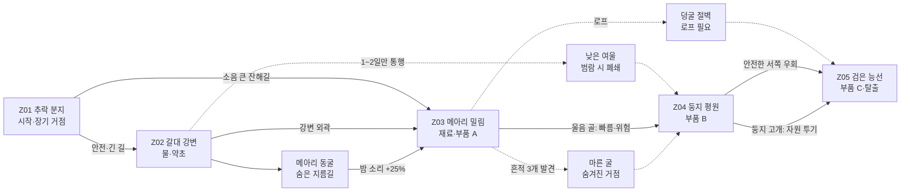
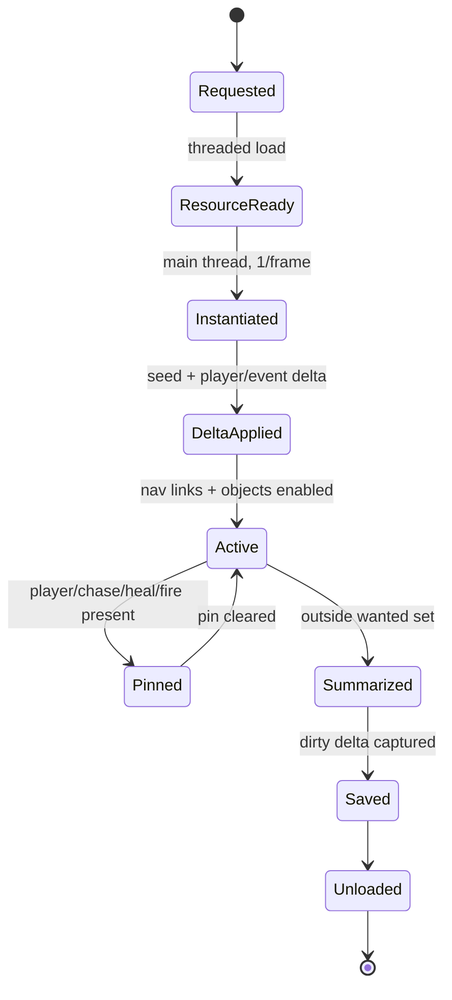
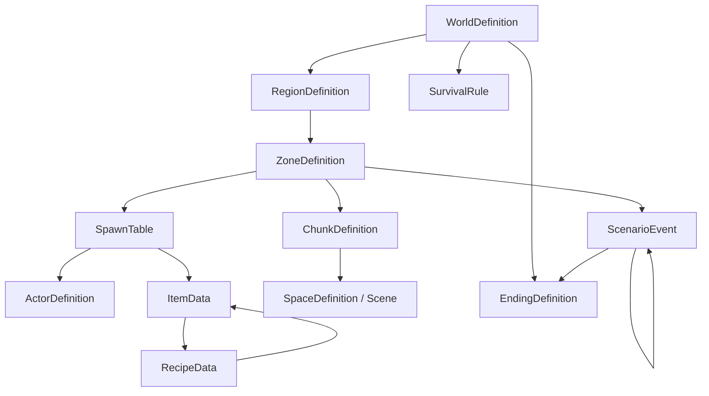

# PRIMAL NIGHT 정식 게임 기획서

- 문서 상태: 시나리오·월드·타일맵 통합 설계 기준안
- 작성 기준일: 2026-07-16
- 엔진: Godot 4.7 stable Standard, Compatibility 렌더러
- 플랫폼: Windows 10·11 x86_64 / Steam
- 화면: 2D 아이소메트릭, `TileMapLayer` 기반
- 개발 전제: 1인 개발, 총 24주 MVP, 싱글 및 검증된 2인 호스트 권한 협동 우선
- 기준 문서: `README.md`, `docs/superpowers/specs/2026-07-13-primal-night-design.md`, `docs/technical/` 전체, 현재 `scripts/`, `scenes/`, `data/` 구조

> 표기 규칙
>
> - **현재 구현**: 저장소의 코드·리소스·자동 검증으로 확인된 사실이다.
> - **설계 확정**: 이 문서에서 정식 게임 목표로 채택한 규칙이다.
> - **가정**: 입력되지 않은 값을 제작 범위에 맞춰 결정한 것이다.
> - **변경 제안**: 현재 구현과 다르거나 아직 없는 기능이다. 이유와 검증 조건을 함께 적는다.
> - **범위 위험 / 기술 위험**: 1인·24주 범위 또는 성능·네트워크 안정성을 위협하는 항목이다.

---

## 1. 입력 주제 요약 및 가정

### 1.1 입력 해석

| 구분 | 결정 |
|---|---|
| 필수 주제 | **원시의 밤** — 랩터가 지배하는 원시 세계에서 인간이 냄새·소리·빛을 관리하며 밤을 살아남는 생존 |
| 핵심 단어 | 원시 생태계, 랩터, 밤, 감각 정보, 바람, 피 냄새, 불, 추적, 협동 |
| 핵심 감정 | 낮의 불안한 준비 → 황혼의 시간 압박 → 짧고 밀도 높은 밤의 공포 → 새벽의 안도 |
| 핵심 공간 | 시간 균열로 서로 다른 중생대 생물이 모인 폐쇄형 화산 계곡 |
| 자연스러운 갈등 | 이동하면 소리가 나고, 다치면 냄새가 나며, 빛은 안전을 만들지만 위치와 자원 소비를 드러낸다 |
| 기술 수준 | 현대 조난자의 소진성 장비 + 현지 원시 재료 제작 |
| 생존의 의미 | 7일 차 화쇄류 전에 구조 신호기 부품을 모아 균열을 열고 살아서 귀환하는 것 |
| 핵심 판타지 | 공룡을 화력으로 정리하는 사냥꾼이 아니라, 바람과 흔적을 읽고 포식자의 결정을 역이용하는 생존자 |

흔한 해석은 “공룡을 쓰러뜨려 장비를 강화하는 액션 생존”이다. 본 설계의 독창적인 해석은 **플레이어의 감각 흔적이 월드에 남고, 랩터가 그 흔적을 조사하는 과정 자체가 전술 지형이 되는 생존 스릴러**다. 적의 체력보다 `어디에서 무엇을 남겼는가`가 더 중요하다.

### 1.2 입력되지 않은 값에 대한 가정

| 입력 | 가정 | 이유 |
|---|---|---|
| 추가 키워드 | 시간 균열, 화산 계곡, 7일 탈출, 제한된 현대 장비, 환경 서사 | 기존 정식 설계와 구현 목표를 유지한다 |
| 원하는 분위기 | 저채도 생태 스릴러, 과도한 고어 없이 압박감이 높은 밤 | 기존 시각·접근성 정책과 1인 제작 범위에 맞는다 |
| 시대·장소 | 현대 조난자들이 떨어진 가상의 중생대 혼합 계곡 | 인간과 비조류 공룡의 역사적 공존을 주장하지 않는다 |
| 제외 요소 | 좀비, 감염 사태, 공룡 길들이기·탑승, 자유 건축, 대규모 NPC 외교, PvP, 무한 절차 생성, 차량, 실시간 유체, 복잡한 다층 건물 | 기존 비목표와 일치하며 핵심 감각 루프를 보호한다 |
| 목표 플레이 시간 | 한 세션 70~90분, 첫 탈출까지 2~3시간(재도전 포함) | 10분짜리 7일 구조와 기존 60~120분 약속 사이의 제작 가능한 목표다 |
| 출시 협동 | 싱글 및 1~2인 우선, 2~4인은 정식 출시 이후 확장 가능성을 구조에 반영 | 현재 `max_clients = 1`이고 2인 E2E만 검증됐다 |

### 1.3 기존 구현 정합성 기준

| 영역 | 현재 구현 사실 | 이 문서의 처리 |
|---|---|---|
| 이동·소음 | 걷기 80px, 달리기 160px, 웅크리기 30px, 수풀 달리기 260px 반경의 `NoiseProfile`; 0.25초 발신 및 근접 반복 병합 | 그대로 기준점으로 사용하고 콘텐츠별 프로필만 추가한다 |
| 냄새 | 128px 셀, 4Hz, 활성 셀만 갱신, 바람 방향·세기에 따른 이류·감쇠, 출혈·날고기·미끼 원천, 권위 스냅샷 | 월드 청크보다 독립된 저해상도 감각 격자로 유지한다 |
| 랩터 | 감지 루프(sense loop): `WANDER → INVESTIGATE → CHASE → FLEE`, 0.2초 AI 틱, 소리 마지막 위치·냄새 경사·시야·불 회피 | 핵심 대표 AI로 유지한다. 무리 포위는 출시 후보다 먼저 넣지 않는다 |
| 부상·생존 | 체력, 출혈 지속 피해, 피 냄새, 붕대 지혈, 스태미나, 체온·수분·포만·피로 단계 | 수분·포만의 행동 효과와 부위 부상은 후속 설계로 분리한다 |
| 모닥불 | 지정 자리 설치, 돌 3+나무 2, 1초 설치, 반경 220px, 연료 60초, 랩터 회피, 호스트 권한 | 자유 건축으로 바꾸지 않는다. 장기 세션용 연료 보충만 변경 제안한다 |
| 네트워크 | ENet 로컬 어댑터, 호스트 권한 이동·아이템·피해·치료·모닥불·감각·재접속, 30초 아바타 잔류·120초 슬롯, 10Hz 스냅샷 | 싱글도 로컬 호스트 흐름을 사용한다. 3~4인은 별도 부하·동시성 관문 후 연다 |
| 세션 | 12분 회색 상자 `SessionClock`과 위험 노출 후 도착하는 `LoopObjective` | 정식 7일 세션의 검증된 최소 골격으로 재사용한다 |
| 타일 | 64×32 아이소메트릭 `TileMapLayer` 3개와 외부 `NavigationRegion2D` | 타일 크기·내비게이션 정책을 유지하고 레이어·청크만 확장한다 |

### 1.4 변경 제안 요약

1. **일반 빛 노출 모델 추가**: 현재 불은 랩터 회피 보호 반경만 제공한다. 횃불·조명탄·번개가 “보이기 쉬움”과 “겁주기”를 함께 만들도록 `LightSignature` 데이터가 필요하다. 이유는 주제의 세 감각 중 빛만 아직 일반화되지 않았기 때문이다.
2. **12분 시계를 7일×10분 세션으로 확장**: 기존 `SessionClock`의 호스트 권한·스냅샷 계약을 유지하고 날짜·낮/황혼/밤 구간을 데이터화한다.
3. **청크 스트리밍과 월드 델타 저장 추가**: 현재 테스트 월드는 한 장면이다. 타일맵 전체 저장 대신 시드+델타를 사용한다.
4. **2~4인 확장은 출시 1~2인과 분리**: `NetConfig.max_clients`, 로컬 PlayerId 핸드셰이크, 네 군집 청크 부하, 치료·획득 동시성 테스트를 통과한 뒤에만 4인을 노출한다. 현재 기능처럼 표시하면 안 된다.
5. **변경 제안 — 공룡·익룡 14종 로스터, 완전 AI는 최대 3유형**: 현재 구현은 회색깃 랩터 1종뿐이다. 24주 MVP는 같은 행동 코드를 쓰는 데이터 변형과 `Curve2D/AnimationPlayer` 사건 연출로 화면 등장 10종을 만들고, 자유 이동 완전 AI는 포식 조사형·청소형·영역 초식형 3유형 상한을 지킨다. 티라노·익룡의 전용 자유 이동 AI와 나머지 종은 범위 관문 또는 정식/확장으로 미룬다.
6. **제한 권총 3발은 6개월 MVP에서 연기**: 기존 정본의 현대 장비 후보지만 현재 전투·호스트 명중 판정이 없다. 조명탄·미끼가 같은 “비싸고 큰 감각 사건”을 더 적은 코드로 검증하므로, 핵심 루프와 저장이 완주된 뒤 정식 버전 후보로만 재평가한다.

---

## 2. 주제에서 도출한 위협 분석

### 2.1 위협 후보

| 위협 범주 | 후보 | 주제 적합성 | 채택 |
|---|---|---|---|
| 능동적 위협 | 랩터 무리, 소형 청소동물, 둥지를 지키는 각룡, 후반 최상위 포식자 | 냄새·소리·빛의 결과를 행동으로 보여준다 | 랩터 필수, 나머지는 단계 도입 |
| 환경적 위협 | 밤의 저온·시야 제한, 강우·범람, 화산재, 낙석, 화쇄류 마감 | 싸우지 않아도 이동·거점 판단을 만든다 | 필수 |
| 자원 위협 | 모닥불 연료, 깨끗한 물, 붕대, 현대 배터리, 신호기 부품, 남은 시간 | 빛과 치료를 무제한 안전장치로 만들지 않는다 | 필수 |
| 사회적 위협 | 동료 간 역할 충돌, 분리 이동, 공유 자원 기회비용 | PvP·배신 없이도 협동 긴장을 만든다 | 시스템적 기회비용만 채택 |
| 심리적 위협 | 보이지 않는 울음, 흔적의 오독, 밤의 제한 정보, 동료와 분리된 공포 | 직접 수치보다 플레이어의 판단 압박으로 작동한다 | 공포 수치 없이 연출로 채택 |

### 2.2 최종 위협 조합

최종 조합은 **랩터의 능동 추적 + 밤/날씨의 환경 압박 + 불·치료·시간의 자원 기회비용**이다. 사회적 위협은 인간 적대 세력으로 만들지 않고 “한 명을 구하러 되돌아갈 것인가, 부품을 지킬 것인가” 같은 협동 판단으로 대체한다. 심리 상태 게이지와 환각은 제외한다. 플레이어가 확인할 수 없는 가짜 단서를 만들어 불공정한 사망을 유발하기 때문이다.

감각 위협의 인과는 다음과 같다.

```text
행동 선택
├─ 빠른 이동 → 큰 소음 → 랩터가 마지막 들린 위치 조사
├─ 부상 방치 → 출혈/피 냄새 → 바람을 따라 냄새 띠 형성
├─ 날고기 운반 → 지속 냄새 → 귀환 경로가 추적 경로가 됨
└─ 불/횃불 사용 → 체온·시야·랩터 억제
                   └─ 연료 소비 + 멀리서 위치 노출(변경 제안)
```

모든 치명적 공격 전에는 발자국, 울음, 풀 움직임, 새 떼, 방향 자막, 경계 표식 가운데 최소 하나를 제공한다. 음소거 상태에서도 방향 아이콘과 화면 가장자리 신호로 대체한다.

---

## 3. 플레이어와 등장 캐릭터 후보

### 3.1 후보군

| 분류 | 후보 | 주제에 적합한 이유 | 최종 반영 |
|---|---|---|---|
| 플레이어 | 조난한 구조대원, 현장 생태 연구원, 음향 기사, 산악 가이드, 전기 정비사 | 같은 현대인이지만 감각 정보·치료·경로·신호기에서 다른 판단을 만든다 | 배경 5종으로 채택 |
| 동료·보호 대상 | 다른 플레이어, 부상한 조난자 기록, 회수 가능한 비상 위치 송신기 | 대규모 대화 AI 없이도 구조 동기를 만든다 | 실제 동료는 협동 플레이어, NPC 보호는 연기 |
| 중립 존재 | 소형 초식·잡식·청소 공룡, 이동하는 대형 초식 무리, 익룡 | 위험의 조기 신호이자 자원·경로를 바꾸는 생태 지표다 | **변경 제안:** 데이터 변형·사건 연출 우선, 완전 AI는 범위 관문 뒤 |
| 적대 존재 | 랩터, 둥지 방어 각룡, 티라노를 포함한 후반 최상위 포식자 | 서로 다른 감각과 대응을 요구한다 | 랩터만 현재, 티라노는 MVP 사건 연출·완전 AI는 확장 |
| 인간 집단 | 이전 탐사대, 구조 당국, 시간 균열 연구 조직 | 기록물과 신호의 출처가 될 수 있다 | 살아 있는 세력 AI가 아닌 환경 서사로만 사용 |
| 환경 상징 | 밤마다 밝아지는 균열 오로라, 재를 뒤집어쓴 흰 랩터 발자국 | 시간이 얼마 남지 않았는지 말 없이 전달한다 | 시각·음향 모티프로 채택 |

### 3.2 플레이어 배경 후보 5종

배경은 단순 수치 보너스가 아니라 **볼 수 있는 정보, 안전한 선택, 시작 경로**를 바꾼다. 현재 코드에는 배경 선택이 없으므로 모두 **변경 제안**이다.

| 배경 | 서사 | 초기 능력 | 장점 / 단점 | 시작 자원·위치 | 전용 사건과 플레이 방식 |
|---|---|---|---|---|---|
| 응급 구조대원 | 균열 사고 현장에 먼저 투입된 구조요원 | 출혈 단계와 치료 남은 시간을 정확히 읽음 | 붕대 효율이 좋지만 전자 장비 해석이 느림 | 붕대 2, 구급 파우치 / 추락지 | “남겨진 압박 붕대” 사건. 위험한 구조와 동료 부축 중심 |
| 현장 생태 연구원 | 생물 흔적을 조사하던 연구원 | 발자국·배설물로 최근 이동 방향과 먹이 상태 식별 | 생태 예측 우수, 무거운 운반 불리 | 표본 칼, 방수 노트 / 강변 가장자리 | “비정상 혼합종 기록” 사건. 관찰·우회 중심 |
| 음향 기록 기사 | 현장 소리를 수집하던 기사 | 최근 큰 소리의 종류와 감쇠 여부를 HUD로 구분 | 소리 미끼 제작 가능, 치료·등반 약함 | 녹음기 1회 충전, 이어보호구 / 추락지 동쪽 | “자기 목소리 재생” 사건. 소리 유인 중심 |
| 산악 가이드 | 탐사대 이동을 담당한 가이드 | 덩굴 절벽과 얕은 급류 지름길 사용 | 경로 선택 우수, 전자 보정 불가 | 로프, 접이식 칼 / 암벽 턱 | “무너지는 우회로” 사건. 빠른 정찰·운반 중심 |
| 전기 정비사 | 신호기와 계측 장비 담당 | 전자 부속으로 신호기 보정 1개를 재료 20% 적게 제작 | 최종 목표 효율 우수, 생태 단서 해석 제한 | 멀티툴, 배터리 / 부서진 계측 포드 | “불완전한 회로도” 사건. 부품 회수·탈출 준비 중심 |

### 3.3 공룡·익룡 로스터 14종

익룡은 분류학상 공룡이 아니지만, 사용자 요구의 “비행 원시 생물”로 같은 로스터에서 관리한다. **회색깃 랩터의 현재 구현을 제외한 아래 모든 종·변형·사건 연출은 변경 제안**이다. 역할은 공격 대상 수를 늘리는 데 있지 않고, 위협·중립·자원·신호를 서로 다른 실루엣과 감각 반응으로 읽게 하는 데 있다.

| ID / 종(모티프) | 범위·구현 방식 | 생태 역할 | 감각 프로필: 냄새·소음·시야 | 등장 Zone | 플레이어 상호작용 |
|---|---|---|---|---|---|
| D01 회색깃 랩터(데이노니쿠스형) | **현재 구현**, MVP 필수 / 포식 조사형 | 핵심 추적 위협 | 냄새 임계 8, 마지막 소리 위치, 시야 180/상실 280px, 불 회피 | Z01 외곽, Z02~Z05 | 바람·미끼·웅크림·모닥불로 조사 경로를 꺾는다 |
| D02 긴발톱 랩터(유타랍토르형) | **변경 제안**, 가능하면 포함 / D01 컨트롤러 | 느리고 무거운 단독 포식자 | 냄새 임계 10, 시야 160px, 큰 소리 우선, 불 회피 | Z04, Z05 | 정면전 불가; 좁은 길을 피하고 큰 미끼로 경로를 바꾼다 |
| D03 갈고리턱(콤프소그나투스형) | **변경 제안**, MVP 필수 / 청소형 | 소형 청소·자원 경쟁 | 음식 냄새 35 이상, 120px 소리, 시야 100px | Z01~Z04 | 바닥 음식 한 묶음을 훔친다; 쫓으면 경계음이 랩터를 부른다 |
| D04 알도둑부리(오비랍토르형) | **변경 제안**, MVP 데이터 변형 / 청소형 | 잡식·둥지 신호 | 알·고기 냄새, 160px 큰 소리, 시야 140px | Z03, Z04 | 반짝이는 재료를 둥지로 옮겨 희귀 캐시와 위험을 함께 만든다 |
| D05 잎꼬리달림이(힙실로포돈형) | **변경 제안**, MVP 데이터 변형 / 영역 초식형 `FLEE` | 소형 초식·조기 경보 | 냄새 추적 없음, 140px 소리 회피, 전방 시야 170px | Z01~Z03 | 무리가 달아나는 방향으로 포식자 접근을 읽고, 지나간 자리에 섬유를 찾는다 |
| D06 방패뿔(프로토케라톱스형) | **변경 제안**, 가능하면 포함 / 영역 초식형 `CHARGE` | 둥지 방어·조건부 위협 | 둥지 반경, 180px 큰 소리, 전방 시야 150px | Z02, Z04 | 땅 긁기→콧김→돌진을 보고 비키거나 랩터와 충돌시킨다 |
| D07 긴볏나팔(파라사우롤로푸스형) | **변경 제안**, MVP 필수 / 경로 사건 | 무리 이동·음향 신호 | 플레이어 추적 없음, 위험 플래그에 500px 경계음 | Z02, Z04 | 울음 방향으로 날씨·티라노 접근을 예측하고 무리가 연 길을 이용한다 |
| D08 하늘돛(프테라노돈형 익룡) | **변경 제안**, MVP 필수 / 상공 `Curve2D` 사건 | 비행·방향 신호 | 냄새 소비 없음, 300px 큰 소리·강한 빛에 이륙 | Z02~Z05 상공 | 그림자와 비행 방향이 사체·폭풍·안전 능선을 알린다; 전투 판정 없음 |
| D09 이빨날개(디모르포돈형 익룡) | **변경 제안**, MVP 데이터 변형 / 군집 사건 | 소형 비행 청소·사체 신호 | 사체 냄새 셀 55 이상에서 사건 확률 증가, 짧은 시야 연출 | Z01~Z04 상공 | 무리가 선회하면 신선한 사체가 있다는 뜻이며, 큰 소리로 흩을 수 있다 |
| D10 긴목거인(브라키오사우루스형) | **변경 제안**, MVP 필수 / 원경 경로 사건 | 중립·지형 규모 신호 | 감각 AI 없음, 저주파 발소리·화면 진동만 생성 | Z03, Z04 원경 | 접근 불가 원경 실루엣이 안전한 낮·대이동 방향을 알리고 나뭇잎 자원 군집을 남긴다 |
| D11 재왕 티라노(티라노사우루스형) | **변경 제안**, MVP 필수는 2개 통로 사건 / 완전 AI는 확장 | 최상위 포식 위협 | 6~7일 또는 사체 냄새 hotspot 80 이상, 600px 저주파 사전 신호 | Z04, Z05 | 예고된 통로를 가로질러 공룡·경로를 재편한다; 처치 불가, 자유 추적 없음 |
| D12 돌등(안킬로사우루스형) | **변경 제안**, MVP 경로 사건 / 완전 AI는 정식 | 대형 초식·길 개방 | 감각 AI 없음, 큰 소리·지면 진동·무리 패닉 연출 | Z03, Z04 | 예약 경로에서 장애물을 부수지만 자원 지점을 짓밟는다 |
| D13 칼등(스테고사우루스형) | **변경 제안**, 정식 버전 / 영역 초식형 변형 | 중립·공간 차단 | 후방 접근 시 꼬리 경고, 180px 발소리 반응 | Z03, Z04 | 꼬리 경고 범위를 피해 기다리거나 랩터 접근을 막는 이동 장벽으로 쓴다 |
| D14 물갈고리(바리오닉스형) | **변경 제안**, 확장 / 수변 포식형 | 물가 최상위·자원 차단 | 물고기·피 냄새, 물보라 소리, 좁은 전방 시야 | Z02 범람 수로 | 물가 해체·채집 시간을 제한한다; 전용 수변 길찾기 없이는 출시하지 않는다 |

**24주 수량 규율:** D01, D03~D05, D07~D12의 **화면 등장 10종**을 목표로 한다. 이 가운데 자유 이동 완전 AI는 D01의 포식 조사형, D03/D04의 청소형, D05의 영역 초식형까지 최대 3유형이고, D07~D12는 정해진 경로·타임라인·감각 단서만 가진 사건 연출이다. D02·D06은 범위 관문을 통과했을 때만, D11/D12의 자유 이동 완전 AI와 D13/D14는 정식/확장에만 넣는다.

---

## 4. 콘셉트 후보 5개와 평가표

### 4.1 후보 A — 《PRIMAL NIGHT: 균열 계곡》

- 한 문장 소개: 7일 뒤 화쇄류가 덮치는 시간 균열 계곡에서 감각 흔적을 관리해 신호기 부품을 모으고 탈출한다.
- 시대·장소: 현대인이 떨어진 가상의 중생대 혼합 화산 계곡.
- 플레이어: 1~2인의 조난자, 향후 2~4인 구조를 고려.
- 주요 대상: 랩터, 청소동물, 초식 무리, 후반 최상위 포식자, 시간 균열.
- 핵심 생존 문제: 밤마다 강해지는 포식 압력과 소진되는 불·치료 자원.
- 주요 위협: 바람을 타는 피 냄새, 행동 소음, 시야 제한, 최종 화쇄류.
- 단기/장기 목표: 물·불 확보 / 부품 3개 회수 후 능선 신호기 가동.
- 탐색 이유: 부품은 서로 다른 위험 규칙을 가진 세 지역에 고정되고, 자원 배치는 시드로 변한다.
- 대표 시스템: 냄새 격자+바람, 소리 마지막 위치 조사, 불의 양면성.
- 방송 돌발 상황: 피 묻은 고기를 든 동료가 모닥불로 달려와 랩터를 함께 데려온다.
- 타일맵 적합성: 지형 병목·수풀·동굴·둥지의 상태를 타일/오브젝트 델타로 표현하기 좋다.
- 1인 난이도: 중. 현재 핵심 감각 루프와 2인 권한 골격이 이미 검증됐다.
- 기술 위험: 청크 스트리밍, 다종 AI, 7일 저장, 빛 노출 일반화.

### 4.2 후보 B — 《불씨 행렬》

- 한 문장 소개: 고정 거점 없이 매일 밤 이동식 불씨를 다음 피난처까지 운반하는 원시 로드 생존.
- 시대·장소: 시간 균열로 끊긴 긴 협곡 회랑.
- 플레이어/대상: 운반대 조난자, 랩터 무리, 길을 막는 초식 무리.
- 생존 문제/위협: 불씨가 꺼지면 체온과 랩터 억제를 동시에 잃고, 너무 밝으면 추적당한다.
- 단기/장기 목표: 다음 바람막이 도착 / 5개 야영지를 통과해 균열문 도달.
- 탐색 이유: 연료와 우회로를 찾지 못하면 야간 이동이 불가능하다.
- 대표 시스템: 들고 이동하는 불씨의 광량·연료·냄새 상호작용.
- 방송 상황: 한 명이 넘어져 불씨를 떨어뜨리고 다른 한 명이 미끼로 무리를 돌린다.
- 타일맵 적합성: 선형 청크 스트리밍은 쉽지만 반복 플레이 경로 다양성이 제한된다.
- 1인 난이도/위험: 중상. 이동식 광원과 동행 경로, 매일 새 구간 제작량이 크다.

### 4.3 후보 C — 《둥지의 신호》

- 한 문장 소개: 구조 송신기가 랩터 번식지 한가운데 추락해, 알을 건드리지 않고 부품을 회수해야 한다.
- 시대·장소: 밤이 긴 고위도 원시 분지.
- 플레이어/대상: 기술자 조난자, 둥지 랩터, 알을 노리는 청소동물.
- 생존 문제/위협: 플레이어뿐 아니라 청소동물이 일으킨 경보까지 관리해야 한다.
- 단기/장기 목표: 둥지 경계 관찰 / 세 둥지에서 송신기 조각 회수.
- 탐색 이유: 둥지마다 바람·경계 순찰·먹이 시간이 달라 안전 창을 찾아야 한다.
- 대표 시스템: 둥지 경계도와 생태 경보 연쇄.
- 방송 상황: 던진 미끼를 청소동물이 다른 둥지로 끌고 가 무리 간 충돌이 난다.
- 타일맵 적합성: 구역별 퍼즐에는 좋지만 장기 생존 월드 확장성이 낮다.
- 1인 난이도/위험: 상. 둥지 집단 AI와 알/청소동물 상호작용이 현재 범위를 넘는다.

### 4.4 후보 D — 《바람 없는 습지》

- 한 문장 소개: 냄새가 빠져나가지 않는 침수 습지에서 물길을 열어 냄새 띠를 재배치하며 탈출한다.
- 시대·장소: 화산재가 내려앉은 원시 삼각주.
- 플레이어/대상: 표류자, 수변 랩터, 대형 양서 생물, 범람.
- 생존 문제/위협: 바람 대신 수류가 냄새를 운반하고, 소음이 물 위로 멀리 전달된다.
- 단기/장기 목표: 마른 섬 확보 / 수문성 암반 세 곳을 열어 탈출 수로 생성.
- 탐색 이유: 수위·수로·갈대 밀도가 매 판 다르다.
- 대표 시스템: 타일 상태 기반 수위·냄새 흐름.
- 방송 상황: 안전한 섬에 피 냄새가 고여 랩터가 물길 양쪽에서 접근한다.
- 타일맵 적합성: 매우 높음. 그러나 실시간 유체처럼 보이지 않도록 단계형 타일이어야 한다.
- 1인 난이도/위험: 중. 냄새 격자 재사용 가능하지만 수위 규칙과 콘텐츠가 새로 필요하다.

### 4.5 후보 E — 《메아리 야영지》

- 한 문장 소개: 시간 균열이 과거 플레이의 소리와 빛을 재생하는 계곡에서 자기 흔적까지 피하며 구조 신호를 맞춘다.
- 시대·장소: 시간이 겹치는 원시 계곡.
- 플레이어/대상: 조난자, 랩터, 이전 루프의 “감각 잔향”.
- 생존 문제/위협: 지난 시도의 소음과 불빛이 현재 AI를 오도하거나 플레이어를 함정에 빠뜨린다.
- 단기/장기 목표: 잔향 패턴 기록 / 세 시간 고리를 동기화해 귀환.
- 탐색 이유: 잔향 발생 지점과 시간이 시드마다 달라진다.
- 대표 시스템: 이전 세션 이벤트 리플레이를 월드 감각 이벤트로 재사용.
- 방송 상황: 과거의 성공적인 미끼가 현재에는 동료를 향해 랩터를 끌어온다.
- 타일맵 적합성: 위치·시간 로그와 잘 맞지만 읽기 어려운 규칙이 된다.
- 1인 난이도/위험: 상. 결정적 리플레이, 저장 용량, 공정한 신호 전달이 어렵다.

### 4.6 평가

| 콘셉트 | 독창성 20 | 주제 15 | 생존 재미 15 | 반복 15 | 방송 10 | 타일맵 10 | 1인 가능 15 | 총점 |
|---|---:|---:|---:|---:|---:|---:|---:|---:|
| A. 균열 계곡 | 18 | 15 | 14 | 14 | 9 | 10 | 14 | **94** |
| B. 불씨 행렬 | 17 | 14 | 13 | 12 | 9 | 9 | 11 | 85 |
| C. 둥지의 신호 | 19 | 13 | 13 | 12 | 9 | 9 | 8 | 83 |
| D. 바람 없는 습지 | 18 | 13 | 12 | 13 | 8 | 10 | 13 | 87 |
| E. 메아리 야영지 | 20 | 12 | 10 | 14 | 10 | 8 | 8 | 82 |

**선정: A. 《PRIMAL NIGHT: 균열 계곡》.** 최고점이라는 이유만이 아니라, 현재 소리·냄새·바람·랩터·모닥불·출혈·2인 권한 루프를 버리지 않고 정식 콘텐츠로 확장할 수 있기 때문이다. D의 수류 아이디어는 강변의 희귀 사건으로 축소해 활용하고, E의 시간 잔향은 기록물 음향 연출로만 사용한다.

---

## 5. 선정된 최종 게임 시나리오

### 5.1 제목 후보와 기본 설정

제목 후보 10개는 다음과 같다.

1. **PRIMAL NIGHT** — 최종 작업명. 짧고 핵심 주제를 직접 전달한다.
2. Scent of the Rift / 균열의 냄새
3. Seven Nights Below / 계곡 아래 일곱 밤
4. Downwind / 풍하
5. Ash Before Dawn / 새벽 전의 재
6. Raptor Wind / 랩터의 바람
7. The Last Fireline / 마지막 불의 선
8. Valley of Listening / 듣는 계곡
9. Blood on the Wind / 바람 위의 피
10. Signal at Black Ridge / 검은 능선의 신호

| 항목 | 최종안 |
|---|---|
| 핵심 로그라인 | 시간 균열에 추락한 현대 조난자들이 7일 동안 소리·냄새·빛을 관리하고, 화산 폭발 전에 구조 신호기를 완성해 랩터의 계곡을 탈출한다. |
| 플레이어 판타지 | 보이지 않는 포식자의 결정을 읽고, 자신의 흔적을 미끼·우회·불로 바꾸는 생존 전문가 |
| 장르 | 2D 아이소메트릭 세션형 생존 스릴러 / 은신·탐색·협동 |
| 분위기 | 저채도 자연색, 고요한 낮, 소리로 먼저 다가오는 밤, 불 주변의 짧은 안도 |
| 아트 | 64×32 픽셀 아이소메트릭 타일, 8방향 캐릭터·공룡, 제한 팔레트, 형태 중심 위험 신호 |
| 사건 전 | 현대의 지질·생태 합동 구조팀이 반복되는 전자기 이상과 실종 신호를 조사한다. |
| 시작 원인 | 계곡의 균열이 구조 헬기·장비 일부를 서로 다른 시간층으로 찢어 떨어뜨린다. |
| 시작 시점 | 첫날 황혼 3분 전. 플레이어는 추락 흔적에서 깨어나고 밤 전에 물·불을 마련해야 한다. |
| 행동 이유 | 7일 뒤 화산 분화와 함께 균열이 닫힌다. 능선 신호기만 귀환 창을 안정화할 수 있다. |

### 5.2 세계관의 핵심 규칙

1. 인간과 공룡은 역사적으로 공존하지 않았다. 계곡은 시간 균열이 여러 시대의 생물을 모은 비정상 생태계다.
2. 랩터는 플레이어 위치를 전지적으로 알지 못한다. 시야, 마지막 소리 위치, 현재 셀의 냄새 경사만 사용한다.
3. 냄새는 바람을 따라 이동하고 약해진다. 출혈·날고기·미끼가 같은 계열의 위험을 만들지만 강도와 용도는 다르다.
4. 불은 랩터를 밀어내고 체온을 회복하지만 연료가 필요하다. **변경 제안**인 일반 빛 노출은 불의 안전을 무효화하지 않고 다른 개체의 시각 조사 확률만 높인다.
5. 대형 포식자는 일반 무기로 정면 처치하지 못한다. 전투는 탈출 시간을 버는 수단이다.
6. 월드의 지형 골격은 학습 가능하게 고정한다. 자원·둥지·길막·날씨·사건 조합은 시드로 달라진다.
7. 시간·AI·피해·아이템·감각·승패는 호스트가 확정한다. 싱글플레이도 로컬 호스트인 같은 규칙을 쓴다.

게임 내에서 절대로 변하지 않는 규칙은 “감지에는 원인이 있고, 치명적 위협에는 사전 신호가 있으며, 핵심 부품 3개 없이는 탈출할 수 없다”다. 플레이어가 점차 발견하는 비밀은 균열이 자연재해가 아니라 이전 구조팀이 잘못 증폭한 공명 신호로 커졌고, 신호기를 탈출용으로 쓸지 안정화용으로 쓸지 선택할 수 있다는 사실이다.

### 5.3 목표 구조

| 기간 | 목표 | 실패 시 의미 |
|---|---|---|
| 단기: 1일 | 물, 불, 붕대, 첫 바람막이 확보 | 첫 밤의 감각 규칙을 값싸게 학습한다 |
| 중기: 2~5일 | 강변·밀림·둥지 평원에서 신호기 부품 3개와 선택 보정 재료 회수 | 자원 손실·우회로 폐쇄·부상으로 다음 날 계획이 바뀐다 |
| 장기: 6~7일 | 화산 능선 도달, 신호기 가동, 90초 충전 후 균열 진입 | 8분 가동 마감과 10분 붕괴 마감 사이에서 엔딩이 갈린다 |

기존 생존 게임과 다른 점은 허기 수치를 오래 채우는 노동보다 **감각 흔적의 생성·전파·오독이 사건을 만든다는 것**, 그리고 무한 정착이 아니라 매 세션 명확한 7일 결말이 있다는 것이다.

### 5.4 주요 등장 대상

| 명칭·유형 | 외형·세계 역할 | 목적과 평상시 행동 | 위협 시 행동·관찰 신호 | 상호작용과 게임플레이 변화 |
|---|---|---|---|---|
| 회색깃 랩터 / 무리 포식자 | 재가 붙은 깃털, 낮은 실루엣. 핵심 감각 AI | 영역 배회, 소리·냄새 조사, 먹이 흔적 확인 | 추격 전 몸을 낮추고 짧은 울음·풀 흔들림·경계 아이콘. 불 안의 전원이 보이면 후퇴 | 미끼·바람·수풀·불로 유도. 현재 구현의 대표 위협 |
| 갈고리턱 청소동물 / 소형 중립-경쟁자 | 까마귀 크기의 민첩한 소형 공룡 | 날고기·시체·버려진 가방을 훔쳐 둥지로 운반 | 몰리면 큰 경계음을 내 랩터를 부르고 도주 | 죽이기보다 쫓거나 먹이를 포기. 자원과 냄새 위치를 재배치 |
| 방패뿔 / 중형 초식동물 | 짧은 목깃과 밝은 경계 반점 | 물과 먹이를 오가며 둥지를 지킴 | 땅 긁기→콧김→직선 돌진의 3단 신호 | 이동 시간을 기다리거나 랩터와 충돌시키는 환경 도구 |
| 돌등 무리 / 대형 초식동물 | 이끼 낀 등과 무거운 발걸음 | 4일 차 계곡 횡단, 길을 만들고 일부 장애물 파괴 | 무리 패닉 시 직선 이동, 화면 진동·새 떼 선행 | 닫힌 길을 열지만 자원 지점을 짓밟는다. 정식 버전 기능 |
| 재왕 / 최상위 포식자 | 화산재 속에서 등선만 보이는 대형 수각류 | 후반에 다른 공룡을 사냥하며 계곡을 횡단 | 멀리서 저주파 울음, 작은 공룡 도주, 지면 진동 | 처치 불가. MVP는 예약 통로 사건, 정식 완전 AI도 동시 1마리 상한 |
| 균열 오로라 / 환경 존재 | 밤하늘의 청록 균열과 반복 펄스 | 날짜가 갈수록 강해져 시간·방향 단서를 제공 | 전자 장비 교란, 순간적인 빛 노출, 화산재 낙하 | 신호기 보정·기록물 해독·엔딩 분기. 전투 대상이 아니다 |

플레이어와의 관계는 회색깃 랩터·재왕이 회피해야 할 포식자, 갈고리턱이 자원을 두고 경쟁하는 중립 개체, 방패뿔·돌등이 침범하거나 진로를 막을 때만 위험한 조건부 중립, 균열 오로라가 관찰·이용해야 할 환경 현상이다. 어떤 개체도 단지 플레이어를 공격하기 위해 대기하지 않는다.

이 표는 이야기의 대표 대상만 요약한다. 공룡 12종과 익룡 2종의 전체 역할·감각·Zone·범위는 §3.3을 정본으로 사용한다.

### 5.5 세력과 공동체

MVP에는 살아 있는 인간 세력과 외교 시스템을 두지 않는다. 1인 개발에서 대화·관계·스케줄·전투까지 얹으면 감각 생존의 완성도가 무너진다. 갈등은 다음으로 대체한다.

- 협동 플레이어 사이의 자원·경로·구조 기회비용
- 이전 탐사대 “파동 관측반”, 구조대 “청색 표식팀”의 기록과 흔적
- 공룡 종 사이의 먹이·둥지·이동 충돌
- 구조 당국의 단방향 무전과 제한된 구조 창

이전 탐사대는 활성 세력이 아니라 환경 서사의 출처다. 동맹·배신 수치나 NPC 평판을 만들지 않는다.

### 5.6 스토리 전달

| 전달 수단 | 예시 | 구현 방식 |
|---|---|---|
| 환경 변화 | 날짜가 지날수록 균열 빛과 화산재, 강 수위가 증가 | 타임라인 이벤트가 타일·날씨 델타를 적용 |
| 배치 | 불이 꺼진 야영지 바깥에 피 묻은 발자국이 풍하로 이어짐 | 공간 변형 프리셋 |
| 기록물 | 방수 노트, 망가진 음성 기록기, 회로도 조각 | 짧은 텍스트·음향, 대화 트리 없음 |
| 통신 | 하루 한 번 잡히는 구조대 단방향 송신 | 시간 고정 이벤트+자막 |
| 흔적 | 먹다 남은 사체, 부러진 수풀, 배설물, 둥지 재료 | 스폰 태그와 최근성 단계 |
| 음향 | 멀리서 겹치는 랩터 울음, 무리 이동의 저주파 | 방향 자막과 화면 가장자리 표시 병행 |
| 반복 현상 | 밤 1분 시점마다 균열 펄스가 전자 장비를 순간 켬 | 날짜별 강도 변화 |
| 발견 장면 | 폐쇄된 동굴 안에서 이전 신호기 테스트 흔적 발견 | 고정 공간+조건부 변형 |
| 월드 반응 | 모닥불을 많이 쓰면 주변 연료 고갈, 같은 경로의 수풀 흔적 증가 | 자원·통행 델타 저장 |

### 5.7 엔딩

기존 정본 설계의 출시 판정은 `전원 탈출 / 부분 탈출 / 전멸·시간 초과` 3종이다. 현재 구현된 `LoopObjective`는 아직 회색 상자 `성공 / 실패`만 판정한다. 아래 6개는 출시의 세 기반 판정에 시나리오 플래그를 조합하는 **변경 제안**이다. 별도 거대 컷신이 아니라 결과 화면·월드 플래그 차이로 제작한다.

| 엔딩 | 기반 판정 | 발생 조건·필요 선택 | 사전 단서 | 월드 결과 |
|---|---|---|---|---|
| 새벽 귀환 | 전원 탈출 | 부품 3개, 기본 신호, 전원 균열 진입 | 구조대 주파수와 8분 가동 마감 | 생존자는 귀환, 계곡 균열은 남음 |
| 조용한 귀환 | 전원 탈출 | 전자 보정 2개로 충전 소음 30% 감소, 아무도 사망하지 않음 | 저소음 회로도 조각 | 랩터 대이동 없이 균열이 닫혀 최고 평가 |
| 기록을 든 귀환 | 전원/부분 탈출 | 비밀 기록 4개와 공명 원인 데이터를 휴대 | 탐사대 노트의 번호 누락 | 귀환 후 사건 원인이 공개되고 후속 난이도 정보 해금 |
| 한 사람의 불 | 부분 탈출 | 한 명이 능선 미끼/불을 유지하고 다른 인원이 탈출 | “충전 중 유인자가 필요하다”는 이전 실패 기록 | 희생자는 잔류·사망, 탈출자는 생존. 협동 전용 |
| 균열 봉합 | 전원 또는 부분 탈출 | 신호기를 귀환이 아니라 안정화에 사용하고 45초 내 자연 균열까지 이동 | 공명 역위상 회로도 | 계곡 균열이 닫혀 생태 확산 방지; 이동 실패자는 잔류 |
| 재 속의 밤 | 전멸·시간 초과 | 아무도 10분 마감 전에 진입하지 못함 | 화산 진동·재 낙하·이중 타이머 | 계곡이 화쇄류에 덮이고 위험 연쇄 요약 표시 |

---

## 6. 핵심 게임 루프

### 6.1 전체 흐름

```text
상태·바람·시간 확인
→ 오늘의 부품/자원 목표와 귀환 시각 선택
→ 냄새 나는 물자·치료·불·미끼 준비
→ 안전 구역 이탈
→ 흔적 관찰·탐색·자원 확보
→ 날씨/동물/경로 사건 발생
→ 웅크림·도주·미끼·불·우회·자원 포기 중 선택
→ 거점 또는 다음 바람막이 도착
→ 지혈·건조·연료 보충·신호기 정비
→ 이동한 공룡·고갈된 자원·열린 길 확인
→ 더 위험한 다음 목표 선택
```

### 6.2 시간 규모별 루프

| 규모 | 플레이어 행동 | 소비 | 보상 | 실패 위험·긴장 | 반복 시 변화 | 연결 시스템 |
|---|---|---|---|---|---|---|
| 1분 | 바람 확인, 1~2개 자원 줍기, 소리 신호에 멈춤, 수풀·바위 사이 이동 | 스태미나, 짧은 시간, 소량 소음 | 작은 자원, 안전 경로 한 칸, 새 흔적 | 성급한 달리기·채집 소리가 조사 유발 | 바람·근처 랩터 상태·가시 흔적 | 소음, 냄새, 스태미나, AI, HUD |
| 10분 | 한 게임 내 하루: 거점 출발→공간 하나 탐색→황혼 전 귀환 또는 야간 강행 | 물·포만·불 연료·붕대·현대 장비 | 신호기 부품/도구 재료/영구 지름길 | 밤, 비, 부상, 귀환로에 형성된 냄새 띠 | 날씨, 둥지, 길막, 자원, 사건 조합 | 시간, 월드 델타, 제작, 이벤트 |
| 1시간 | 5~6일을 버티며 세 부품과 보정 재료를 모아 능선 진입 | 대부분의 현대 장비, 거점 자원, 경로 선택 기회 | 탈출 가능성, 엔딩 단서, 숙련 지식 | 누적 자원 고갈·무리 이동·화산재·동료 사망 | 시드, 시작 배경, 부품 위치 변형, 사건 연쇄 | 세이브, 난이도, 엔딩, 협동 |

### 6.3 단계별 경제

| 단계 | 행동 | 소비 | 즉시 보상 | 실패 시 남는 결과 |
|---|---|---|---|---|
| 관찰 | 바람·발자국·울음·빛 확인 | 시간 | 위험 방향 정보 | 밤/날씨가 악화 |
| 준비 | 냄새 물자 분리, 붕대·미끼·불 선택 | 인벤토리 칸·무게 | 대응 선택지 | 다른 도구를 포기 |
| 이동 | 걷기·웅크림·달리기·지름길 | 시간·스태미나·소음 | 거리·새 공간 | 흔적과 피로 누적 |
| 확보 | 채집·회수·분해 | 소음·노출 시간 | 자원·부품·기록 | 랩터 조사 또는 경로 차단 |
| 위기 대응 | 미끼·불·우회·자원 투기·구조 | 소모품·경로·체력 | 생존과 시간 확보 | 아이템/시체/불이 월드에 남음 |
| 귀환·정비 | 지혈·건조·제작·신호기 조립 | 거점 자원·낮 시간 | 다음 밤 안전도 | 연료 고갈·거점 냄새 축적 |

### 6.4 보상 주기

- 0~3분: 눈에 보이는 자원 1개 또는 바람·흔적 튜토리얼 정보.
- 3~5분: 작은 공간 하나, 안전한 우회로, 제작 재료 묶음 가운데 하나.
- 5~10분: 부품 진행, 영구 지름길, 희귀 사건, 배경 전용 정보 가운데 하나.
- 10분마다: 날짜 전환과 월드 상태 변화가 다음 계획을 강제로 갱신한다.
- 실패해도 사망 연쇄 요약과 발견한 생태 정보가 플레이어 지식으로 남는다. 영구 능력치 성장으로 난이도를 무너뜨리지는 않는다.

---

## 7. 월드 지역 정의표

### 7.1 단일 Region: 균열 계곡

| Zone | 공간 유형 | 기능 역할 | 주요 자원 | 능동적 위협 | 환경 위험 | 스토리 역할 | 재방문 이유 |
|---|---|---|---|---|---|---|---|
| Z01 추락 분지 | 파손 장비·현무암 웅덩이 | 시작, 튜토리얼, 초기 안전 구역 | 붕대, 현대 장비, 마른 나무 | 첫날에는 청소동물, 밤부터 랩터 외곽 순찰 | 잔해 낙하, 노출된 평지 | 추락 원인과 첫 구조 송신 | 거점·신호기 조립대·보관 |
| Z02 갈대 강변 | 얕은 강·습지·모래톱 | 물·약초·회복 자원 | 물, 갈대 섬유, 약초, 점토 | 수변 랩터, 둥지 각룡 외곽 | 3일 차 범람, 젖음·저체온 | 이전 탐사대의 첫 야영지 | 물 재보급, 범람 후 열린 수로 |
| Z03 메아리 밀림 | 밀집 수풀·거목·동굴 | 도구 재료·정보·은신 학습 | 목재, 수지, 섬유, 날고기 | 랩터 핵심 영역, 청소동물 | 시야 제한, 큰 수풀 소음, 낙목 | 공명 실험 기록과 부품 A | 풍부한 재료, 동굴 지름길 |
| Z04 둥지 평원 | 초지·둥지 고리·마른 수로 | 고위험·고보상, 부품 B | 뼈, 질긴 가죽, 전자 포드 | 방패뿔, 랩터 사냥조, 무리 이동 | 엄폐 부족, 4일 차 대이동 | 서로 다른 시대 생물이 모인 증거 | 희귀 재료, 무리가 연 새 길 |
| Z05 검은 능선 | 화산 사면·용암동굴·신호대 | 최종 목표, 부품 C, 탈출 | 흑요석, 전자 부속, 조명탄 | 재왕 통로 사건 1회, 후반 랩터 | 화산재, 낙석, 저온, 7일 화쇄류 | 균열 원인과 엔딩 선택 | 신호기 보정·최종 탈출 |

### 7.2 동선 규칙

- 안전하지만 긴 경로: 추락 분지→강변 외곽→밀림 남쪽→평원 우회→능선 서쪽. 모닥불 지정 자리 4개, 이동 12~15분.
- 빠르지만 위험한 경로: 밀림 중심 “울음 골”을 지나 평원 둥지 사이로 통과. 이동 6~8분, 랩터·둥지 위험이 겹친다.
- 조건 차단: 3일 차 강 범람은 낮은 여울을 닫고 북쪽 통나무길을 연다.
- 도구 해제: 로프는 밀림 절벽 지름길, 돌칼은 덩굴문, 해독 기록은 능선 공명문을 연다.
- 지형 지름길: 메아리 동굴은 밀림과 강변을 잇지만 밤에는 울림 때문에 소리 유효 반경이 25% 커진다.
- 시간대 변화: 낮의 평원은 초식 무리 위험, 밤의 밀림은 랩터 위험이 높다.
- 날씨 변화: 비는 발소리 반경을 일부 가리지만 체온을 낮추고 냄새 감쇠를 빠르게 한다. 이 수치는 이벤트 데이터로 조정한다.
- 대가 통과: 둥지 고개에서는 날고기/미끼를 반대편에 버리거나, 돌길을 달려 큰 소리를 감수해야 한다.
- 숨겨진 거점: 바람이 항상 계곡 밖으로 부는 “마른 굴”. 세 개의 긁힌 표식과 새 떼 방향으로 발견한다.

---

## 8. Mermaid 월드 연결 구조



경로 화살표는 공간 연결만 뜻한다. 런타임 통행 가능 여부는 `WorldDelta`의 `route_state`와 날짜·날씨 플래그가 결정한다.

---

## 9. 타일맵 레이어 정의표

### 9.1 목표 Scene 구성

현재 `test_world.tscn`의 `Ground / Collision / Occlusion` 3개 `TileMapLayer`와 외부 `NavigationRegion2D`를 확장한다. 모든 것을 타일로 만들지 않는다. 아이템·문·모닥불·공룡처럼 식별자와 독립 상태가 필요한 대상은 Scene 오브젝트다.

| 순서 | 레이어 / 노드 | 담당 | Y-Sort | 충돌 | Navigation | 런타임 변경 | 저장 상태 | 청크 로딩 |
|---:|---|---|---|---|---|---|---|---|
| 0 | `BaseTerrainLayer` | 흙, 풀, 모래, 암반, 얕은 물 바닥 | 아니오 | 아니오 | 소스만 제공 | 제한 | 변경 타일만 | 청크 원본 즉시 적용 |
| 1 | `TerrainDetailLayer` | 잎, 자갈, 균열, 물결 장식 | 아니오 | 아니오 | 아니오 | 예 | 희귀 영구 흔적만 | 시드 장식 배치, 대부분 저장 안 함 |
| 2 | `RouteLayer` | 오솔길, 마른 수로, 다리 바닥, 동굴 바닥 | 아니오 | 아니오 | 가능 영역 표시 | 예 | 열린/닫힌 경로 | 경로 상태 델타 후 적용 |
| 3 | `HazardStateLayer` | 진흙, 범람, 화산재, 불탄 지면 | 아니오 | 일부 감속 영역 | 비용만 영향 | 예 | 좌표+상태+만료일 | 환경 이벤트 델타 적용 |
| 4 | `LowerStructureLayer` | 절벽 하단, 잔해 바닥, 낮은 벽 | 예 | 예 | 차단 경계 | 예 | 파괴·개방 타일 | 베이스 후 델타 |
| 5 | `BackPropLayer` | 캐릭터 뒤에 보일 나무·바위 하단 | 예 | 선택 | 정적 차단 | 일부 | 파괴·채집 여부 | 오브젝트 스폰 전 배치 |
| 6 | `EntranceMarkerLayer` | 동굴 입구, 덩굴문, 여울 연결 표식 | 아니오 | 아니오 | 링크 메타데이터 | 예 | 잠금·통행 상태 | 표식을 Scene 오브젝트로 변환 후 숨김 |
| 7 | `FrontPropLayer` | 캐릭터 앞을 가리는 수풀·바위 상단 | 예 | 선택 | 아니오 | 일부 | 파괴·채집 여부 | Y-Sort 루트에 등록 |
| 8 | `CanopyOcclusionLayer` | 나뭇가지, 동굴 천장, 잔해 지붕 | 아니오 | 아니오 | 아니오 | 페이드만 | 숨김 상태는 저장 안 함 | 카메라 근처만 표시 갱신 |
| 9 | `CollisionLayer` | 보이지 않는 지형 충돌 폴리곤 | 아니오 | 예, layer 1 | 아니오 | 경로 변화 시 | 교체 좌표 | 시각 타일과 같은 프레임에 적용 |
| 10 | `InteractionMarkerLayer` | 채집점·스폰점·공간 ID·스토리 표식 | 아니오 | 아니오 | 아니오 | 에디터 전용 | 오브젝트 ID 상태 | 오브젝트 생성 후 런타임 숨김 |
| 11 | `DebugLayer` | 청크 경계, 공간 ID, 냄새 셀, 경로 비용 | 아니오 | 아니오 | 아니오 | 개발 빌드만 | 저장 안 함 | 기본 비활성 |
| — | `NavigationRegion2D` | 타일에서 분리된 이동 가능 폴리곤 | — | — | **실제 내비게이션** | 링크 단위 갱신 | 링크 상태 | 청크별 Region 활성화 |
| — | `DynamicObjects` | 플레이어, 공룡, 아이템, 불, 문, 흔적 | 예 | 대상별 | `NavigationAgent2D` | 예 | 안정 ID별 델타 | 청크 오브젝트 레지스트리로 생성 |

**현재 정책 유지:** TileMap 내장 내비게이션을 직접 런타임 경로로 사용하지 않는다. `NavigationRegion2D / NavigationServer2D`가 실제 경로를 담당한다. `EntranceMarkerLayer`와 타일 custom data는 링크 생성용 데이터일 뿐이다.

### 9.2 좌표·앵커·가림 규칙

- 시점: 2D 아이소메트릭. 포식자를 항상 다 보여주지 않고 수풀·그림자·발자국으로 암시하는 주제에 적합하다.
- 타일: 현재 리소스와 같은 64×32px 다이아몬드. 논리상 한 칸은 약 1m의 통행 단위로 취급하되 밸런스 거리는 Godot 월드 px를 정본으로 사용한다.
- 좌표 변환: 직접 공식을 중복 구현하지 않고 `TileMapLayer.local_to_map()`과 `map_to_local()`을 사용한다.
- 원점: 모든 이동 스프라이트의 발 접점은 로컬 `(0, 0)`이며 시각물은 아래 중앙을 앵커로 맞춘다. 큰 공룡도 충돌 중심이 아니라 발 접점으로 Y-Sort한다.
- 구조물 앞·뒤: 몸통 하단은 `BackPropLayer`, 캐릭터보다 앞에 나올 수 있는 상단은 `FrontPropLayer` 또는 `CanopyOcclusionLayer`로 분리한다.
- 가려진 캐릭터: 캐릭터 주변 96px 안의 캐노피를 0.35 알파로 페이드하고, 캐릭터 실루엣 외곽선을 표시한다. 색만으로 구분하지 않는다.
- 실내·실외: `SpaceArea2D`의 `space_id`, `exposure`, `acoustic_profile`로 판정한다. 타일 모양을 매 프레임 검사하지 않는다.
- 방·공간: 동굴 방, 잔해 칸막이, 바람막이는 폴리곤 Area 한 개로 묶고 안정적인 `space_id`를 가진다.
- 출입구·잠금: `Entrance` Scene이 `from_space`, `to_space`, `required_tag`, `route_state`를 가진다. 로프·돌칼·이벤트 플래그는 호스트가 검증한다.
- 타일 교체: 파괴·범람·재 상태는 `(layer_id, tile_coord, source_id, atlas_coord, alternative)` 델타로 기록한다.
- 높이: MVP는 한 평면의 절벽·경사로만 표현한다. 경사로 `NavigationLink2D`가 높이 단계를 잇는다.
- 여러 층: **정식 버전으로 연기.** 동굴은 같은 좌표의 다른 층이 아니라 별도 Zone Scene/입구 전환으로 만든다. 다층 가림·내비게이션·네트워크 좌표가 핵심 재미에 비해 비싸다.
- 구조물 ID: `region_id/zone_id/chunk_x_chunk_y/object_local_id` 형식의 안정 ID를 사용한다. 노드 경로는 저장 키로 사용하지 않는다.

### 9.3 빛 상태 표현

현재 모닥불은 `campfire_lit(position, radius)`로 랩터 보호와 체온 회복에 연결된다. 다음은 **변경 제안**이다.

```text
LightSignature
- source_id
- position
- visibility_radius
- fear_radius
- flicker_noise
- fuel_remaining
- tags: [fire, carried, flare, lightning]
```

불·횃불·조명탄은 같은 데이터 구조를 쓰되, `visibility_radius`와 `fear_radius`가 다르다. 랩터는 불 태그의 `fear_radius`를 피하고, 청소동물·후반 포식자는 `visibility_radius`를 조사 단서로 쓸 수 있다. 동적 2D 광원은 Low 4개, High 8개 상한을 지킨다. 실제 감지 규칙은 그래픽 품질과 분리해 Low에서도 동일하다.

---

## 10. Region·Zone·Chunk·Tile 구조

### 10.1 계층 책임과 수치

```text
World: 세션 시드·날짜·전역 날씨·엔딩 상태
└─ Region: 균열 계곡 1개, 장기 생태·화산 단계
   └─ Zone: 역할이 다른 5개 생태 구역
      └─ Chunk: 32×32 타일의 로딩·저장·활성 단위
         └─ Tile: 64×32px 아이소메트릭, 통행·지형 custom data
```

| 계층 | 책임 | MVP 권장값 | 정식 버전 목표 |
|---|---|---:|---:|
| World | 시드, 7일 시간, 날씨 순서, 참가자, 엔딩 | 1세션 월드 | 동일, 선택 난이도만 확장 |
| Region | 전역 환경 단계와 Zone 연결 | 1개 균열 계곡 | 1개 유지. 대형 월드 증설 안 함 |
| Zone | 생태·자원·스토리 규칙 | 5개 | 5개, 각 Zone 희귀 변형 증가 |
| Chunk | 로딩·오브젝트 활성·델타 저장 | 40개 플레이 가능 / 8×8 경계 | 최대 64개 플레이 가능 / 12×8 경계 |
| Tile | 지형·충돌·custom data | 청크당 32×32=1,024 | 동일 |

- Zone당 6~10개 청크(MVP), 정식 버전 8~16개.
- MVP 플레이 가능 타일 약 40,960개. 모든 레이어에 모든 타일을 칠하지 않는다.
- 화면·리소스 로딩 범위: 플레이어 군집마다 3×3 청크.
- 완전 시뮬레이션 범위: 현재 청크와 직교 인접 4개를 기본으로 하되, 전역 공룡 상한 24마리·실제 추격 12마리를 우선한다.
- 인접 사전 로딩: 이동 벡터 앞쪽 청크 1개를 먼저 요청한다.
- 2인이 서로 멀면 최대 두 활성 군집, 시각 청크 상한 18개. 정책 문서의 기존 기준과 같다.
- 시작 분지에서 검은 능선까지 위험 직선 경로 6~8분, 안전 경로·탐색 포함 12~15분을 목표로 플레이테스트한다.

### 10.2 향후 3~4인 전제

**변경 제안:** 저장·감각·AI 데이터는 `player_id` 배열과 군집 집합을 사용해 4명을 막지 않는다. 그러나 출시 설정은 2인이다.

- 현재 `NetMovement`와 `NetSurvival`의 스냅샷 엔트리 상한 8은 4인을 수용한다.
- 현재 `NetConfig.max_clients = 1`은 호스트+1명만 허용한다. 4인 시 3으로 바꿔야 한다.
- 현재 로컬 세션의 포트 기반 임시 PlayerId 전달은 다중 동시 접속 핸드셰이크로 교체해야 한다.
- 4명이 네 방향으로 갈라지면 3×3 청크가 최대 36개다. **기술 위험:** 4인 출시 전 B02/B04/B08 변형 벤치마크와 24마리 완전 AI 상한을 동시에 검증한다.
- 성능이 부족하면 규칙을 클라이언트별로 다르게 만들지 않고, 4인 모드에만 최대 분산 거리 경고·재집결 카운트다운을 설계한다. 측정 전에는 넣지 않는다.

### 10.3 사체 자원 배치와 청크 책임

**변경 제안:** 사체는 타일 장식이 아니라 안정 ID를 가진 `Carcass` Scene 오브젝트다. 플레이어가 대형 공룡을 반복 사냥해 재료를 파밍하는 구조는 만들지 않으며, 시드 고정 사체·포식 사건의 잔해·소형 개체 사망으로만 제한한다. 살아 있는 티라노·대형 초식은 해체 대상이 아니다.

| 단계 | 청크에 저장할 상태 | Zone 배치·수량 | 자원 후보 | 감각·재생성 규칙 |
|---|---|---|---|---|
| 소형 사체 | `carcass_id, species_id, stage, yield_mask` | Z01~Z03, 세션 3~5개 | 날고기 1~2, 공룡 뼈 1, 힘줄 0~1 | 신선 냄새 55, 완전 고갈 후 재생성 없음 |
| 중형 사체 | 위 상태+`butcher_progress, hide_quality` | Z02~Z04, 세션 2~3개 | 날고기 3~5, 뼈 2~4, 가죽 1~2, 힘줄 1~2 | 신선 냄새 80, 랩터 요약 개체의 조사 목적지 후보 |
| 대형 잔해 | 위 상태+`event_id, blocked_until` | Z04 또는 Z05, 세션 최대 1개 | 뼈 4~6, 가죽 2~3, 힘줄 2, 고기 4~6 | 고정 사건 후만 개방, 6일 이후 재왕 통로와 겹칠 수 있음 |
| 마른 골격 | `carcass_id, bone_slots, depleted` | Z03~Z05, 세션 2개 | 뼈 1~3, 희귀하게 전자 부속 | 피 냄새 없음, 뼈 꺾기 소음만 발생 |

- `Carcass`는 `DynamicObjects` 레지스트리에 들어가고 해체 진행·획득 슬롯·고갈 여부만 청크 델타로 저장한다. `TileMapLayer` 셀을 사체 인벤토리로 쓰지 않는다.
- 호스트가 월드 시드와 `carcass_id`로 산출량을 한 번 확정한다. 청크 언로드·재접속 뒤 다시 굴리지 않아 복제 파밍을 막는다.
- Z01은 소형 사체로 위험을 학습하고, Z02는 물가 노출, Z03은 랩터 영역, Z04는 가죽·힘줄 고수익, Z05는 재왕 통로라는 서로 다른 비용을 붙인다.
- 화면 밖 사체는 `stage, scent_strength, reserved_predator_eta`만 요약한다. 실제 아이템 Scene은 청크 활성 시에만 생성한다.

---

## 11. 청크 및 월드 스트리밍 구조

### 11.1 로딩 정책

1. 호스트 `WorldStreamer`가 모든 플레이어의 청크 좌표를 수집한다.
2. 서로 인접한 플레이어를 활성 군집으로 합쳐 중복 로딩을 제거한다.
3. 각 군집의 3×3 청크를 `wanted`, 이동 방향 한 칸을 `prefetch`로 계산한다.
4. 한 프레임에는 Scene 적용 1개, 내비게이션 링크 적용 1묶음만 수행한다.
5. 화면 밖 안전 청크는 LRU로 언로드한다. 플레이어·진행 중 치료·추격·불타는 모닥불이 있는 청크는 고정한다.
6. 베이스 Scene을 연 뒤 `SeededInitialState → PlayerDelta → EventDelta` 순으로 적용한다.
7. 언로드 전 동적 오브젝트를 요약 상태로 변환하고 델타를 dirty 청크에만 기록한다.

### 11.2 청크 좌표

```gdscript
const CHUNK_TILES := Vector2i(32, 32)
const TILE_SIZE := Vector2i(64, 32)

func world_to_chunk(layer: TileMapLayer, world_pos: Vector2) -> Vector2i:
    var tile := layer.local_to_map(layer.to_local(world_pos))
    return Vector2i(
        floori(float(tile.x) / CHUNK_TILES.x),
        floori(float(tile.y) / CHUNK_TILES.y)
    )
```

음수 좌표에서도 truncation이 아니라 `floori`를 써야 경계가 뒤집히지 않는다.

### 11.3 Godot 의사코드

```gdscript
class_name WorldStreamer
extends Node

const LOAD_RADIUS := 1
const MAX_APPLY_PER_FRAME := 1

var loaded: Dictionary[Vector2i, ChunkRuntime] = {}
var pending_load: Array[Vector2i] = []
var wanted: Dictionary[Vector2i, bool] = {}

func update_players(players: Array[Player]) -> void:
    wanted.clear()
    for player in players:
        var center := world_to_chunk(_base_layer, player.global_position)
        for y in range(center.y - LOAD_RADIUS, center.y + LOAD_RADIUS + 1):
            for x in range(center.x - LOAD_RADIUS, center.x + LOAD_RADIUS + 1):
                wanted[Vector2i(x, y)] = true
        var ahead := center + dominant_chunk_direction(player.velocity)
        wanted[ahead] = true

    for coord in wanted:
        if not loaded.has(coord) and coord not in pending_load:
            ResourceLoader.load_threaded_request(chunk_path(coord))
            pending_load.append(coord)

func _process(_delta: float) -> void:
    var applied := 0
    for coord in pending_load.duplicate():
        if applied >= MAX_APPLY_PER_FRAME:
            break
        if ResourceLoader.load_threaded_get_status(chunk_path(coord)) != ResourceLoader.THREAD_LOAD_LOADED:
            continue
        var scene: PackedScene = ResourceLoader.load_threaded_get(chunk_path(coord))
        var runtime := instantiate_chunk(scene, coord)
        apply_seeded_state(runtime, world_seed)
        apply_deltas(runtime, save_data.chunk_delta(coord))
        loaded[coord] = runtime
        pending_load.erase(coord)
        applied += 1

    for coord in loaded.keys():
        if not wanted.has(coord) and can_unload(loaded[coord]):
            save_dirty_delta(loaded[coord])
            summarize_actors(loaded[coord])
            loaded[coord].queue_free()
            loaded.erase(coord)
```

`duplicate()` 할당은 청크 로딩 프레임의 작은 대기열에만 쓰는 의사코드다. 실제 구현에서는 인덱스 큐로 바꾸되 프로파일링 전에 WorkerThreadPool을 도입하지 않는다.

### 11.4 오브젝트 활성과 화면 밖 시뮬레이션

| 대상 | 완전 활성 | 간소화 상태 | 청크 경계 처리 |
|---|---|---|---|
| 플레이어 | 항상 | 없음 | 대상 청크를 먼저 고정·프리로드 |
| 랩터 | 활성 군집, 전체 최대 24 | `chunk_id, 목적지, 도착 시각, 체력, cue` | 목표 청크를 예약하고 경계에서 좌표 이전 |
| 초식 무리 | 화면 주변 대표 개체 | 개체 수, 이동 경로, ETA | Zone 그래프 간 이동 이벤트 |
| 아이템 | 로드 청크 | 안정 ID+수량+상태 | 던진 물체가 경계 넘으면 새 청크 소유권으로 원자적 이전 |
| 모닥불 | 로드 청크에서 시각·광원 | `lit, fuel_remaining, last_sim_time` | 언로드 시간만큼 호스트가 연료를 계산 |
| 냄새 | 활성 셀 격자 | 먼 Zone은 원천 강도 요약 | 격자는 월드 좌표라 청크 경계에 별도 복사 없음 |
| 소리 | 이벤트 즉시 | 저장 안 함 | 반경 내 감지자 공간 해시 조회 |

청크별 랜덤 시드는 `hash(world_seed, region_id, zone_id, chunk_coord)`로 결정하고 저장하지 않는다. 생성 결과가 바뀌는 업데이트에서는 생성기 버전을 저장해 기존 세션을 보호한다.

### 11.5 프레임 드롭·메모리 예방

- 타일·Scene 리소스는 threaded load, SceneTree 반영은 메인 스레드에서 한 청크씩 한다.
- 내비게이션 전체 재베이크를 금지하고 청크별 `NavigationRegion2D`와 출입구 링크만 활성화한다.
- 풀링은 혈흔, 발자국 데칼, 일시적 소리 표시, 투사체만 후보로 둔다. 공룡·아이템은 측정 전 풀링하지 않는다.
- 방향 없는 청크 왕복 10회에서 50ms 이상 멈춤 0회, 잔류 메모리 30MB 이하가 완료 조건이다.

---

## 12. 대표 공간 콘텐츠 목록

### 12.1 공간 데이터 공통 필드

```text
space_id, space_type, zone_id, chunk_ids, subareas,
entrances[{id, condition, route_state}], resource_state,
key_objects, actor_spawn_rules, story_props, secret_area,
destruction_state, time_variants
```

### 12.2 MVP 대표 공간 10개

| ID / 공간 | 구역·출입·접근 | 자원·핵심 정보 | 개체·환경 서사 | 비밀·변화·시간대 |
|---|---|---|---|---|
| S01 균열 추락흔 | Z01, 3개 열린 출입 | 초기 현대 장비, 붕대, 첫 무전 | 찢긴 안전벨트가 균열 방향을 가리킴 | 잔해 밑 배터리; 3일 차 낙석으로 한 출구 폐쇄 |
| S02 현무암 바람막이 | Z01, 좁은 입구 | 첫 모닥불 자리, 마른 나무 | 불 바깥의 긁힌 자국으로 안전 반경 학습 | 벽 틈 기록; 밤에만 바람이 약함 |
| S03 붉은 갈대 웅덩이 | Z02, 여울 2개 | 물, 갈대 섬유, 약초 | 물가 발자국과 마신 흔적 | 3일 차 범람, 새 모래톱 생성 |
| S04 침수 관측소 | Z02, 덩굴문/돌칼 | 부품 단서, 방수 노트, 구급품 | 이전 탐사대의 수위 표식 | 바닥 해치; 비 오는 날만 접근 가능 |
| S05 울음 골 | Z03, 빠른 중심길 | 수지·목재 다량 | 소리가 절벽에 반사되는 좁은 통로 | 암벽 우회; 밤 소리 반경 +25% |
| S06 메아리 동굴 | Z02↔Z03, 입구 2개 | 부품 A, 흑요석 소량 | 공명 실험 장치와 실패 기록 | 숨은 마른 굴 연결; 균열 펄스 때 문 개방 |
| S07 갈고리턱 둥지 | Z03, 수풀 틈 | 훔친 아이템 묶음 | 플레이어가 버린 물자가 쌓임 | 낮에 비고 밤에 개체 귀환 |
| S08 방패뿔 산란환 | Z04, 3개 접근로 | 부품 B, 뼈, 전자 포드 | 둥지를 건드리지 않아도 경계 반응 | 4일 무리 이동 후 안전 창 90초 |
| S09 무리 횡단 수로 | Z04, 평소 막힘 | 희귀 약초, 열린 지름길 | 대형 무리가 장애물을 부순 흔적 | 사건 후 Z05 서쪽길 개방, 자원 일부 파괴 |
| S10 검은 능선 신호대 | Z05, 부품 3개 필요 | 부품 C, 최종 신호기, 엔딩 단서 | 이전 가동 실패와 희생 흔적 | 보정 회로실; 7일 차 이중 마감 적용 |

### 12.3 공간별 변형

| 공간 | 일반 탐색 | 위험 변형 | 희귀 사건 변형 |
|---|---|---|---|
| S01 | 잔해에서 시작 장비 회수 | 배터리 누전이 주기적으로 빛 노출 생성 | 다른 배경의 가방 1개가 나타남 |
| S02 | 연료를 모아 첫 불 설치 | 이미 피 냄새 띠가 입구를 가로지름 | 이전 조난자의 완전한 건조 꾸러미 |
| S03 | 물과 갈대 채집 | 수변 랩터가 풍상에서 접근 | 범람 뒤 약초섬과 지름길 동시 생성 |
| S04 | 덩굴을 잘라 기록 회수 | 바닥이 무너져 소음+젖음 발생 | 살아 있는 단방향 무전 1회 |
| S05 | 소리 타이밍을 보고 통과 | 청소동물이 돌을 굴려 조사 유발 | 랩터 두 무리가 반대편에서 충돌 |
| S06 | 부품 A와 기록 회수 | 균열 펄스가 휴대 장비를 강제 점등 | 역위상 회로도 조각 발견 |
| S07 | 비어 있을 때 훔친 물자 회수 | 청소동물 경계음이 랩터를 부름 | 이전 판에 잃은 아이템 한 묶음 재발견 |
| S08 | 경계 주기를 관찰해 포드 접근 | 둥지와 랩터 사냥이 겹침 | 알이 부화해 경계 범위가 잠시 줄어듦 |
| S09 | 막힌 수로 주변 자원 채집 | 무리 패닉이 플레이어 거점 방향으로 진행 | 무리가 비밀 능선길을 완전히 개방 |
| S10 | 부품 조립 후 충전 | 화산재+재왕+랩터가 동시에 경로 변경 | 균열 봉합 엔딩용 자연 균열이 가까이 생성 |

---

## 13. 주제에 필요한 생존 시스템

숫자를 많이 유지하는 것이 목적이 아니다. HUD 기본 표시는 `양호 / 주의 / 위험` 단계이고 상세 화면만 원인과 정확한 효과를 설명한다.

| 후보 | 관련성·목적 | 확인 / 증감 | 다른 시스템·선택 | 반복 작업 완화 | MVP / 정식 |
|---|---|---|---|---|---|
| 체력 | 치명 위험의 최종 결과 | 현재 바·단계 / 피해·치료 | 출혈, 쓰러짐, 엔딩 | 자동 회복 없음, 치료 원인 명시 | **현재 구현, MVP** |
| 스태미나 | 단기 도주 자원 | 현재 바 / 달리기 소모·정지 회복 | 소음, 피로, 이동 | 수동 음식 섭취 없이 자동 회복 | **현재 구현, MVP** |
| 체온 | 밤·비·불의 가치 | 단계 / 노출 감소·불 회복 | 빛, 연료, 젖음 | 의복 세부 슬롯 대신 3단계 | **현재 구현, MVP** |
| 수분 | 강변 재방문과 운반 선택 | 단계 / 시간 감소·물 회복 | 오염 물, 무게, 경로 | 하루 1~2회 보급 목표 | **현재 단계 구현, 효과 변경 제안** |
| 포만 | 위험한 식량 확보와 냄새 선택 | 단계 / 시간 감소·음식 회복 | 날고기 냄새, 건조, 회복 | 칼로리·영양소 세분화 금지 | **현재 단계 구현, 효과 변경 제안** |
| 피로 | 장기 이동·휴식 압박 | 단계 / 이동 증가·정지 회복 | 스태미나 소모·회복 | 수면 미니게임 없이 거점 휴식 | **현재 구현, MVP** |
| 출혈 | 주제 핵심인 피 냄새 원천 | 상태 아이콘·혈흔 / 부상 시작·붕대 종료 | 체력, 냄새, 치료, 협동 | 붕대 2초, 부위별 미세 출혈 없음 | **현재 구현, MVP** |
| 부위 부상 | 경로·도구 선택 차별화 | 머리/몸통/팔/다리 | 이동·제작·공격 | 4부위, 상태 3종만 우선 | 변경 제안, 가능하면 포함 |
| 질병 | 오염 물의 기회비용 | 발열 단계 | 수분·체온·약초 | 병원균 종류 없이 1개 `sickness` | 정식 버전 |
| 장비 상태 | 현대 장비 소진 | 내구 막대 | 수리 불가 현대/수리 가능 원시 | 모든 재료에 내구도 금지 | 일부 MVP |
| 무게 | 냄새 물자·연료 운반 선택 | 총 무게 단계 | 이동·피로·인벤토리 | 현재 슬롯 8→출시 16, 테트리스 없음 | **무게 계산 현재, 제한 변경 제안** |
| 시간 제한 | 세션 방향과 밤 긴장 | 날짜·구간·이중 마감 | 날씨·사건·엔딩 | 7일 이후 무한 연장 없음 | **12분 시계 현재, 7일 변경 제안** |
| 음식 부패 | 날고기 운반 지연의 대가 | 신선/상함 2단계 | 냄새 강도·건조대 | 개별 초 단위 타이머 대신 일자 단계 | 정식 버전 |
| 날씨 노출 | 비·재가 경로를 바꿈 | 상태 아이콘 | 체온, 소리, 냄새, 길 | 날씨별 게이지 추가 금지 | MVP |
| 수면 | 피로 회복과 밤 건너뛰기 | 거점 상호작용 | 피로, 기습 사건 | 싱글만 시간 가속, 협동 전원 동의 | 가능하면 포함 |
| 공포·스트레스 | 수치화하면 정보 중복 | 환경음·애니메이션으로만 표현 | 판단 압박 | 게이지 없음 | 제외 |
| 산소·방사선 | 주제와 무관 | — | — | — | 제외 |
| 기억·신뢰 | 살아 있는 NPC 세력이 없음 | — | 협동은 플레이어 신뢰로 충분 | — | 제외 |
| 위생 | 핵심 감각 선택과 약하게만 관련 | — | 냄새 세척으로 충분 | 별도 게이지 없음 | 제외 |
| 거점 안정도 | 불·연료·경로 상태로 충분 | 설비 아이콘 | 모닥불·저장·비 | 합산 점수 없음 | 별도 수치 제외 |
| 보호 대상 상태 | NPC 보호 AI가 없음 | — | 동료 상태는 기존 생존 수치 사용 | — | 제외 |

수분·포만이 0이어도 즉사하지 않는다. 먼저 스태미나 회복과 자연 체력 회복이 감소하고, 다음 날까지 방치했을 때만 체력에 간접 영향을 준다. 현재 `SurvivalStats`의 “바닥나도 즉사하지 않음” 계약을 유지한다.

---

## 14. 자원·아이템 및 SpawnTable 구조

### 14.1 데이터 경계

현재 `ItemData`에는 `id, display_name, stackable, max_stack, weight, smell_*`가 있고 5개 아이템이 등록돼 있다. 아래 필드는 **변경 제안**이다.

```text
id, name, category, weight, stack_size, durability, rarity,
use_effect, equip_slot, noise_profile, condition,
spawn_tags, crafting_tags, story_tags
```

기존 필드를 버리지 않고 `ItemData`에 필요한 필드만 추가한다. 데이터가 없는 아이템은 로드 시 개발 빌드에서 실패한다. 30개 단계부터는 현재 `GameData.ITEM_PATHS` 코드 배열 대신 정렬된 `data/items/*.tres`를 `DirAccess`로 읽거나 명시적 Catalog Resource를 사용한다. 둘 중 하나만 구현하며, 저장 ID는 파일 경로가 아니라 `id`다.

### 14.2 MVP 아이템 34개

`현재`는 이미 데이터 리소스가 존재하는 5개를 가리킨다.

| id / 이름 | 분류 | 무게·스택 | 내구/슬롯·희귀도 | 사용·소음·조건 | 스폰/제작/스토리 태그 |
|---|---|---|---|---|---|
| `stone` 돌 **현재** | 원시 재료 | 1.0 / 20 | — / 흔함 | 모닥불·도구, 채집 180px | river, ridge / hard, fire |
| `wood` 나무 **현재** | 원시 재료 | 0.8 / 20 | — / 흔함 | 연료·도구, 채집 180px | forest / fuel, shaft |
| `fiber` 섬유 | 원시 재료 | 0.2 / 20 | — / 흔함 | 묶기·붕대 | river, forest / cordage |
| `dry_bark` 마른 껍질 | 연료 | 0.2 / 10 | — / 보통 | 점화 성공 보정 | crash, dry / tinder |
| `resin` 수지 | 재료·치료 | 0.3 / 10 | — / 보통 | 방수·세척제 | forest / sealant, medicine |
| `river_water` 강물 | 음료 | 1.0 / 3 | 용기 / 흔함 | 수분 회복, 질병 위험 | river / water, unsafe |
| `clean_water` 정수 | 음료 | 1.0 / 3 | 용기 / 보통 | 안전한 수분 회복 | camp / water, safe |
| `redleaf` 붉은잎 | 약초 | 0.1 / 10 | — / 보통 | 세척제 재료 | river, cave / medicine |
| `bright_fruit` 밝은열매 | 음식 | 0.3 / 8 | 신선/상함 / 흔함 | 포만 소량, 냄새 약함 | forest / food |
| `raw_meat` 날고기 **현재** | 음식·냄새 | 1.0 / 5 | 신선/상함 / 보통 | 0.5초마다 냄새 45 | carcass / food, smell |
| `dried_meat` 말린고기 | 음식 | 0.5 / 5 | 3일 / 보통 | 포만 회복, 냄새 10 | rack / food, preserved |
| `bone` 공룡 뼈 | 사체 재료 | 0.4 / 10 | — / 보통 | 미끼·뼈 제작 | nest, carcass / hard, bone |
| `dinosaur_hide` 공룡 가죽 **변경 제안** | 사체 재료 | 0.8 / 5 | 신선/건조 / 보통 | 신선 상태 냄새 30, 방한 장비 | carcass / hide, armor |
| `sinew` 힘줄 **변경 제안** | 사체 재료 | 0.2 / 10 | 신선/건조 / 보통 | 결속·덫, 신선 상태 냄새 20 | carcass / cordage, bone |
| `obsidian` 흑요석 | 재료 | 0.5 / 10 | — / 희귀 | 날 도구 효율 | ridge, cave / blade |
| `bandage` 압박 붕대 **현재** | 치료 | 0.1 / 5 | 일회 / 보통 | 2초 지혈, 치료 중 이동 잠금 | crash, station / medicine |
| `herbal_wash` 약초 세척제 | 치료 | 0.3 / 3 | 일회 / 보통 | 열상·질병 위험 감소 | craft / medicine |
| `splint` 부목 | 치료 | 0.8 / 2 | 일회 / 보통 | 골절 이동 제한 완화 | craft / medicine, support |
| `bait` 미끼 **현재** | 감각 도구 | 0.5 / 5 | 일회 / 보통 | 투척 220px 소리, 냄새 55 | craft, nest / lure |
| `torch` 횃불 | 빛·방어 | 1.0 / 1 | 180초 / 보통 | carried light, 작은 fear | craft / light, fuel |
| `stone_knife` 돌칼 | 도구 | 0.8 / 1 | 40회 / 흔함 | 덩굴문·채집 | craft / blade, tool |
| `bone_scraper` 뼈 긁개 **변경 제안** | 해체 도구 | 0.6 / 1 | 30회 / 보통 | 사체 해체 시간 25% 감소 | craft / bone, butcher, tool |
| `spear` 돌창 | 도구·방어 | 2.5 / 1 | 20회 / 보통 | 소형 개체 억제, 투척 큰 소리 | craft / weapon, reach |
| `hide_mantle` 가죽 망토 **변경 제안** | 몸 장비 | 1.5 / 1 | 5일 / 보통 | 추위 감소 15%, 젖으면 무게·이동 소음 증가 | craft / hide, armor |
| `rope` 로프 | 경로 도구 | 1.5 / 1 | 3개 설치 / 보통 | 절벽 지름길 영구 개방 | craft / route |
| `waterskin` 물주머니 | 용기 | 0.6 / 1 | 30회 / 보통 | 물 3회 운반 | craft / container |
| `phone` 스마트폰 | 현대 장비 | 0.2 / 1 | 배터리 100 / 희귀 | 손전등 또는 녹음 미끼 | crash / modern, dismantle |
| `lighter` 라이터 | 현대 장비 | 0.1 / 1 | 점화 8회 / 희귀 | 즉시 점화, 소음 없음 | crash / modern, fire |
| `first_aid_kit` 구급상자 | 현대 치료 | 1.0 / 1 | 3회 / 희귀 | 빠른 치료·감염 억제 | crash, station / modern, medicine |
| `flare` 조명탄 | 빛·신호 | 0.4 / 3 | 일회 / 희귀 | 매우 큰 빛·소리, 유인/퇴치 | crash, ridge / modern, signal |
| `electronic_parts` 전자 부속 | 보정 재료 | 0.2 / 6 | — / 희귀 | 신호기 선택 업그레이드 | dismantle / electronics |
| `receiver_coil` 수신 코일 | 핵심 부품 | 2.0 / 1 | 파괴 불가 / 고유 | 부품 A | S06 / quest, signal |
| `phase_capacitor` 위상 축전기 | 핵심 부품 | 2.0 / 1 | 파괴 불가 / 고유 | 부품 B | S08 / quest, signal |
| `antenna_segment` 안테나 절편 | 핵심 부품 | 2.5 / 1 | 파괴 불가 / 고유 | 부품 C | S10 / quest, signal |

> **각주 — `현재` 태그 범위:** 해당 아이템의 `.tres` 데이터 리소스가 현재 저장소에 존재한다는 뜻으로만 사용한다. 같은 행의 분류·내구·슬롯·희귀도와 확장 `use_effect` 서술은 §14.1의 **변경 제안**이며 구현 완료를 뜻하지 않는다.

위 네 신규 항목(`dinosaur_hide`, `sinew`, `bone_scraper`, `hide_mantle`)은 모두 **변경 제안**이다. 정식 버전 후보인 `dinosaur_tooth`와 `tooth_knife` 2개는 MVP 34개에 포함하지 않으므로 정식 카탈로그도 36개로 40개 상한 이하다.

핵심 부품은 버리기 확인이 필요하고 청크 언로드·재접속·부분 획득에서 소실되면 안 된다. 호스트가 소유권을 확정하고 저장 스냅샷에 안정 ID로 기록한다.

### 14.3 핵심 제작법 18개와 지정 설비

| 제작 결과 | 재료 | 장소·시간 | 감각 비용 |
|---|---|---|---|
| 압박 붕대 | 섬유 2+수지 1 | 어디서나 2초 | 작은 부스럭 소리 |
| 횃불 | 나무 1+섬유 1+수지 1 | 불 근처 3초 | 점화 빛 |
| 돌칼 | 돌 2+섬유 1 | 바닥 3초 | 140px |
| 돌창 | 나무 2+돌 1+섬유 1 | 거점 5초 | 180px |
| 로프 | 섬유 6 | 거점 5초 | 120px |
| 물주머니 | 섬유 2+수지 2 | 거점 5초 | 120px |
| 정수 | 강물 1+수지 1 | 불 10초 | 조리 냄새·빛 |
| 말린고기 | 날고기 1 | 건조대 1일 | 지속 냄새 |
| 약초 세척제 | 붉은잎 2+정수 1 | 거점 3초 | 없음 |
| 부목 | 나무 1+섬유 2 | 어디서나 3초 | 80px |
| 미끼 | 날고기 1+뼈 1 | 어디서나 2초 | 제작 중 냄새 |
| 뼈 긁개 **변경 제안** | 공룡 뼈 2+힘줄 1 | 어디서나 3초 | 뼈 꺾기 160px |
| 뼈촉 창 **변경 제안** | 나무 2+공룡 뼈 2+힘줄 1 | 거점 5초, 기존 `spear` 산출 | 180px, 투척 220px |
| 가죽 망토 **변경 제안** | 공룡 가죽 2+힘줄 2 | 건조대 1일 | 건조 중 냄새 35 |
| 뼈 풍경 **변경 제안** | 공룡 뼈 3+힘줄 1 | 지정 경보 자리 3초 | 설치 160px, 감지 시 260px |
| 모닥불 | 돌 3+나무 2 | 지정 자리 1초 | **현재 200px**, 빛 220px |
| 저소음 신호 보정 | 전자 부속 3 | 신호대 5초 | 충전 소음 -30% |
| 고속 충전 보정 | 전자 부속 3 | 신호대 5초 | 충전 90→75초 |

자유 제작대 트리와 수십 개 중간재는 만들지 않는다. 조합은 `RecipeData`가 소유하고 호스트가 재료·거리·현재 상태를 검증한다.

지정 자리에만 스냅되는 생존 설비는 별도로 다음 7개를 상한으로 둔다.

| 설비 | 상태 | 기능 | 설치·유지 규칙 |
|---|---|---|---|
| 모닥불 | **현재 구현** | 랩터 회피·체온·점화 | 돌 3+나무 2, 반경 220px, 연료 60초 |
| 건조대 | 변경 제안 | 날고기→말린고기 | 나무 3+섬유 2, 1일, 조리 냄새 발생 |
| 저장 바구니 | 변경 제안 | 거점 아이템 8칸 | 나무 2+섬유 2, 호스트 소유권 저장 |
| 침낭 | 가능하면 포함 | 피로 회복·싱글 시간 가속 | 섬유 4, 협동은 전원 동의 |
| 빗물받이 | 가능하면 포함 | 비 사건 뒤 안전한 물 | 나무 2+수지 2, 비 없으면 생산 없음 |
| 가시 장애물 | 정식 버전 | 소형 개체 감속·큰 소음 | 나무 3+뼈 2, 지정 방어 자리만 |
| 뼈 풍경 | **변경 제안, MVP** | 대형 개체·문 통과를 소리로 알림 | 뼈 3+힘줄 1, 지정 자리만; 경보음도 포식자 조사 단서 |

모닥불 연료 보충은 **변경 제안**이다. 현재 `Campfire`는 60초 후 소등만 지원하므로 C03의 “나무 투입”을 구현하려면 플레이어가 지정 불 가까이에서 나무를 소비하고, 호스트가 거리·수량·현재 점화 상태를 검증해 `fuel_remaining`을 상한까지 늘려야 한다. 자유 배치나 무한 연료는 허용하지 않는다.

**변경 제안 — 수량 상한 조정:** 핵심 제작은 14→18개다. 핵심 18개에 이미 모닥불·뼈 풍경이 포함되므로, 나머지 지정 설비 5개를 더한 MVP 고유 제작법은 **23개**다. 사용자 요구의 뼈 도구·무기·장비·구조물을 각각 하나씩 보장하기 위해 기존 정본의 20개 상한을 23개로 조정한다.

정식 버전은 다음 3개만 추가해 총 **26개**, 절대 상한 **28개**로 둔다. 모두 **변경 제안**이며 F-B 폴백에서는 통째로 연기한다.

| 정식 확장 제작 | 재료 | 역할·제약 |
|---|---|---|
| 이빨칼 | 공룡 이빨 2+힘줄 1 | 내구 50회 해체 도구; 별도 전투 콤보 없음 |
| 힘줄 덫 | 힘줄 3+나무 2 | 소형 청소·초식만 10초 구속; 랩터·티라노 면역 |
| 갈비뼈 건조대 보강 | 공룡 뼈 5+나무 3 | 기존 건조대 슬롯 +2; 새 설비 Scene 대신 상태 업그레이드 |

### 14.4 사체 해체 위험·보상 루프

**변경 제안:** 새 `CarcassHarvest`는 기존 `NoiseEmitter`, 등록형 `SmellSource`, `SmellGrid`, 호스트 권한 아이템 지급을 그대로 연결한다. 별도 냄새 시뮬레이터나 미니게임을 만들지 않는다.

```text
사체 발견
→ 바람·랩터 ETA·귀환 무게 확인
→ 도구 선택 후 해체 홀드
→ 25/50/75/100% 산출 슬롯을 호스트가 1회 확정
→ 해체 소음 + 신선한 피 냄새가 조사 목적지 생성
→ 지금 철수 / 더 해체 / 사체를 미끼로 남김
→ 가죽·힘줄 건조, 뼈 제작, 날고기 분리 운반
```

| 규칙 | 수치·조건 | 기존 시스템 연결 | 실패·악용 방지 |
|---|---|---|---|
| 해체 시간 | 맨손 불가, 돌칼 8초, 뼈 긁개 6초, 중형 이상은 2~4회 구간 | 상호작용 홀드와 스태미나 | 이동·피격·거리 72px 초과 시 중단, 진행은 사체에 저장 |
| 절단 소음 | 구간 완료마다 240px, 0.5초 안 반복은 병합 | `NoiseEmitter` 새 프로필, 마지막 위치 조사 | 클라이언트가 조용한 완료를 주장할 수 없음 |
| 피 냄새 | 신선 80, 일부 해체 55, 골격 0; 128px 셀·4Hz | `SmellSource` 등록, 바람 이류·0.85 감쇠 | 호스트가 stage로 강도 산출, 임의 값 RPC 거부 |
| 운반 흔적 | 날고기 현재 45, 신선 가죽 30, 힘줄 20 | 기존 아이템 냄새 원천 확장 | 가방에 넣어도 냄새 삭제 안 함; 건조 후 5 이하 |
| 산출 확정 | 25%마다 미개봉 슬롯 1개, `yield_mask` bit 설정 | 인벤토리 호스트 명령·청크 델타 | 재접속·동시 해체에서 같은 bit 두 번 지급 금지 |
| 생태 반응 | 냄새 55 이상이면 가까운 랩터·청소형의 조사 후보, 80 이상이면 재왕 사건 가중치 | 기존 랩터 경사 탐색, `EventDirector` 제안 | 즉시 스폰 금지; 발자국·울음·익룡 선회 후 ETA 최소 10초 |

보상은 고기보다 **가죽·힘줄·뼈의 선택권**이다. 한 사체를 완전히 해체하면 20~40초를 노출하고 인벤토리 3~6칸을 차지하므로, 플레이어는 필요한 제작 한 종류만 확보하고 나머지를 포식자 유인원으로 남길 수 있다. 협동에서는 한 명이 해체하고 다른 한 명이 바람·울음·불 경로를 감시하는 명확한 역할이 생긴다.

### 14.5 SpawnTable

```text
SpawnTable
- id
- allowed_space_tags
- entries[{resource_id, weight, min_count, max_count, required_day, blocked_flags}]
- rolls
- unique_group
- respawn_rule: NEVER | DAILY_LIMITED | EVENT_ONLY
- depletion_flag
```

| 공간 태그 | 주요 테이블 | 희귀 규칙 | 재생성 |
|---|---|---|---|
| `crash` | 붕대, 현대 장비, 마른 껍질 | 세션당 현대 장비 총량 고정 | 없음 |
| `river` | 물, 섬유, 붉은잎, 돌 | 비 뒤 약초 가중치 +25% | 식물만 하루 제한 |
| `forest` | 나무, 수지, 열매, 날고기 사건 | 같은 청크에 음식 과밀 금지 | 나무 없음, 열매 제한 |
| `nest` | 뼈, 미끼 재료, 훔친 물자 | 랩터/초식 둥지 중 하나만 희귀 캐시 | 없음 |
| `ridge` | 흑요석, 전자 부속, 조명탄 | 고위험 공간당 희귀 1개 보장 | 없음 |
| `carcass_small/medium/large` | 날고기, 공룡 뼈, 가죽, 힘줄 | §10.3의 시드 고정 수량·`yield_mask` 사용 | 없음; 사건도 이미 소비된 ID 재사용 금지 |

월드 생성 시 시드로 자원 군집을 확정한다. 채집 후 빈 자리와 고갈 플래그는 저장한다. 자원 재생성은 열매·약초처럼 설명 가능한 대상에만 하루 한정으로 허용하며, 핵심 부품·현대 장비·광물은 재생성하지 않는다.

---

## 15. 등장 개체 AI 또는 환경 위협 시뮬레이션

### 15.1 MVP 행동 유형 상한

프롬프트의 “MVP 행동 유형 최대 3개”는 **AI 역할 3종**으로 제한한다. 이미 검증된 랩터 4상태를 3상태로 억지로 합치지 않는다. 회색깃 랩터 행만 현재이며, 다른 종·프로필·사건은 모두 **변경 제안**이다.

| AI 유형 | 감지 정보 | 의사결정·평상시 | 위협 시 / 상호작용 | 환경·다른 개체 | 화면 밖 |
|---|---|---|---|---|---|
| 랩터 **현재** | 시야 180/상실 280px, 소리 마지막 위치, 냄새 임계 8, 불 반경 | 0.2초 틱, 배회·단서 조사 | 최근접 비보호 플레이어 추격, 전원 불 안이면 후퇴 | 벽 소리 0.5 감쇠, 냄새 경사 한 셀, 향후 먹이 경쟁 | 청크·목적지·ETA 요약 |
| 청소형 — D03/D04 **변경 제안** | 음식·사체 냄새, 바닥 아이템, 큰 소리 | 먹이 탐색·절도·둥지 귀환 | 위협받으면 경계음 후 도주 | 랩터를 부르거나 먹이를 재배치 | 훔친 아이템 ID·둥지·ETA |
| 영역 초식형 — D05/D06 **변경 제안** | 전방 시야, 둥지·무리 거리, 큰 소리 | 물·먹이 이동, 둥지 경계 | 프로필의 `defense_mode`가 `FLEE` 또는 `CHARGE` | 랩터 접근 시 도주/방어, 무리 경계음 | Zone 경로·무리 상태·ETA |

종 수는 컨트롤러 수가 아니다. 기존 `ActorDefinition`에 `species_id, behavior_profile_id, presentation_mode, carcass_profile_id`를 추가하고, 속도·크기·감각 임계·방어 모드·SpriteFrames만 Resource로 바꾼다.

| 표시 방식 | 대상 | 실행 규칙 | 성능·범위 규칙 |
|---|---|---|---|
| `FULL_AI` 포식 조사형 | D01, D02 | 현재 랩터 상태와 감각 소비를 공유 | 두 종 합산도 완전 AI 24·추격 12 상한 안에 포함 |
| `FULL_AI` 청소형 | D03, D04 | 같은 절도·도주 컨트롤러, 먹이/반짝임 가중치만 다름 | 동시 6마리, 한 프레임 경로 요청 4개 상한 공유 |
| `FULL_AI` 영역 초식형 | D05, 가능하면 D06 | 같은 이동·경계 컨트롤러, `FLEE/CHARGE` 데이터 분기 | F-B 적용 시 D05는 비충돌 무리 사건으로 전환하고 제3 AI를 제거 |
| `PATH_EVENT` | D07~D12 | `Curve2D`, `AnimationPlayer`, 단일 경보 Area로 정해진 경로만 재생 | 동시 최대 2사건, 개별 `NavigationAgent2D`·전지적 추적·화면 밖 틱 없음 |
| 정식/확장 완전 AI | D11~D14 | D12/D13은 영역 초식형 재사용, D11 최상위·D14 수변 포식만 새 역할 후보 | 24주 빌드에 D11~D14 전용 컨트롤러를 넣지 않음 |

익룡 D08/D09는 고도별 비행 AI를 만들지 않는다. 상공 곡선, 지면 그림자, 울음 방향, 사체/폭풍 플래그에 따른 출현만 재생하며 공격 충돌은 없다. 재왕 티라노 D11도 MVP에서는 10초 이상 저주파·도주 무리·지면 진동을 먼저 보인 뒤 예약된 통로를 한 번 통과할 뿐, 플레이어 좌표를 실시간으로 추적하지 않는다. 자유 이동 티라노·익룡 AI는 정식/확장 범위다.

### 15.2 현재 랩터 상태 머신 유지

```text
Raptor (CharacterBody2D)
├─ Body / Sprite2D
├─ CollisionShape2D
├─ NavigationAgent2D
└─ AlertIndicator

enum State
WANDER → INVESTIGATE → CHASE → FLEE
   ↑          └─ search_sweeps 2회 후 상실 ─┘
```

상태마다 Node 클래스를 새로 만드는 구조로 리팩터링하지 않는다. 한 스크립트의 4상태가 이미 작고 테스트되어 있으며, 단일 구현을 여러 클래스로 나누면 네트워크 상태 복제와 관심도 규칙만 흩어진다. 종별 상태 조합이 실제로 달라져 중복이 생길 때만 데이터/상태 전략 분리를 검토한다.

### 15.3 길찾기와 갱신 분산

- 가까운 개체: `NavigationAgent2D`와 청크별 `NavigationRegion2D`를 사용한다.
- 전략 이동: Zone/Chunk 연결 그래프의 A*로 “어느 출입구까지 갈지”만 정한다. 타일 단위 A*를 모든 개체에 중복 실행하지 않는다.
- 한 프레임 새 경로 요청 최대 4개, 실제 추격 최대 12마리, 완전 AI 최대 24마리.
- AI는 인스턴스 ID 또는 스케줄 슬롯으로 4개 버킷에 나눠 갱신한다. 추격 개체는 5~10Hz, 배회는 2~5Hz, 요약 개체는 도착 시각만 계산한다.
- 겹침 방지는 작은 분리 steering과 NavigationAgent 회피를 측정 후 선택한다. 모든 개체에 고비용 avoidance를 기본 활성화하지 않는다.

### 15.4 감각 전파

| 감각 | 생산 | 전파 | AI 소비 | 네트워크 |
|---|---|---|---|---|
| 소리 | `NoiseEmitter`가 위치·반경·프로필 ID 이벤트 | 공간 해시, 반복 병합, 벽 감쇠 | 마지막 들린 좌표만 조사 | 호스트 권한, 결과 상태 복제 |
| 냄새 | 등록형 `SmellSource`, 출혈 EventBus, **변경 제안** 사체·신선 가죽·힘줄 | 128px 셀, 4Hz, 바람 이류·0.85 감쇠 | 자기 셀 농도와 상승 경사, 사건은 hotspot 단계만 소비 | 호스트 격자, 4Hz 활성 셀 스냅샷 |
| 빛 | 모닥불 이벤트 **현재**, `LightSignature` 제안 | 반경+차폐, 그래픽 광원과 규칙 분리 | 공포/시각 조사 반경 | 호스트 원천 상태만 복제 |
| 흔적 | 발자국·혈흔·부러진 수풀 제안 | 청크 델타, 수명 제한 | 최근성·방향 단서 | 중요한 흔적만 신뢰 복제 |

빛과 흔적을 추가할 때 매 프레임 전체 노드 검색을 하지 않는다. 원천 등록·해제와 공간 해시를 사용한다.

### 15.5 공정성·보안

- 조사 중 플레이어 실시간 좌표를 덮어쓰지 않는다. 소리는 첫/최근 유효 위치, 냄새는 격자 경사만 따른다.
- 클라이언트가 “조용했다”, “불 안이다”, “미끼를 던졌다”를 확정하지 않는다. 자세는 속도로 교차검증하고, 불·수풀·아이템은 호스트 월드를 본다.
- 일반 빛 시스템도 클라이언트 광원 표시가 아니라 호스트 `LightSignature`를 감지 정본으로 사용한다.
- AI 공격 전 최소 한 개의 비음향 신호를 보장하고, 사망 화면에 최근 위험 연쇄를 표시한다.
- 익룡 사건은 그림자만으로 피해를 주지 않고, 티라노 통로는 사전 경보 뒤 고정 경로 Area만 위험하게 한다. 스크립트 연출을 순간이동 공격으로 쓰지 않는다.

---

## 16. 고정·조건부·랜덤 이벤트

### 16.1 데이터와 충돌 규칙

현재 저장소에는 `EventDirector`와 아래 45개 이벤트가 구현되어 있지 않다. 모두 정식 콘텐츠를 위한 **설계 확정/변경 제안**이며, 현재 `SessionClock`·`LoopObjective`·`EventBus`를 기반으로 추가한다.

```text
event_id
event_type: FIXED | CONDITIONAL | RANDOM
priority
trigger_conditions
allowed_regions
time_range
environment_conditions
required_flags
blocked_flags
weight
cooldown
once
actions
follow_up_events
```

- 호스트 `EventDirector`만 트리거를 추첨·확정한다.
- 한 틱에 월드 경로를 바꾸는 이벤트는 우선순위가 가장 높은 1개만 실행한다.
- `blocked_flags`가 충돌하면 이벤트를 조용히 성공 처리하지 않고 보류 사유를 개발 로그에 남긴다.
- 랜덤 이벤트는 월드 시드+날짜+이벤트 슬롯으로 결정해 저장·재접속 후 재추첨하지 않는다.
- 플레이어 근처에 즉시 개체를 생성하는 이벤트는 화면 밖 출입구와 사전 신호를 필수로 한다.

### 16.2 고정 이벤트 10개

| ID | 발생 조건·상황 | 사전 신호 | 선택 | 즉각 결과 | 장기 결과·월드 변화 | 후속 |
|---|---|---|---|---|---|---|
| F01 첫 황혼 | 1일 7:00, 추락 분지 | 빛 감소, 기온 아이콘, 먼 울음 | 바람막이 귀환 / 마지막 채집 | 야간 시야·체온 감소 시작 | 첫 모닥불 여부가 밤 난이도 플래그가 됨 | F02 |
| F02 첫 균열 펄스 | 1일 밤 1:00 | 청록 섬광 5초 전, 전자 잡음 자막 | 장비 끄기 / 빛을 미끼로 사용 | 휴대 전자 장비가 8초 켜지고 소리 1회 | 펄스 패턴 첫 기록 해금 | F05, C11 |
| F03 사냥로 개방 | 2일 새벽 | 분지 외곽의 새 발자국과 새 떼 | 강변 우회 / 밀림 정찰 | 랩터 활동 영역이 Z03까지 확장 | 첫 육식 공룡 이동 플래그 | C01, R15 |
| F04 범람 전선 | 3일 낮 2:00 | 먹구름, 강물 색, 무전 기상 경보 | 여울 먼저 건넘 / 높은 길 선택 | 비·젖음·냄새 감쇠 변화 | 낮은 여울 폐쇄, 통나무길 개방 | R01, C08 |
| F05 끊긴 구조 송신 | 3일 황혼 | 라디오 LED와 반복 3음 | 위치 기록 / 배터리 절약 | 부품 C가 능선에 있다는 단서 | 구조 주파수·8분 가동 마감 공개 | F09 |
| F06 돌등 대이동 | 4일 낮 4:00 | 지면 진동, 먼 먼지, 초식 경계음 | 기다림 / 뒤따름 / 우회 | Z04 주요 길이 90초 차단 | 장애물 1~2개 파괴, 자원 일부 소실 | C09, R06 |
| F07 긴 발톱의 밤 | 5일 황혼 | 겹치는 랩터 울음과 둥지 이탈 흔적 | 불 강화 / 야간 원정 | 랩터 요약 개체가 밀림·평원으로 이동 | 밤 스폰 가중치 상승, 부품 회수 압박 | C12, R15 |
| F08 재가 내리는 날 | 6일 시작 | 붉은 하늘, 마스크 경고, 재 냄새 | 능선 진입 / 거점 보강 | 시야 감소, 일부 길 감속, 태양광 없음 | Z05 개방, 재왕 이동 시작 | R12, F09 |
| F09 마지막 가동 창 | 7일 시작 | 두 개 타이머와 연속 진동 | 즉시 조립 / 보정 후 조립 | 가동 완료 마감 8:00 표시 | 가동 성공 시 90초 또는 75초 충전 | C07, F10 |
| F10 계곡 붕괴 | 7일 10:00 또는 전원 결말 확정 | 60·30·10초 경보, 화쇄류 벽 | 균열 진입 / 동료 대기 | 미진입 플레이어 실패 확정 | 참가자별 탈출·사망·잔류·연결 종료 저장 | 엔딩 판정 |

### 16.3 조건부 이벤트 15개

| ID | 발생 조건·상황 | 사전 신호 | 선택 | 즉각 결과 | 장기 결과·월드 변화 | 후속 |
|---|---|---|---|---|---|---|
| C01 풍하의 피 | 출혈 플레이어 풍하 2셀 안에 랩터 | HUD 바람 화살표+랩터 조사 경보 | 지혈 / 풍상 이동 / 미끼 분리 | 랩터가 냄새 경사를 조사 | 피 띠가 사라질 때까지 귀환로 위험 | C02 또는 추격 |
| C02 피 묻은 귀환 | 출혈/날고기 상태로 거점 반경 진입 | 거점 쪽 냄새 셀 강조가 아닌 캐릭터 반응 | 밖에 버림 / 즉시 지혈 / 다른 거점 | 거점 외곽에 조사 발생 | 버린 아이템·혈흔이 월드에 남음 | R07, R09 |
| C03 꺼져 가는 원 | 켜진 불 연료 15초 이하, 밤 | 불꽃·연료 아이콘, 랩터 울음 | 나무 투입 / 횃불로 이동 / 소등 은신 | 안전 반경 유지 또는 종료 | 연료 고갈과 다음 밤 준비 변화 | C11 |
| C04 둘로 갈린 길 | 2인 거리가 2청크 초과 20초 | 동료 방향·거리 경고 | 재집결 / 역할 분담 지속 | 각자 별도 활성 군집과 감각 위험 | 구조 시간·청크 부하 증가 | C13, 네트워크 경고 |
| C05 끊긴 동료 | 클라이언트 이탈 | 연결 자막, 아바타 정지 | 30초 보호 / 떠남 | 아바타는 무행동 잔류 후 제거 | 120초 슬롯, 미복귀면 부분 탈출 후보 | 재접속 스냅샷 |
| C06 첫 부품의 무게 | 핵심 부품 첫 획득 | 장비 진동과 무전 조각 | 즉시 귀환 / 다음 공간 계속 | 2kg 이상 무게·경로 압박 | 부품 획득 저장, 해당 공간 희귀도 소진 | C07 |
| C07 신호기 완성 가능 | 부품 3개가 거점/플레이어에 모임 | 조립대 활성·능선 방향 표시 | 능선 이동 / 전자 보정 탐색 | 최종 목표 활성 | 7일 전에도 능선 사전 설치 가능 | F09 |
| C08 범람 뒤 길 | F04 후 S04 수위 조건 충족 | 떠오른 해치와 물살 방향 | 해치 진입 / 안전한 길 유지 | 침수 관측소 비밀 방 개방 | 역위상 회로 단서 획득 가능 | 엔딩 균열 봉합 |
| C09 무리가 연 문 | F06 중 돌등 무리가 특정 장애물 충돌 | 금 간 바위와 진행 방향 | 무리를 유도 / 거리를 둠 | 지름길 개방, 주변 자원 파괴 | `route_state=open` 영구 저장 | R06 |
| C10 훔쳐 간 가방 | 청소동물이 바닥 아이템을 획득 | 짧은 울음, 이동하는 아이템 아이콘 | 추적 / 포기 / 미끼로 교환 | 아이템이 S07로 이동 | 둥지 위험·보상 증가 | R07 |
| C11 불 없는 첫 밤 | 밤 시작 시 켜진 불·횃불 0 | 기온 급락, 울음이 가까워짐 | 웅크려 버팀 / 급히 점화 / 동굴 이동 | 체온 감소·시야 제한 강화 | 생존 시 “어둠 적응” 지식 설명 해금(능력치 없음) | F02 또는 R14 |
| C12 반복 소음 조사 | 5초 내 같은 청크 큰 소리 3회 | HUD 소리 화살표가 황색→적색 | 멈춤 / 마지막 위치에 미끼 / 달리기 | 강한 최신 소리로 조사 목표 갱신 | 해당 청크 랩터 관심도 30초 유지 | 추격 또는 상실 |
| C13 쓰러진 동료 | 협동 플레이어 체력 0, 60초 구조 창 | 큰 방향 경보·출혈 연쇄 | 구조 / 장비 회수 / 탈출 계속 | 구조자는 이동·공격 제한 | 1~4일 1회 새벽 복귀 또는 시체 델타 | 엔딩 부분 탈출 |
| C14 마른 굴 발견 | 표식 3개 조사 후 DRY 근처 | 바람이 밖으로 흐르는 먼지 | 입구 개방 / 위치만 기록 | 숨은 거점과 모닥불 자리 해금 | 영구 지름길·안전 저장점 후보 | R08 |
| C15 진실의 조각 | 기록 4개 모두 획득 | 노트 번호와 주파수 일치 표시 | 구조대에 전송 / 보정에 사용 | 진실 엔딩 플래그 또는 균열 봉합법 | 결과 화면과 최종 선택 변화 | 기록을 든 귀환 / 균열 봉합 |

### 16.4 랜덤 이벤트 20개

| ID | 발생 조건·상황 | 사전 신호 | 선택 | 즉각 결과 | 장기 결과·월드 변화 | 후속 |
|---|---|---|---|---|---|---|
| R01 급격한 풍향 전환 | 낮/황혼, 쿨다운 5분 | 잎·연기 방향이 5초 흔들림 | 대기 / 냄새 물자 이동 | 바람 45~90도 회전 | 기존 냄새 띠가 새 경로와 교차 | C01 |
| R02 소나기 띠 | 2~5일 낮, 비 아님 | 빗소리 접근 방향 자막 | 이동 강행 / 바람막이 | 발소리 일부 감쇠, 체온 감소 | 약초 재생 슬롯 활성 | R16 |
| R03 지표 안개 | 강변 새벽 | 물 위 흰 띠와 시야 경고 | 강변 탐색 / 높은 길 | 시야 반경 감소 | 수변 랩터·희귀 약초 가중치 상승 | C01 |
| R04 낙목 | Z03, 플레이어 화면 밖 인접 청크 | 갈라지는 소리 3단계 | 피함 / 소리 이용 | 한 길 차단, 220px 소리 | 새 엄폐·채집점 생성 | C12 |
| R05 소규모 낙석 | Z05, 진동 뒤 | 자갈과 그림자 표식 | 후퇴 / 바위 뒤 대기 | 통로 20초 차단 | 낮은 확률로 흑요석 생성 | F08 |
| R06 길 잃은 돌등 | 4~6일 Z03/Z04 | 지면 진동과 부러지는 나무 | 유도 / 숨음 | 큰 개체가 직선 통과 | 장애물·채집점 무작위 델타 | C09 |
| R07 갈고리턱 습격 | 거점에 음식이 바닥에 있음 | 작은 발소리·물건 흔들림 | 쫓음 / 먹이 포기 | 음식 1묶음 이동 | S07 보상 증가, 경계음 가능 | C10 |
| R08 버려진 방수 가방 | 미방문 공간, 세션 1회 | 인공색 천 조각 | 즉시 열기 / 주변 조사 | 현대 소모품 1개 | 가방 소유자의 기록 플래그 | C15 |
| R09 신선한 사체 | Z02~Z04, 랩터 없음 | 익룡 선회·피 냄새가 먼저 보임 | 일부 해체 / 완전 해체 / 미끼로 둠 | 고기·뼈·가죽·힘줄과 240px 절단 소음 | 랩터 요약 개체가 해당 청크로 이동 | C02 |
| R10 둥지 이동 | 2~5일 밤 종료 | 발자국이 기존 둥지 밖으로 이어짐 | 새 위치 정찰 / 옛 둥지 약탈 | 랩터 스폰 중심 1청크 이동 | 익숙한 안전로가 위험해짐 | C12 |
| R11 균열 반향 | 동굴, 펄스 쿨다운 | 세 번 반복되는 자기 발소리 | 멈춰 진짜 소리 구분 / 빠져나감 | 장식 반향만 생성, AI 소리는 한 번 | 기록 단서 또는 긴장만 남음 | C15 |
| R12 재 돌풍 | 6~7일 야외 | 하늘 어두움·바람 경보 | 바위 뒤 숨음 / 강행 | 시야·이동 20초 악화 | 발자국 흔적 일부 덮임 | F09 |
| R13 짧은 평온 | 큰 위기 후 3분 | 새 울음 복귀·음악 감소 | 회복 / 탐색 계속 | 근처 적대 AI 조사 가중치 감소 | 보상 자원 1군집 노출 | 다른 랜덤 차단 60초 |
| R14 맑은 밤 | 비 없는 밤 10% | 별빛과 긴 가시거리 | 빛 끄기 / 빠른 원정 | 시야 증가, 체온 감소 유지 | 랩터 시야 단서도 강해짐 | C11 |
| R15 랩터 영역 충돌 | 두 요약 무리가 같은 Zone 목적지 | 서로 다른 방향 울음 | 우회 / 틈새 통과 / 구경 | 랩터끼리 경계·이동 | 한 무리가 다른 청크로 밀림 | R10 |
| R16 붉은잎 개화 | 비 뒤 강변 | 붉은 점과 향기 | 채집 / 남겨 길 표시 | 약초 2~4개 | 해당 군집은 재생성 쿨다운 2일 | 치료 제작 |
| R17 쓴 물 | 강변 자원 테이블 15% | 죽은 작은 생물·물색 | 정수 / 다른 물 찾기 | 그냥 마시면 질병 위험 | 물 지점 `unsafe` 상태 하루 유지 | 질병(정식 버전) |
| R18 멀리서 온 조명탄 | 2~4일 밤, 세션 1회 | 10초 전 무전 잡음 | 광원 쪽 조사 / 거점 유지 | Z02 또는 Z04에 큰 빛·소리 | 이전 탐사대 캐시 또는 랩터 집결 | R08 / R15 |
| R19 마른 번개 | 5~6일 비 없음 | 정전기·번쩍임 경고 | 수풀 이탈 / 불 이용 | 작은 화재 타일 1군집, 큰 소리 | 1일 뒤 불탄 길·목탄 자원 | R04 |
| R20 잠든 둥지 | Z04 낮, 희귀 | 경계음이 없고 성체 발자국이 바깥으로 향함 | 빠른 회수 / 알 관찰 / 우회 | 부품 접근 안전 창 60초 | 시간을 넘기면 성체 귀환 | C06 |

수량 검증: 고정 10개, 조건부 15개, 랜덤 20개다.

---

## 17. 창발적 시나리오 예시

| # | 결합 시스템 | 예상하지 못한 상황 | 플레이어 선택·결과 |
|---:|---|---|---|
| 1 | 출혈+바람+거점 불 | 지혈하지 않은 동료가 풍하 거점으로 달려와 냄새 띠가 안전지대를 관통 | 밖에서 지혈하거나 미끼를 더 풍하에 던져 조사 경로를 꺾음 |
| 2 | 날고기+청소동물+랩터 | 내려놓은 고기를 청소동물이 훔쳐 랩터 둥지 반대편으로 이동 | 도난을 포기하면 우연한 유인, 쫓으면 경계음과 추격 |
| 3 | 수풀+달리기+소리 병합 | 조용히 숨으려다 수풀 안에서 달려 평소보다 큰 260px 소리가 남음 | 멈춰 마지막 위치를 버리거나 다른 지점에 미끼 착지음 생성 |
| 4 | 범람+냄새+지름길 | 물길이 닫혀 기존 피 냄새 띠를 두 번 지나야 하는 귀환로만 남음 | 침수 관측소 해치를 열거나 자원을 버리고 긴 높은 길 선택 |
| 5 | 초식 돌진+랩터 조사 | 채집 소리에 온 랩터와 둥지 방패뿔의 돌진선이 겹침 | 두 개체를 충돌시키되 돌진 신호를 놓치면 플레이어도 다침 |
| 6 | 동료 분리+재접속 | 부품 운반자가 이탈하고 아바타가 30초 동안 냄새 나는 날고기를 든 채 남음 | 보호·아이템 회수·재집결 사이에서 선택, 120초 안 복귀 시 상태 보존 |
| 7 | 재 돌풍+모닥불+체온 | 재 돌풍으로 시야가 줄었는데 연료가 15초 남고 랩터 울음이 가까워짐 | 나무를 태워 안전 유지하거나 빛을 포기하고 동굴까지 웅크려 이동 |
| 8 | 무리 이동+월드 델타 | 돌등 무리가 안전 경로를 열면서 유일한 약초 군집을 짓밟음 | 영구 지름길과 치료 자원 중 어느 쪽을 유도할지 결정 |
| 9 | 신호 충전+빛+미끼 | 조명탄으로 재왕을 멀리 유인했지만 큰 소리가 랩터를 신호대에 더 빨리 부름 | 소리와 빛에 반응하는 종 차이를 이해해야 함 |
| 10 | 골절+로프 지름길+시간 | 능선 마감 2분 전에 다리 부상자가 로프 길을 쓸 수 없게 됨 | 부축해 긴 길, 부목 소비, 한 사람만 먼저 가동 중 선택 |
| 11 | 마른 번개+불 회피 | 자연 화재가 랩터를 밀어내며 우연한 안전 통로를 만듦 | 불이 번지기 전 통과하면 빠르지만 퇴로가 불탄 타일로 닫힘 |
| 12 | 같은 세기 반복 소리+조사 | 동료의 이어지는 발소리가 랩터 조사 목표를 계속 갱신해 다른 플레이어가 부품을 회수 | 유인자가 멈추는 순간 조사 훑기가 시작되므로 철수 타이밍이 중요 |
| 13 | 사체 해체+바람+익룡+티라노 사건 | 풍상에서 해체해 안전하다고 판단했지만 이빨날개 선회와 소음이 재왕 통로 사건의 사전 신호를 겹치게 함 | 25% 산출만 들고 철수하거나 사체를 남겨 랩터 조사와 재왕 경로를 충돌시킴 |

이 사례들은 별도 스크립트 퀘스트가 아니라 시스템 결과로 발생해야 한다. 이벤트 시스템은 조건과 월드 델타만 제공하고, 결말을 강제로 연출하지 않는다.

---

## 18. 시간에 따른 월드 변화

### 18.1 MVP 압축 시간

- 하루 10분: 낮 7분, 황혼 1분, 밤 2분.
- 7일 기본 세션 70분. 일시정지·결과·로딩을 포함해 70~90분을 목표로 한다.
- 0.75× / 1.0× / 1.25× 전체 속도 옵션. 협동에서는 전원에게 같은 속도만 적용한다.
- 인벤토리·제작 일시정지는 싱글에서만 허용한다.

| 기간 | 날씨·환경 | 자원·경로 | 개체 활동 | 통신·목표·위험 |
|---|---|---|---|---|
| 첫 24시간(1일) | 온화, 첫 밤 저온, 균열 펄스 약함 | 추락 자원 풍부, 기본 길 개방 | 청소동물 중심, 랩터 외곽 | 물·불·붕대 학습, 첫 무전 잡음 |
| 2~3일 | 3일 비·범람 가능 | 여울 폐쇄·통나무길 개방, 약초 증가 | 랩터 밀림 이동, 둥지 위치 변화 | 부품 A, 구조 주파수 단서, 위험 중간 |
| 4~7일 | 대이동→화산재→분화 | 돌등이 길을 열고 일부 자원 파괴, 능선 개방 | 랩터 활동 증가, 초식 이동, 재왕 1마리 | 부품 B/C, 이중 마감, 최고 위험 |
| 2주 | **정식 버전 이후 생존 연장 모드만**: 반복 비·재 | 현대 자원 소진, 일부 식물만 제한 재생 | 영역이 새 평형으로 이동 | 구조 창 종료, 균열 봉합 목표로 전환 |
| 1개월 | **범위 위험**: 계곡 일부 회복·새 둥지 | 구조물 노후·연료 희소 | 세대·번식 정밀 시뮬은 하지 않음 | 무한 문명 발전 없이 생존 기록 종료 권장 |
| 장기 생존 | 출시 MVP에는 없음 | 농사·전력망·자유 건축 없음 | 먼 지역은 요약만 | 세션형 정체성을 해치면 구현하지 않음 |

### 18.2 밤의 긴장 곡선

```text
황혼 60초: 귀환 압박, 온도·빛 준비
밤 0~30초: 주변 소리가 줄고 첫 위치 재평가
밤 30~75초: 랩터 조사 가중치와 이동 증가
밤 75~105초: 균열 펄스 또는 날짜 사건
밤 105~120초: 새벽 방향 신호, 마지막 추격/귀환
```

밤을 단순히 화면을 어둡게 만드는 구간으로 쓰지 않는다. 감각 신호의 종류, 바람, 체온, 개체 이동을 함께 바꾸되 갑작스러운 무신호 스폰은 금지한다.

### 18.3 장기 변화 범위 판단

2주·1개월은 프롬프트 요구에 따라 확장 방향만 정의했다. 기존 제품은 7일 탈출형이고 무한 샌드박스가 비목표다. 7일 캠페인의 완주율·반복성이 검증되기 전 장기 생존 모드를 만들지 않는다.

---

## 19. 영구 월드 상태와 세이브 구조

### 19.1 저장 원칙

```text
Base World
+ Seeded Initial State
+ Player-created Delta
+ Event-created Delta
= Current World State
```

전체 `TileMapLayer` 셀을 저장하지 않는다. 베이스 Scene과 생성기 버전으로 재현할 수 없는 **차이만** 청크별로 기록한다.

| 데이터 | 저장 내용 | 소유·검증 |
|---|---|---|
| 세션 | schema/build/generator 버전, 월드 시드, 날짜, 구간 시간, 날씨 순서 | 호스트 |
| 플레이어 | PlayerId, 위치, 생존 수치, 부상, 장비, 인벤토리, 배경, 생사·연결 상태 | 호스트, 재접속 스냅샷 재사용 |
| 방문 | 발견 Zone·공간·청크, 지도 표식 | 호스트 확정, UI는 읽기 전용 |
| 경로 | 열린 덩굴문, 설치한 로프, 범람·낙석·무리 이동 상태 | 안정 `route_id` |
| 타일 | 파괴·범람·재·화재로 바뀐 셀의 레이어와 새 타일 키 | 청크 델타 |
| 오브젝트 | 획득·이동·소멸 아이템, 모닥불, 문, 부품, 시체, **변경 제안** 사체 해체 단계·`yield_mask` | 안정 `object_id/carcass_id`, 수량 불변식 |
| 개체 | 완전 AI는 위치·체력·상태·목표, 먼 AI는 청크·목적지·ETA | 호스트 |
| 이벤트 | 완료/보류/쿨다운, 고정 슬롯 결과, 후속 이벤트 | EventDirector |
| 시나리오 | 부품, 기록, 진실, 보정, 엔딩 플래그 | 호스트, 신뢰 전송 |
| 거점 | 모닥불 연료, 보관함, 건조대, 발견한 숨은 거점 | 청크 오브젝트 델타 |
| 관계 | 살아 있는 세력 없음 | 저장하지 않음 |

### 19.2 청크 델타 예시

```json
{
  "chunk_id": "valley/z03/2_-1",
  "base_revision": 3,
  "tile_changes": [
    {"layer": "HazardStateLayer", "x": 12, "y": 8, "tile_key": "ash_01"}
  ],
  "object_changes": {
    "z03_2_-1/vine_gate_a": {"state": "cut"},
    "z03_2_-1/raw_meat_02": {"state": "removed"},
    "z03_2_-1/carcass_01": {"stage": "partial", "progress": 0.5, "yield_mask": 3}
  },
  "actor_summaries": [
    {"actor_id": "raptor_pack_03", "chunk": [3, -1], "eta": 24.5}
  ]
}
```

JSON은 설명용이다. 실제 파일은 명시적 스키마 Dictionary 또는 바이너리 Variant 중 프로파일과 마이그레이션 용이성을 비교해 하나를 선택한다. 임의 객체를 역직렬화하지 않는다.

### 19.3 저장 시점과 안전성

- 하루 시작, 핵심 부품 회수, 정상 종료, 최종 신호 가동 직전에 저장한다.
- 플레이 중 메인 스레드는 작은 불변 스냅샷만 2ms 이내 캡처한다.
- 파일 쓰기는 백그라운드에서 500ms 이내 목표로 수행한다. SceneTree Node를 작업 스레드에서 만지지 않는다.
- `save.tmp` 작성→무결성·스키마 확인→기존 최신을 `save.backup`으로 이동→원자적 교체 순서다.
- 최신 1개와 직전 정상 1개를 유지하고 원본을 자동 삭제하지 않는다.
- 저장 파일에 IP, 인증 토큰, Steam 세션 티켓을 넣지 않는다.
- 클라이언트는 저장 파일을 확정하지 않는다. 호스트 종료 시 마지막 안전 저장 후 세션을 닫는다.

### 19.4 버전·마이그레이션

```text
SaveEnvelope
- schema_version
- content_version
- generator_version
- engine_version
- checksum
- payload
```

1. 같은 schema: 그대로 읽고 누락된 선택 필드만 명시 기본값으로 채운다.
2. `N → N+1`: 순차 migration 함수만 허용한다. 여러 버전을 건너뛰어도 각 단계를 통과한다.
3. 제거된 아이템: `migration_table`의 대체 ID로 변환하거나, 대체 불가하면 안전 거점의 복구 상자로 이동한다.
4. 바뀐 청크 베이스: `base_revision`별 좌표 변환표를 적용한다. 변환 불가 델타는 버리지 않고 복구 로그와 별도 보관 목록에 둔다.
5. 미래 버전 세이브: 읽기 거부 후 업데이트 안내. 억지로 로드하지 않는다.
6. 자동 테스트: 이전 두 schema fixture의 왕복, 강제 종료 후 backup 복원, 아이템 총량, 핵심 부품 유일성, 사체 `yield_mask` 재지급 0회를 검증한다.

저장 파일은 재접속 상태보다 긴 수명의 정본이다. 현재 `NetResync`의 인벤토리·체력·출혈·생존 수치·위치 수집 로직을 공통 `PlayerSnapshot` 데이터로 추출할 수 있지만, 저장 구현 전에 실제 중복이 확인될 때만 추출한다.

---

## 20. Godot SceneTree 예시

### 20.1 런타임

**변경 제안:** 아래 트리는 현재 `main.tscn`의 `Main` 직속 평면 구조를 `Session/Network/WorldRoot` 하위로 재편한 목표 구조이며, 하단에 명시한 네트워크 신호 순서 자동 통합 테스트를 통과할 때만 전환한다.

```text
root
├─ EventBus                 # 현재 Autoload
├─ PerfMonitor              # 현재 Autoload
├─ GameData                 # 현재 Autoload
├─ SaveManager              # 변경 제안: 원자적 저장·migration만
└─ Main (Node2D)
   ├─ Session
   │  ├─ NetSession         # SessionService 구현
   │  ├─ SessionClock       # 호스트 시간
   │  ├─ LoopObjective      # MVP/회색 상자 목표
   │  └─ EventDirector      # 장면 소유, 전역 Autoload 아님
   ├─ Network
   │  ├─ NetMovement
   │  ├─ NetPickup
   │  ├─ NetSurvival
   │  ├─ NetCampfire
   │  └─ NetResync
   ├─ WorldRoot (Node2D)
   │  ├─ WorldStreamer
   │  ├─ SmellGrid          # 월드 좌표 저해상도 격자
   │  ├─ LoadedChunks
   │  │  └─ Chunk_2_-1
   │  │     ├─ TileLayers
   │  │     │  ├─ BaseTerrainLayer (TileMapLayer)
   │  │     │  ├─ TerrainDetailLayer (TileMapLayer)
   │  │     │  ├─ RouteLayer (TileMapLayer)
   │  │     │  ├─ HazardStateLayer (TileMapLayer)
   │  │     │  ├─ LowerStructureLayer (TileMapLayer)
   │  │     │  ├─ BackPropLayer (TileMapLayer)
   │  │     │  ├─ EntranceMarkerLayer (TileMapLayer)
   │  │     │  ├─ FrontPropLayer (TileMapLayer)
   │  │     │  ├─ CanopyOcclusionLayer (TileMapLayer)
   │  │     │  ├─ CollisionLayer (TileMapLayer)
   │  │     │  └─ InteractionMarkerLayer (TileMapLayer)
   │  │     ├─ NavigationRegion2D
   │  │     ├─ Spaces
   │  │     │  └─ SpaceArea2D
   │  │     └─ DynamicObjects (Node2D, y-sort)
   │  │        ├─ Entrances
   │  │        ├─ WorldItems
   │  │        ├─ CampfireSites
   │  │        └─ Creatures
   │  └─ ActorSummaryRegistry
   ├─ Players
   │  ├─ HostPlayer
   │  └─ RemotePlayers
   ├─ Hud
   └─ Debug
      ├─ NoiseDebug
      ├─ ChunkDebug
      └─ PerformanceOverlay
```

### 20.2 청크 인스턴스 생명주기



현재 `main.tscn`의 네트워크 노드 순서, 특히 `NetMovement`가 아바타를 만든 뒤 `NetResync`가 복원하는 순서를 유지한다. SceneTree 재구성 시 이 신호 구독 순서를 자동 통합 테스트로 보호한다.

---

## 21. Godot 폴더 및 Resource 구조

### 21.1 현재 구조를 보존하는 목표 폴더

대규모 일괄 이동은 하지 않는다. 기능을 만들 때 아래 위치에 추가하며 기존 `scripts/net`, `scripts/senses`, `scripts/survival` 경계를 재사용한다.

```text
res://
├─ project.godot
├─ scenes/
│  ├─ main.tscn
│  ├─ player/
│  ├─ creature/
│  ├─ items/
│  ├─ props/
│  ├─ ui/
│  └─ world/
│     ├─ regions/valley/
│     ├─ zones/
│     ├─ chunks/
│     └─ spaces/
├─ scripts/
│  ├─ core/                 # EventBus, GameData, PerfMonitor
│  ├─ net/                  # SessionService, 권한·복제·재접속
│  ├─ session/              # 시간, 목표, 이벤트 디렉터
│  ├─ world/                # streamer, delta, space, route
│  ├─ senses/               # noise, smell, light signature
│  ├─ creature/             # AI와 종별 런타임
│  ├─ player/
│  ├─ survival/
│  ├─ inventory/
│  ├─ items/
│  ├─ props/
│  ├─ crafting/             # 제작을 실제로 시작할 때만 생성
│  ├─ save/                 # 저장을 실제로 시작할 때만 생성
│  └─ debug/
├─ data/
│  ├─ worlds/
│  ├─ regions/
│  ├─ zones/
│  ├─ chunks/
│  ├─ actors/
│  ├─ creatures/
│  ├─ items/
│  ├─ recipes/
│  ├─ senses/
│  ├─ survival/
│  ├─ spawn_tables/
│  ├─ events/
│  └─ endings/
├─ resources/
│  ├─ net/
│  ├─ player/
│  └─ tiles/
├─ assets/
│  ├─ tiles/
│  ├─ sprites/
│  ├─ ui/
│  └─ audio/
├─ tests/                   # scripts 경계와 같은 하위 구조
└─ tools/                   # 기준선 캡처·검증 도구
```

사용하지 않는 `machines`, `npc`, `economy` 폴더는 만들지 않는다. 빈 폴더와 “나중용” 인터페이스를 미리 만들지 않는다.

| 폴더 | 책임 | 주요 Scene / Node / Resource / Script |
|---|---|---|
| `scenes/world` | 플레이 가능한 Region·Zone·Chunk·Space 조립 | `chunk_*.tscn`, `SpaceArea2D`, `NavigationRegion2D`, 각 `TileMapLayer` |
| `scenes/player` | 아바타의 시각·충돌·컴포넌트 배선 | 현재 `player.tscn`, `Player`, `HealthComponent`, `Inventory` |
| `scenes/creature` | 개체별 시각·충돌·Navigation 배선 | 현재 `raptor.tscn`, 이후 scavenger/herbivore Scene |
| `scripts/core` | 전역 이벤트·읽기 전용 데이터·계측 | 현재 `event_bus.gd`, `game_data.gd`, `perf_monitor.gd` |
| `scripts/net` | 전송 백엔드 경계, 호스트 권한, 복제, 재접속 | 현재 `SessionService`, `NetMovement`, `RpcGuard`, `NetResync` |
| `scripts/session` | 세션 시간·목표·이벤트 판정 | 현재 `SessionClock`, `LoopObjective`, 제안 `EventDirector` |
| `scripts/world` | 청크 좌표·로딩·공간·경로·델타 | `WorldStreamer`, `WorldDelta`, `SpaceArea2D`, `Entrance` 제안 |
| `scripts/senses` | 소리·냄새·빛의 원천과 전파 | 현재 `NoiseEmitter`, `SmellGrid`, 제안 `LightSignature` |
| `scripts/survival` | 생존 수치·부상·치료 | 현재 `SurvivalStats`, `HealthComponent`, `NetSurvival` |
| `scripts/items` / `inventory` | 월드 아이템·투척·소유권·슬롯 | 현재 `WorldItem`, `ThrowableBait`, `Inventory`, `NetPickup` |
| `scripts/crafting` | Recipe 검증과 지정 설비 설치 | 실제 제작 Sprint가 시작될 때 생성, `RecipeData` 소비 |
| `scripts/save` | snapshot DTO, 원자적 파일, migration | 실제 저장 Sprint가 시작될 때 생성, SceneTree 직접 보유 금지 |
| `data` | 코드와 분리된 게임 규칙·콘텐츠 | `.tres` 정의, ID 참조, 이벤트·SpawnTable·Ending 데이터 |
| `tests` | 같은 도메인 경계의 최소 회귀·보안·결정성 검사 | GUT와 고정 시드 fixture |
| `tools` | 실제 기준선 캡처와 정적 검사 | 현재 frame/sense baseline 도구, save migration 검사 제안 |

### 21.2 Autoload 결정

| 후보 | 결정 | 이유 |
|---|---|---|
| `EventBus` | 유지, **현재** | 도메인 이벤트의 검증된 전역 경계 |
| `PerfMonitor` | 유지, **현재** | 커스텀 모니터와 기준선 계측 |
| `GameData` | 유지, **현재** | 아이템 등 읽기 전용 데이터 Catalog |
| `SaveManager` | 추가 제안 | Scene 교체와 무관한 원자적 I/O·migration만 전역 책임 |
| `GameState` | 추가 안 함 | Session/World 상태와 중복된다 |
| `WorldManager` | Autoload 안 함 | 현재 월드 Scene과 수명주기가 같아 `Main/WorldRoot`가 소유 |
| `TimeManager` | Autoload 안 함 | 현재 `SessionClock`을 확장하면 충분하다 |
| `EventDirector` | Autoload 안 함 | 월드 시드·세션과 함께 생성·폐기돼야 한다 |
| `AudioManager` | 지금 추가 안 함 | 전역 믹서·장면 전환 문제가 실제로 생길 때 추가한다 |

### 21.3 Resource 정의

| Resource | 주요 필드 | 책임·참조 |
|---|---|---|
| `WorldDefinition` | `id, regions, session_rules, seed_version` | 월드 최상위 구성 |
| `RegionDefinition` | `id, zone_ids, bounds, ecology_rules, timeline_id` | 계곡의 전역 환경 |
| `ZoneDefinition` | `id, chunk_coords, space_ids, spawn_tables, weather_weights, route_ids` | 생태·콘텐츠 규칙 |
| `ChunkDefinition` | `id, coord, scene, base_revision, object_seeds, nav_links` | 로딩 가능한 고정 단위 |
| `ActorDefinition` | `id, scene, role, senses, movement, spawn_tags, summary_rules`; **변경 제안:** `species_id, behavior_profile_id, presentation_mode, carcass_profile_id` | 공룡·익룡·플레이어 외형/행동 데이터 |
| `ItemData` | 현재 필드+`category, durability, rarity, tags, effects` | 프롬프트의 `ResourceDefinition` 역할. 같은 개념 클래스를 하나 더 만들지 않음 |
| `SpawnTable` | `entries, rolls, allowed_tags, respawn_rule, unique_group` | 시드 기반 자원·개체 배치 |
| `SurvivalRule` | `stat, rates, thresholds, modifiers, ui_stage_keys` | 날씨·공간·행동에 따른 수치 규칙 |
| `ScenarioEvent` | 16.1 필드 전체 | 조건·행동·후속 이벤트 데이터 |
| `EndingDefinition` | `id, base_outcome, required_flags, blocked_flags, priority, summary_key` | 기존 3개 판정을 6개 표현으로 매핑 |
| `RecipeData` | `id, ingredients, result, station_tag, duration, noise_profile` | 제작 규칙과 UI의 단일 출처 |

`ResourceDefinition`이라는 새 클래스를 `ItemData` 옆에 만들지 않는다. 현재 `ItemData`가 이미 그 책임을 수행하며, 이름만 맞추기 위한 중복은 저장 ID와 UI 데이터의 두 정본을 만든다.

### 21.4 Resource 참조 관계



새 Zone·Chunk·SpawnTable·이벤트·엔딩은 Resource 추가로 등록할 수 있어야 한다. 단, 완전히 새로운 AI 의사결정이나 새 네트워크 명령은 코드 변경이 필요하다. “모든 콘텐츠를 무코드로”라는 과도한 범용 시스템은 만들지 않는다.

---

## 22. MVP와 정식 버전 범위 비교

### 22.1 수치 목표

| 항목 | 현재 검증 프로토타입 | 24주 MVP | 정식 버전 목표 |
|---|---:|---:|---:|
| 맵 | 약 20×12 냄새 셀의 테스트 월드 | 1 Region, 5 Zone, 플레이 가능 40 Chunk | 같은 계곡 5 Zone, 최대 64 Chunk |
| 타일 | 64×32, 3개 TileMapLayer | 64×32, 11개 목적 레이어 중 필요한 레이어만 | 동일, 변형 타일·공간 증가 |
| 대표 공간 | 목표 장면 1개 | 10개 | 15~20개 변형 포함 |
| AI 유형 | 랩터 1종 | 최대 3유형 | 역할 5유형 상한 |
| 완전 AI | 랩터 1마리 기준 | 최대 24, 추격 12 | 동일 상한, 요약 AI 100 |
| 공룡·익룡 로스터 | 회색깃 랩터 1종 | 화면 등장 10종, 완전 AI는 3유형 상한 | 설계 14종, 전용 자유 이동 AI는 단계 도입 |
| 아이템 | 5개 | 34개 상한 | 36개 계획, 40개 이하 |
| 제작법 | 모닥불·치료 경로 | 핵심 18개+지정 설비, 고유 총 23개 | 26개 계획, 절대 28개 상한 |
| 이벤트 | 감각 루프 고정 하네스 | 데이터 풀 45개(고정 10+조건 15+랜덤 20), 세션별 가변 활성 10~15개 | 데이터 풀 유지, 변형 actions 확대 |
| 엔딩 | 성공/실패 회색 상자 | 기반 3종 필수, 표현 최대 6종은 F-C 관문 뒤 | 표현 6종 유지 |
| 시간 | 12분 phase | 7일×10분, 70~90분 세션 | 동일, 선택 장기 모드는 출시 후 |
| 플레이 인원 | 로컬 ENet 1~2인 검증 | 싱글+Steam 1~2인 | 2~4인은 별도 확장 관문 후 |
| 저장 | 재접속 상태 스냅샷 | 호스트 세션 저장+backup+migration | 청크·콘텐츠 증가 대응 |

### 22.2 반드시 포함

- 기존 이동·웅크림·소음·냄새·바람·출혈·지혈·모닥불·랩터 감지 루프.
- D01·D03~D05·D07~D12의 화면 등장 10종. 새 자유 이동 AI는 최대 3유형이고 익룡·긴목·티라노·돌등은 사건 경로 연출이다.
- 사체 시드·해체 진행·산출 bit 저장, 공룡 뼈·가죽·힘줄과 뼈 제작 4종의 위험·보상 루프.
- 7일 세션, 부품 3개, 신호기 가동과 세 기반 결과 판정.
- 5 Zone의 고정 지형 골격, 10개 대표 공간, 시드 자원·사건 변형.
- 청크 스트리밍, 월드 델타, 원자적 저장과 직전 backup.
- 싱글 및 Steam 1~2인 호스트 권한, 초대·재접속·버전 불일치.
- 위험 방향 자막, 색 외 형태 신호, 입력 재지정, 0.75× 속도.
- 최소 사양 PC 1080p 일반 60fps, 1% Low 45fps 목표.

### 22.3 가능하면 포함

- 청소형과 D05 영역 초식형까지 완전 AI 3유형, D06 방패뿔 데이터 변형.
- 부위 부상 4곳 중 열상·골절의 최소 효과.
- 횃불·조명탄을 일반화한 `LightSignature`.
- 공간 5개 추가 변형과 기반 판정에 매핑되는 표현 엔딩 6종.
- 컨트롤러 전체 완주와 한국어·영어 동시 문자열.

### 22.4 정식 버전 또는 출시 후로 연기

- 돌등·칼등·물갈고리, 재왕 티라노·익룡의 자유 이동 완전 AI, 3~4인 협동, 장기 생존 모드.
- 이빨칼·힘줄 덫·갈비뼈 건조대 보강의 정식 제작 3종.
- 여러 층, 대형 월드, 차량, 자유 건축, 농사, NPC 외교, 전용 서버, 호스트 이전.
- 공룡 길들이기·탑승·교배, PvP, Workshop, 공식 모드 도구.

**범위 위험:** 저장·migration은 W14, 5 Zone·부품 루프는 W18, 이벤트·엔딩 통합은 W20 관문에서 각각 판정한다. 관문을 넘지 못하면 아래 대응 폴백을 즉시 적용하되 기존 랩터 감각 루프, 부품 3개 도달성, 세 기반 탈출 판정은 줄이지 않는다.

로드맵의 고밀도 스프린트는 아래 폴백 ID를 인라인으로 참조한다.

- **F-A 저장 폴백:** W14에 저장·마이그레이션 관문을 통과하지 못하면 장식 타일 델타를 버리고 플레이어·핵심 부품·경로·지정 오브젝트·사체 `yield_mask`만 저장한다. 원자적 교체, 직전 backup, 순차 migration과 산출 중복 방지는 줄이지 않는다.
- **F-B 콘텐츠 폴백:** W18에 5 Zone 골격은 유지하되 대표 공간의 추가 변형과 D06·정식 뼈 제작 3종을 연기한다. 완전 AI는 포식 조사형+청소형 2유형으로 줄이고 D05를 비충돌 무리 사건으로 바꾸되, 서로 식별되는 화면 등장 10종·뼈 핵심 제작 4종·부품 3개 도달성은 유지한다.
- **F-C 이벤트·엔딩 폴백:** 이벤트 데이터 풀 45개는 유지하되 세션별 조건·랜덤 활성 회전을 10~15개로 제한하고, 엔딩은 기반 판정 3종을 먼저 완성한다. 표현 6종과 방패뿔 AI는 관문 통과 후에만 추가한다.
- **F-D 에셋 폴백:** 종 수 대신 종별 고유 동작 수와 공간 장식 변형을 줄이고, 사건 종은 고정 경로용 1개 동작·실루엣·울음으로 표현한다. 화면 등장 10종의 식별 실루엣, 자유 이동 종의 위험 방향 8방향, 자막, 색 외 형태 신호는 줄이지 않는다.

### 22.5 난이도·보상

| 난이도 축 | 쉬움 | 기본 | 어려움 | 바꾸지 않는 것 |
|---|---|---|---|---|
| 정보 | 방향 신호 지속 증가 | 기본 사전 신호 | 정확한 종류 표시 감소 | 무신호 즉사 금지 |
| 자원 | 붕대·연료 +25% | 기준 SpawnTable | 현대 장비·연료 -20% | 핵심 부품 3개 |
| 이동 | 일부 길막 감소 | 기준 | 범람·낙석 가중치 증가 | 맵 골격 |
| 시간 | 0.75× 옵션 | 1.0× | 1.25× | 마감 규칙 표시 |
| AI | 조사 훑기 1회 | 현재 2회 | 영역 이동·단서 관심 지속 증가 | 적 체력 뻥튀기 없음 |
| 흔적 | 냄새 감쇠 빠름 | 현재 | 감쇠 느림·피 흔적 지속 | 호스트 권한·공정성 |

고위험 지역 보상은 단순 자원 수량이 아니다.

- S06: 부품 A+강변 지름길+공명 기록.
- S08: 부품 B+희귀 전자 부속+무리 이동 정보.
- S10: 부품 C+신호 보정+엔딩 선택.
- 위험을 감수하면 **다음 이동의 시간·정보·선택지**가 늘어난다.

반복 플레이에서는 시작 배경·위치 변형, 자원 군집, 여울/낙목 경로, 이벤트 슬롯, 랩터 영역, 비밀 기록 위치, 일부 엔딩 보정 조건이 달라진다. 지형 골격과 감각 규칙은 바꾸지 않아 학습이 보상으로 남는다.

---

## 23. 6개월 개발 로드맵

2주 단위 12 Sprint다. W1~4는 현재 저장소의 검증 결과를 반영해 완료로 표시한다. 표의 `범위 위험 F-*` 태그는 §22.4 폴백을 즉시 적용해야 하는 관문이며, 다음 스프린트로 미완료 기능을 조용히 이월하지 않는다.

| 주차 | 구현 목표 | 결과물 | 완료 조건 | 테스트 | 예상 문제 | 다음 단계 기준 |
|---|---|---|---|---|---|---|
| W1~2 **완료** | 이동·상호작용·감각 목표 장면 | 플레이어, 체력·스태미나, 인벤토리, 불, 냄새, 랩터 | 목표 장면 `investigate→chase→flee` 10/10 | GUT·뮤테이션·replay | 결정성·공정성 테스트 구멍 | Round2 BLOCKER 0 |
| W3~4 **완료** | 호스트 권한 2인+감각 루프 확장 | 이동·아이템·치료·불·재접속, 웅크림·미끼·생존수치, 10시드 하네스 | GUT 266/266, 10시드 10/10 | ENet 2인 E2E, sense budget | 원격 자세·재접속 누락 | 교차 리뷰 중대 해소 |
| W5~6 | Steam 어댑터 조기 검증 | `SteamSessionService`, 친구 초대 spike, Windows export | 두 계정 초대→목표 장면→재접속 3회 | RTT 100/250ms, 버전 불일치 | GodotSteam 4.7 호환·릴레이 | 2주 말 불안정하면 콘텐츠 네트워크화 중단 후 기반 수정 |
| W7~8 | 타일·공간 수직 조각 | Z01~Z03 연결 3청크, 레이어 계약, Space/Entrance, 익룡·긴목 원경 placeholder | 추락→강변→밀림 10~15분 루프와 경로 사건 2개 | 타일 계약, Y-Sort, 음소거 위험 신호 | 가림·좌표·nav seam | 50ms 청크 멈춤 0, 길찾기 seam 0 |
| W9~10 | 자원·제작·빛 최소 | 아이템 20개 우선, 제작 10개, 소형 사체 1개, 뼈 긁개, 횃불 LightSignature | 해체 소음→피 냄새→랩터 조사와 불·미끼 해법 재현 | 총량 불변, 권한 변조, Light/AI, 산출 bit | 데이터 필드·UI·복제 | 설명 수치=Resource, B06 예산 통과, 같은 산출 2회 지급 0 |
| W11~12 | 청크·월드 델타 기반 | 40청크 골격, streamer, route/tile/object delta 계약 | 3청크 왕복 10회, 델타 재적용 결과 동일 | B09, nav seam, 안정 ID | nav 갱신·델타 순서 | 50ms 멈춤 0, 재적용 불일치 0 |
| W13~14 **범위 위험 F-A** | 저장·backup·migration 전용 | 원자적 저장, 직전 backup, schema fixture, `N→N+1` migration | 저장 20회, 강제 종료 복구, 이전 2개 schema 왕복 | B10, 손상 파일, 핵심 부품 유일성, 사체 산출 중복 | 파일 증가·부분 기록·산출 bit 회귀 | 최신/backup 복구와 migration 전부 통과; 실패 시 F-A 적용 |
| W15~16 **범위 위험 F-B** | 3일 완주형 콘텐츠 | Z01~Z03, 공간 6개, 아이템 34·핵심 제작 18, 사체 3등급, 부품 A | 외부 설명 없이 해체→건조→뼈 제작을 포함한 싱글/2인 3일 완주 | 5시드, 자원 총량, 산출 bit, 길 찾기 | 자원 노동·콘텐츠 제작량 | 5팀 중 4팀이 첫 15분에 물·불 확보; 초과 시 F-B 적용 |
| W17~18 **범위 위험 F-B** | 5 Zone·7일 부품·생태 루프 | Z04/Z05, 공간 골격 10개, 화면 등장 10종, 완전 AI 최대 3유형, 부품 3개 | 싱글/2인 부품 회수→능선→세 기반 결과 완주, 종 10개 식별 | 시드 10개 도달성·막힘·AI 상한·save/load | 70분 콘텐츠·종별 에셋 | 막힘 0, 평균 60분 내 능선; 실패 시 F-B로 AI 2유형 전환 |
| W19~20 **범위 위험 F-C** | 이벤트 회전·랩터 중심 통합 | EventDirector, 고정 10개, 조건·랜덤 활성 10~15개, 익룡·긴목·티라노 경로 사건, 기반 엔딩 3종 | 사건 충돌 없이 세 기반 결과 각 3회, 티라노 사전 신호 10초 보장 | B04/B12, 우선순위 조합, 고정 시드 | 이벤트 상태 조합 폭증 | 전체 루프 완주 후 기능 동결; 자유 이동 티라노·익룡 AI 금지 |
| W21~22 **범위 위험 F-D** | 핵심 에셋·접근성·외부 테스트 | 자유 이동 종 8방향 시트, 사건 종 실루엣·울음, 타일, 방향 자막, 한/영 UI, 20팀 빌드 | 10종 식별·위험 신호 5/5 인지, 진행 차단 동기화·저장 손상 0 | 음소거·색각·컨트롤러, B01~B12, 30분 soak | 종별 에셋·실기기 병목 | 차단 기준 전부 통과; 실패 시 종 삭제 대신 F-D 동작 축소 |
| W23~24 | Steam Demo·출시 후보 | 성능·네트워크 수정, depot, 복구 로그, 심사 여유 | 클린 Windows 2대에서 설치→싱글/2인 탈출 | 250ms/5%, 릴리스 빌드 전체 완주 | 심사 수정·막판 회귀 | 체크리스트가 아니라 실제 결과 파일 존재 |

그래픽은 W7~8까지 회색 상자를 유지하고, W19 이전에는 핵심 플레이 판독에 필요한 최소 에셋만 만든다. 방향 에셋은 정책대로 8방향 전체와 프레임을 한 요청에서 만들고 픽셀 스냅·동일 팔레트 후 반영한다.

W19~20의 활성 수치는 데이터 45개를 삭제한다는 뜻이 아니다. 고정 이벤트 10개는 일자 진행을 담당하고, 조건·랜덤 풀에서는 시드마다 10~15개만 활성화해 한 세션의 상태 조합과 테스트 범위를 제한한다.

---

## 24. 기술적 위험과 대응 방법

| 위험 | 가능성 / 영향 | 조기 검증 | 완화 | MVP에서 제거·축소 조건 |
|---|---|---|---|---|
| 타일맵 규모·렌더링 | 중 / 높음 | B02, 18청크, 1080p Low 드로콜 | 레이어별 가시 범위, 2048 아틀라스, 장식 밀도 옵션 | 장식·애니메이션 타일 축소, 게임 규칙 유지 |
| 청크 로딩 프레임 드롭 | 높음 / 높음 | B09 왕복 10회, 50ms 프레임 계수 | threaded load, 1 frame 1 apply, 사전 로딩 | 정식 맵 64→40청크, 스트리밍 자체는 유지 |
| 14종 로스터가 AI 14종으로 번짐 | 높음 / 높음 | W17 컨트롤러 종류·활성 개체 계측 | Resource 변형+경로 사건, 완전 AI 최대 3유형 | F-B: AI 3→2유형, 화면 등장 10종은 비충돌 사건으로 유지 |
| 다수 개체 AI | 중 / 높음 | B04 24완전/12추격 | 틱 분산, 공간 해시, 먼 요약 | F-B: AI 3→2유형, 상한 24 유지 |
| Navigation 갱신 | 높음 / 높음 | 경로 개방·청크 seam 반복 | 청크 Region+Link, 요청 4/frame | 파괴 경로 종류 축소, 다층 제거 |
| Y-Sort·아이소 가림 | 중 / 중 | 플레이어·대형 공룡 8방향 회전 캡처 | 발 앵커 통일, 상·하단 분리, 캐노피 페이드 | 복잡한 지붕·다층 제거 |
| 파괴 월드 저장 | 중 / 높음 | 1,000 tile delta 왕복 | 베이스+델타, 안정 ID, chunk dirty | F-A: 자유 파괴·장식 타일 델타 제거, 지정 상태 교체만 |
| 이벤트 상태 충돌 | 높음 / 높음 | 데이터 45개 우선순위 조합·고정 시드 | required/blocked flag, 단일 경로 mutation/틱 | F-C: 조건·랜덤 세션별 활성 10~15개, 데이터 풀 유지 |
| 저장 파일 증가 | 중 / 높음 | B10 20회, 2MB 재접속·세션 파일 추세 | dirty chunk, 만료 흔적 정리, schema version | F-A: 장식 흔적 영구 저장 제거 |
| 사체 산출 복제·경제 과잉 | 중 / 높음 | 동시 해체·언로드·재접속 20회 | 호스트 고정 `carcass_id`, 25% `yield_mask`, 시드 산출 | 정식 뼈 제작 3종 연기, 핵심 4종 유지 |
| 콘텐츠 제작량 | 높음 / 높음 | W15 3일 외부 완주 | 공간10·아이템34·핵심제작18·고유23 상한, 변형 프리셋 | F-B: 공간 골격10·화면 종10·뼈 핵심4 유지, 추가 변형 축소 |
| 여러 층 공간 | 높음 / 중 | 구현하지 않음 | 별도 Zone Scene 입구 전환 | MVP·기본 정식 버전에서 제거 |
| 향후 3~4인 | 높음 / 높음 | 4클라 36청크, 획득·치료 동시성, 250ms/5% | 호스트 권한, 군집 union, 명령·payload 상한 | 출시 기능으로 표시하지 않음; 1~2인 유지 |
| Steam 어댑터 | 중 / 높음 | W5 실제 Windows 두 계정 | SessionService 경계, 버전 고정, SDR | 실패 시 싱글 데모로 축소 검토하되 조용히 대체 금지 |
| 아트·애니메이션 | 높음 / 높음 | 자유 이동 1종+사건 2종 실제 캡처 | 행동 유형별 뼈대·팔레트 재사용, 사건 종 고정 경로 | F-D: 종 삭제 대신 고유 동작 축소, 자유 이동 방향 수 유지 |
| 냄새 격자 확장 | 중 / 높음 | B06 사체·가죽·힘줄 원천 증가, 활성 셀·p95 | 등록 목록, 활성 셀만 4Hz, 분산 계산 | 신선 단계 지속시간 축소, 핵심 blood/raw_meat/bait/carcass 유지 |
| 일반 빛 감지 | 중 / 중 | 불+횃불+조명탄 8광원 | 규칙 반경과 그래픽 광원 분리 | 모닥불 보호만 유지하고 carried light는 연기 |

절대 성능 차단선은 p95 25ms 초과, p99 33.3ms 초과, 50ms 이상 멈춤 1회, 100ms 이상 멈춤 1회, 지속 메모리 증가다. 저장 중 메인 스레드 50ms 정지, 2인 아이템 복제·상태 역행, RTT 250ms 진행 차단은 출시 차단이다.

### 24.1 2~4인 보안 예방 체크

- 발신자에서 플레이어를 유도하고, 클라이언트가 보낸 대상 PlayerId를 신뢰하지 않는다.
- 좌표·거리·쿨다운·소유권·재료·홀드 시간·현재 생존 상태를 호스트가 재검증한다.
- 사체 해체 명령은 `carcass_id`와 홀드 시작/취소만 받고, 산출 ID·수량·`yield_mask`는 호스트가 시드와 현재 단계로 계산한다.
- RPC별 발신자, 초당 횟수, 4KB 일반 payload 상한을 유지한다.
- 재접속 새 peer를 `RpcGuard` 허용 목록에 재등록하고 이전 peer는 제거한다.
- 반복 위반 연결 종료는 현재 미착수다. **변경 제안:** 구조화 위반 임계값을 설정하되 오탐·열악망 테스트 후 활성화한다.
- 로비 구성원이 아닌 패킷, 임의 객체 역직렬화, 절대/상위 탈출 NodePath를 거부한다.

---

## 25. 지금 바로 구현할 첫 번째 프로토타입 작업 목록

### 25.1 목표

다음 프로토타입은 새 공룡이나 대형 맵이 아니라 **현재 감각 루프가 실제 `TileMapLayer` 청크 경계를 넘어도 유지되는 3청크 수직 조각**이다.

```text
추락 분지 청크
→ 갈대 강변 청크
→ 메아리 밀림 청크의 목표 지점

부상/날고기 중 하나로 위험 노출
→ 바람·소리·불·웅크림 중 2개 이상 사용
→ 12분 안 도착
```

### 25.2 작업 순서와 완료 증거

| 순서 | 작업 | 재사용 / 최소 변경 | 실행 가능한 완료 증거 |
|---:|---|---|---|
| 1 | 현재 기준선 고정 | 기존 GUT 266, sense 10시드, ENet 하네스 | 같은 명령·수집 수·실패 0 기록 |
| 2 | 64×32 `TileSet`에 terrain custom data 정의 | 현재 tileset 재사용, 새 라이브러리 없음 | 타일 8종의 collision/terrain tag 자동 검사 |
| 3 | 32×32 청크 Scene 3개 제작 | Base/Route/Collision/Occlusion 최소 4레이어부터 | 각 청크 ID·좌표·타일 크기 계약 GUT |
| 4 | `world_to_chunk()`와 3×3 wanted 계산 | `TileMapLayer.local_to_map` 사용 | 음수 좌표 포함 경계 테스트 1개 |
| 5 | 한 프레임 한 청크 로더 | `ResourceLoader.load_threaded_request` | 청크 왕복 10회, 누락·중복 Node 0 |
| 6 | 청크별 `NavigationRegion2D`와 입구 Link | 현재 `NavigationAgent2D` 유지 | 랩터와 플레이어가 seam 3곳 통과 |
| 7 | `SpaceArea2D` 2개 | 야외/메아리 골의 acoustic multiplier만 | 입장 시 소리 프로필 결과가 데이터대로 변함 |
| 8 | 기존 감각 노드 배선 | `SmellGrid`, `Raptor`, `CampfireSite`, `LoopObjective` 코드 변경 최소 | 출혈→냄새→조사→추격→불 후퇴 실제 상태 로그 |
| 9 | 최소 월드 델타 | 덩굴문 1개와 획득 아이템 1개의 상태만 | 언로드→로드 후 문·아이템 상태 동일 |
| 10 | 호스트 권한 재연결 | 현재 `NetResync` 패턴 | 클라이언트가 경계에서 이탈·복귀해 위치·상태 수렴 |
| 11 | 3청크 12분 하네스 | 기존 `sense_loop_harness` 구조 재사용 | 고정 시드 5개에서 성공/실패 판정과 감각 상태 전환 |
| 12 | 성능 게이트 | 기존 PerfMonitor·baseline 도구 | 청크 전환 50ms 이상 0, scent p95≤1ms, AI p95≤3ms |
| 13 | 가짜 완료 검사 | 기존 기술 문서 패턴 재사용 | TODO/FIXME/빈 `pass`/상수 성공/주석 처리 테스트 전수 확인 |

### 25.3 이 프로토타입에서 하지 않을 것

- 새 공룡·익룡 로스터 전체, 45개 이벤트 전체, 34개 아이템 전체, 완성 에셋.
- 저장 파일 migration 전체, 일반화된 모든 타일 파괴, 여러 층.
- 4인 설정 변경. 2인 청크 분리 부하가 먼저다.
- 범용 상태 머신 프레임워크나 별도 청크 플러그인 도입.

### 25.4 최종 정합성 관문

첫 프로토타입은 다음을 모두 실제 실행으로 확인해야 완료다.

- 기존 감각 하네스와 2인 하네스가 그대로 통과한다.
- 랩터가 청크 경계 뒤의 플레이어 좌표를 전지적으로 추적하지 않고 소리 위치·냄새 경사를 따른다.
- 불·출혈·아이템 이벤트가 호스트에서 한 번만 발생한다.
- 청크를 다시 로드해도 핵심 아이템이 복제·소실되지 않고 열린 통로가 되닫히지 않는다.
- 디버그 타일·주석·TODO가 아니라 실제 상태·위치·델타·프레임 지표가 성공을 증명한다.
- 수정 파일은 이 프로토타입의 최소 범위로 제한하고, 성능이 충분하면 스레드·풀링·추가 추상화를 넣지 않는다.

이 관문이 통과하면 같은 구조에 Zone과 콘텐츠를 추가한다. 통과하지 못하면 맵을 더 그리지 않고 청크·내비게이션·권한의 근본 원인을 먼저 고친다.
