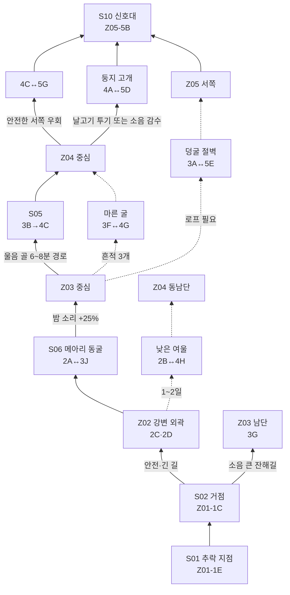

# PRIMAL NIGHT — MVP 맵 디자인 초안

> 상태: **초안 제안 / 미구현**  
> 기준: `GAME_SCENARIO_WORLD_TILEMAP.md` §7(지역), §8(연결), §10(40청크·32×32 타일)  
> 엔진 전제: Godot 4.7, `TileMapLayer`, 64×32px 아이소메트릭 타일

이 문서는 정본의 Zone 역할과 연결 구조를 바꾸지 않고, MVP 40개 플레이 가능 청크를 8×8 경계 안에 실제로 배치해 보는 레벨 디자인 초안이다. 아래에서 청크 좌표, 랜드마크의 정확한 셀, 위험·보상 지점의 세부 배치는 모두 **초안 제안**이며 플레이테스트 후 이동할 수 있다. `Z01→Z05`의 기능, §8에 명시된 연결, 3일 차 범람과 로프·둥지 고개 조건은 정본이다.

## 1. 좌표와 범례

- 한 청크는 32×32 타일(논리상 약 32m×32m), 전체 경계는 8×8 청크다.
- `x0→x7`은 서쪽에서 동쪽, `y0→y7`은 남쪽에서 북쪽이다.
- 표기 `3E`는 `Z03`의 다섯 번째 청크를 뜻한다. `··`는 경계 안의 비플레이 영역(절벽·깊은 물·원경)이다.
- 대문자 표식은 아래 배치표의 랜드마크를 뜻하며 실제 타일 문자열이나 런타임 ID가 아니다.

## 2. 40청크 계곡 배치도

```text
                              북 / 검은 능선
        x0   x1   x2   x3   x4   x5   x6   x7
y7     [··] [··] [5A] [5B] [5C] [5D] [··] [··]
y6     [··] [5E] [5F] [5G] [5H] [4A] [4B] [··]
y5     [··] [3A] [3B] [4C] [4D] [4E] [4F] [··]
y4     [3C] [3D] [3E] [3F] [4G] [4H] [··] [··]
y3     [3G] [3H] [3I] [3J] [2A] [2B] [··] [··]
y2     [1A] [1B] [1C] [2C] [2D] [2E] [··] [··]
y1     [1D] [1E] [1F] [2F] [2G] [2H] [··] [··]
y0     [··] [··] [··] [··] [··] [··] [··] [··]
                              남 / 추락 접근면
```

| Zone | 초안 청크 | 수량 | 정본 허용 범위 | 기능 검산 |
|---|---|---:|---:|---|
| Z01 추락 분지 | 1A~1F | 6 | 6~10 | 시작·튜토리얼·거점 |
| Z02 갈대 강변 | 2A~2H | 8 | 6~10 | 물·약초·범람 |
| Z03 메아리 밀림 | 3A~3J | 10 | 6~10 | 재료·은신·부품 A |
| Z04 둥지 평원 | 4A~4H | 8 | 6~10 | 고위험 보상·부품 B |
| Z05 검은 능선 | 5A~5H | 8 | 6~10 | 부품 C·신호·탈출 |
| **합계** |  | **40** | §10 MVP 40 | **일치** |

## 3. 랜드마크와 목표 배치

정본 랜드마크 이름과 기능은 유지하고, 좌표만 초안으로 지정한다.

| ID | 초안 청크 | 랜드마크·Zone | 기능과 시각 앵커 | 출입·상호작용 |
|---|---|---|---|---|
| S01 | 1E `(1,1)` | 균열 추락흔 / Z01 | 부서진 헬기 꼬리, 청록 균열 자국 | 시작 지점. S02까지 바람·웅크림·채집 학습 |
| S02 | 1C `(2,2)` | 현무암 바람막이 / Z01 | 검은 암반 반원과 첫 모닥불 자리 | 장기 거점·보관·신호기 조립대, 안전로의 출발점 |
| S03 | 2D `(4,2)` | 붉은 갈대 웅덩이 / Z02 | 붉은 갈대 고리와 얕은 물 | 물·약초. 열린 수면이라 낮에도 시야 노출 |
| S04 | 2H `(5,1)` | 침수 관측소 / Z02 | 기울어진 현대 관측 폴과 방수 상자 | 3일 차 수위 변화 전후 출입 방식이 달라짐 |
| S05 | 3B `(2,5)` | 울음 골 / Z03 | 양쪽 절벽과 흔들리는 수풀 띠 | Z03→Z04 최단 위험로, 달리기 소음이 증폭됨 |
| S06 | 2A↔3J `(4,3)↔(3,3)` | 메아리 동굴 / Z02↔Z03 | 두 입구의 흰 석회 흔적 | 부품 A. 밤에는 소리 유효 반경 +25%, 마른 굴 단서 1개 |
| S07 | 3D `(1,4)` | 갈고리턱 둥지 / Z03 | 훔친 가방·뼈가 쌓인 거목 뿌리 | 소형 개체가 옮긴 자원 회수, 경계음 위험 |
| S08 | 4D `(4,5)` | 방패뿔 산란환 / Z04 | 납작한 둥지와 원형 발자국 | 부품 B. 접근 전 땅 긁기·콧김 신호를 읽어야 함 |
| S09 | 4G `(4,4)` | 무리 횡단 수로 / Z04 | 짓밟힌 마른 수로와 부러진 관목 | 4일 차 돌등 무리 이후 Z05 서쪽 우회 진입이 열림 |
| S10 | 5B `(3,7)` | 검은 능선 신호대 / Z05 | 능선 끝의 현대식 안테나 잔해 | 부품 C·최종 조립·90초 충전·균열 진입 |

### 초안 제안: 보조 앵커

| 표식 | 초안 청크 | 용도 | 정본과의 관계 |
|---|---|---|---|
| F1 | 2C `(3,2)` | 두 번째 모닥불 지정 자리 | 안전 경로의 4개 지정 자리 중 하나 |
| F2 | 3F `(3,4)` | 숨겨진 거점 “마른 굴” | 긁힌 표식 3개를 찾으면 Z04로 연결 |
| F3 | 4C `(3,5)` | 서쪽 우회 바람막이 | 안전 경로의 네 번째 모닥불 자리 |
| R1 | 2B `(5,3)` | 낮은 여울 남단 | 1~2일 통행, 3일 차 범람 폐쇄 |
| R2 | 3A `(1,5)` | 덩굴 절벽 하단 | 로프 설치 시 Z05-5E로 연결 |
| H1 | 4E `(5,5)` | 사체 해체 고보상 지점 | §10.3의 Z04 사체 후보를 공간화한 초안 |

모닥불 지정 자리는 S02, F1, F2, F3의 **정확히 4개**다. H1은 새 서사 고정물이 아니라 월드 시드가 사체를 배치할 수 있는 후보 태그이며, 사체가 없는 시드에서는 빈 초지로 남는다.

## 4. 출입 경로·지름길·차단 경로



| 연결 | 유형 | 초안 경계 | 상태·대가 | 플레이어가 읽는 신호 |
|---|---|---|---|---|
| Z01→Z02 | 안전 주경로 | 1C↔2C | 항상 통행, 대신 우회 | 넓은 발자국·모닥불 표식 |
| Z01→Z03 | 빠른 초반길 | 1A↔3G | 잔해를 넘을 때 큰 소음 | 흔들리는 금속과 빈 캔 |
| Z02↔Z03 | 동굴 지름길 | 2A↔3J | 밤 소리 반경 +25% | 울림 아이콘·낙수 방향음 |
| Z02→Z04 | 시간 차단 | 2B↔4H | 1~2일만 통행, 3일 차 폐쇄 | 수위 눈금·떠내려오는 갈대 |
| Z03→Z04 | 빠른 위험로 | 3B↔4C | 랩터 영역과 둥지 노출 중첩 | 겹친 울음·수풀 흔적 |
| Z03→Z05 | 도구 지름길 | 3A↔5E | 로프 필요, 회수 불가 설치물 | 절벽 위 청색 장비 끈 |
| Z03→Z04 | 숨은 거점길 | 3F↔4G | 긁힌 표식 3개 발견 | 바깥쪽으로 고정된 바람 화살표 |
| Z04→Z05 | 안전 우회 | 4C↔5G | 4일 차 S09 무리 이동 후 안정화 | 짓밟힌 길과 멀어지는 저주파 |
| Z04→Z05 | 대가 통과 | 4A↔5D | 반대편 미끼 투기 또는 돌길 질주 | 둥지 경계 반점·소리 큰 자갈 |

## 5. 위험·보상과 부품 A/B/C

| 목표 | 초안 위치 | 위험 중첩 | 보상 | 실패해도 남는 정보 |
|---|---|---|---|---|
| 부품 A | S06, 3J측 동굴실 | 좁은 퇴로 + 소리 증폭 + 랩터 조사 | 신호기 공명 코일, 마른 굴 단서 | 동굴의 안전한 정지 지점과 울림 주기 |
| 부품 B | S08, 4D 둥지 중앙 | 방패뿔 돌진 + 엄폐 부족 + 랩터 사냥조 | 전력 조절기, 뼈·가죽 후보 | 방패뿔의 3단 경고와 무리 이동 시간 |
| 부품 C | S10, 5B 안테나 하부 | 화산재 + 낙석 + 후반 랩터/재왕 통로 | 송신 증폭기, 최종 신호대 해금 | 재왕 통과 주기와 능선 바람 방향 |
| 사체 H1 | 4E | 해체 소음 + 피 냄새 + 열린 평지 | 뼈·가죽·힘줄 고수익 | 바람이 냄새를 보내는 포식자 진입축 |
| 침수 상자 | S04, 2H | 젖음·저체온 + 수위 마감 | 현대 붕대·전자 부속 후보 | 3일 차 범람의 정확한 시각 단서 |

부품은 이 초안에서 각 1개 고정 후보처럼 보이지만, 런타임에서는 정본대로 해당 랜드마크 내부의 2~3개 스폰 포인트 중 시드가 선택한다. 따라서 위치 암기보다 감각·경로 판단이 우선이며, 부품 자체를 다른 Zone으로 옮기지는 않는다.

## 6. 시작 지점에서 신호기까지의 동선

### 안전·학습 경로(정본 목표 12~15분)

`S01(1E) → S02(1C) → 2C → S03(2D) → S06(2A/3J) → F2(3F) → F3(4C) → S09(4G) → 5G → S10(5B)`

- 첫 왕복에서 S01→S02→Z02로 냄새·물·모닥불을 학습한다.
- 부품 A 회수 뒤 F2를 발견하면 밤 귀환 거리가 줄어든다.
- 4일 차 이후 S09가 서쪽 우회를 열어 부품 B와 능선 진입을 연결한다.
- 최종 등반에서는 F3에서 연료·지혈을 끝내고 Z05로 들어간다.

### 빠른·위험 경로(정본 목표 6~8분)

`S02(1C) → 1A/3G 잔해길 → S05(3B) → S08(4D) → 4A 둥지 고개 → 5D → S10(5B)`

이 경로는 울음 골의 랩터, S08의 방패뿔, 둥지 고개의 자원 투기를 연속으로 감수한다. 로프가 있다면 `S05→3A→5E→S10`으로 부품 B 구간을 건너뛸 수 있지만, 실제 탈출에는 부품 B가 필요하므로 귀환·구조용 지름길이지 목표 생략 수단이 아니다.

## 7. 시간대·날짜별 위험 변화

| 시점 | Z01 | Z02 | Z03 | Z04 | Z05 | 경로 판단 |
|---|---|---|---|---|---|---|
| 낮 | 첫날 비교적 안전 | 물·약초, 열린 수면 노출 | 시야 제한·수풀 소음 | 초식 무리·둥지 위험 | 화산재·저온 | 부품·자원 확보, 바람 방향 기록 |
| 황혼 | 외곽 랩터 진입 예고 | 수변 랩터 이동 시작 | 울음과 조사 지점 증가 | 무리 귀환·엄폐 감소 | 낙석 빈도 상승 | 4개 모닥불 중 도달 가능한 곳 선택 |
| 밤 | 2일 차부터 외곽 순찰 | 물가 냄새 조사 | 랩터 최고 위험, S06 소리 +25% | 랩터 사냥조와 둥지 동시 위험 | 균열 빛·청록 장비 노출 | 웅크림·미끼·불·우회 중심, 해체 금지에 가까운 고위험 |
| 3일 차 | — | 낮은 여울 폐쇄, 북쪽 통나무길 개방 | 통나무길 유입 흔적 증가 | 4H 남단 접근 차단 | — | 기존 계획을 저장 상태가 아닌 `route_state`로 갱신 |
| 4일 차 | — | — | 무리 선행 진동 | S09 횡단, S08 접근 창 약 90초 | 서쪽 우회 개방 | 저주파를 위험뿐 아니라 시간 창 신호로 사용 |
| 6일 차 | 재 증가 | 수질 저하 연출 | 작은 공룡 북상 | 대형 잔해/재왕 통로 후보 | 재왕 예약 통로 사건 | 대형 포식자는 추격 AI가 아니라 예약 경로 사건 |
| 7일 차 | 장기 체류 불가 | 범람 지속 | 귀환 가치 급감 | 능선 진입만 유효 | 8분 가동·10분 붕괴 이중 마감 | 부품 3개·연료·지혈을 확인하고 S10 돌입 |

시간대 위험은 그래픽 가시성에 의존하지 않는다. 저주파, 방향 자막, 화면 가장자리 표식, 수위 눈금, 수풀 흔들림을 함께 써서 소리 없이 플레이하거나 색각이 달라도 경로 변화를 읽을 수 있게 한다.

## 8. TileMapLayer 제작 전달 규칙

1. 각 청크 Scene은 `zone_id`, `chunk_coord`, 출입구 마커, 랜드마크 스폰 포인트만 확정한다.
2. 바닥·경로·위험·구조·가림은 정본 §9의 각 `TileMapLayer`에 나누고, 부품·사체·모닥불·문은 `DynamicObjects` Scene으로 둔다.
3. 모든 경계 출입구는 양쪽 청크에서 같은 안정 ID(`region/zone/x_y/entrance`)를 쓴다.
4. 범람·무리 이동·로프 설치는 타일 전체를 복제하지 않고 `WorldDelta.route_state`와 교체 좌표만 저장한다.
5. Z01에서 Z05까지 위험 경로 6~8분, 안전 경로 12~15분을 회색 상자 플레이테스트의 합격 기준으로 삼는다.
6. 실제 타일 페인팅 전에 40청크 모두에 32×32 경계, 출입구, 충돌, 내비게이션 링크만 둔 회색 상자를 먼저 만든다.

## 9. 정합 자체 점검

| 항목 | 결과 |
|---|---|
| 플레이 가능 청크 수 | 6+8+10+8+8 = **40**, §10과 일치 |
| Zone당 청크 수 | 모두 6~10 범위 |
| 8×8 경계 | x0~x7, y0~y7 안에 전부 포함 |
| §8 연결 | 모든 실선·조건선·숨은 경로를 유지 |
| 모닥불 지정 자리 | 정확히 4개 |
| 부품 | A=Z03 경계 동굴, B=Z04, C=Z05로 §7과 일치 |
| 시작→능선 시간 목표 | 위험 6~8분 / 안전 12~15분 유지 |
| 새 설정 표기 | 정확 좌표·보조 앵커·후보 태그는 모두 **초안 제안** |
